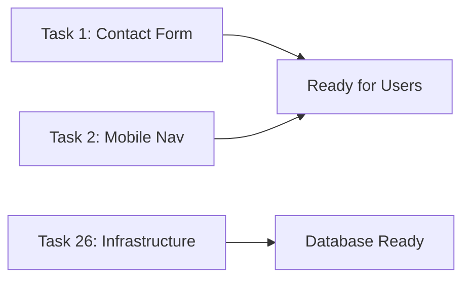
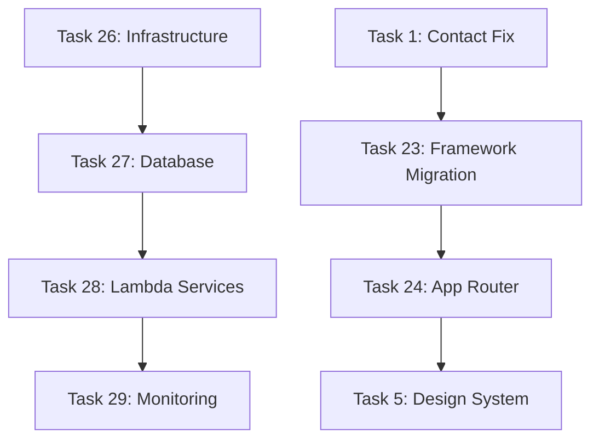
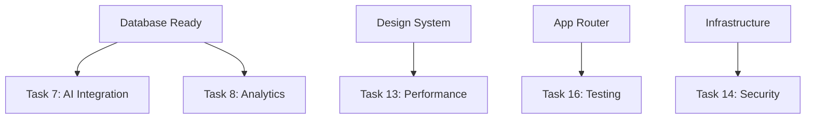
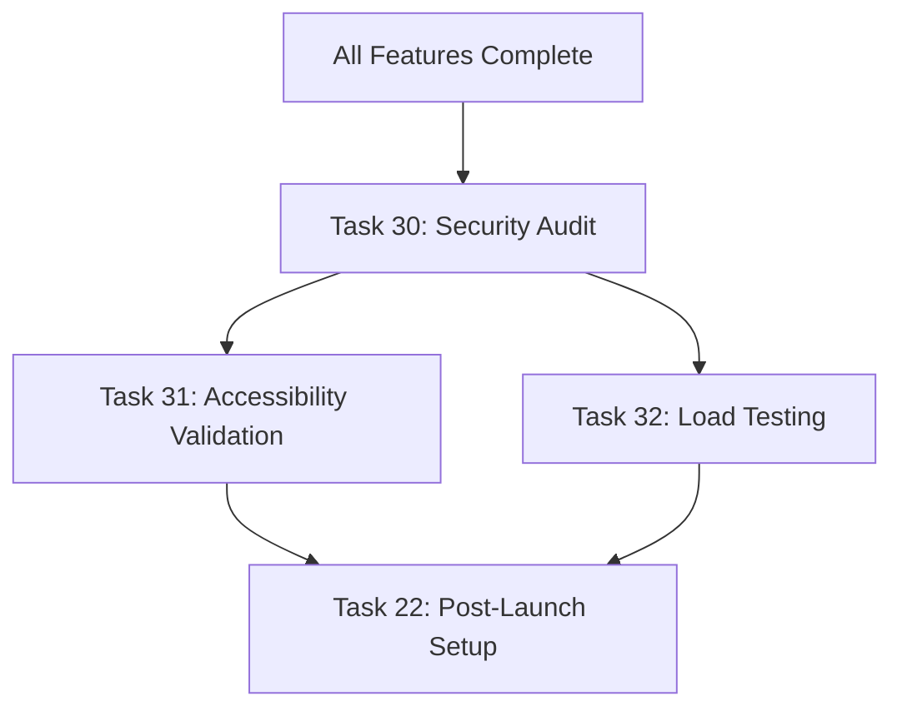

# bjornmelin-platform-io Workflow Guide

**Version:** 1.0  
**Date:** June 21, 2025  
**Total Tasks:** 29  
**Estimated Duration:** 12-16 weeks

## 🎯 Executive Summary

This document outlines the optimized critical path for developing the bjornmelin-platform-io portfolio platform. The workflow is designed for maximum parallelization while maintaining logical dependencies and minimizing blockers.

## 📋 Phase Overview

| Phase | Duration | Tasks | Priority | Dependencies |
|-------|----------|-------|----------|--------------|
| **Phase 0: Emergency Fixes** | Week 1 | 3 tasks | P0 Critical | None - Start immediately |
| **Phase 1: Foundation** | Weeks 1-4 | 8 tasks | High | Sequential foundation building |
| **Phase 2: Platform Features** | Weeks 3-8 | 12 tasks | Medium-High | Parallel after foundations |
| **Phase 3: Advanced Features** | Weeks 6-10 | 8 tasks | Medium | Parallel development |
| **Phase 4: Launch Validation** | Weeks 11-12 | 4 tasks | High | Sequential pre-launch |

## 🚀 Phase 0: Emergency Fixes (Start Immediately)

**Duration:** Week 1  
**Can Start:** Day 1  
**Blocking:** High - Prevents business impact

| Task ID | Title | Priority | Duration | Team |
|---------|-------|----------|----------|------|
| 1 | Emergency Contact Form Repair | P0 | 2-3 days | Frontend |
| 2 | Mobile Navigation Emergency Fix | P0 | 1-2 days | Frontend |
| 26 | Core Infrastructure & Networking | High | 3-5 days | DevOps |

**Success Criteria:**
- ✅ Contact form submission works
- ✅ Mobile navigation functional on all devices
- ✅ AWS infrastructure foundation ready

## 🏗️ Phase 1: Foundation Pipeline (Weeks 1-4)

**Critical Path:** Sequential foundation building enabling all future work

### Infrastructure Stream (DevOps Team)
| Task | Duration | Dependencies | Notes |
|------|----------|--------------|-------|
| 26: Core Infrastructure | 3-5 days | None | VPC, CloudFront, Route 53 |
| 27: Database Services | 2-3 days | Task 26 | DynamoDB, S3, Redis |
| 28: Lambda Services | 3-4 days | Task 27 | API Gateway, microservices |
| 29: Monitoring & CI/CD | 3-4 days | Task 28 | CloudWatch, deployment automation |

### Framework Stream (Frontend Team)
| Task | Duration | Dependencies | Notes |
|------|----------|--------------|-------|
| 23: Framework Migration | 3-4 days | Task 1 | Next.js 15, React 19, pnpm |
| 24: App Router Conversion | 4-5 days | Task 23 | Server Components migration |
| 5: Design System | 4-6 days | Task 24 | Tailwind v4, glassmorphism |

## 🚀 Phase 2: Platform Features (Weeks 3-8)

**Parallel Development:** Multiple teams can work simultaneously

### AI & Analytics Stream
| Task | Duration | Dependencies | Team |
|------|----------|--------------|------|
| 7: OpenAI GPT-4o Integration | 3-4 days | Task 27 | Backend |
| 8: Advanced Analytics | 4-5 days | Task 27 | Full-stack |
| 11: AI Lead Qualification | 4-5 days | Tasks 7, 3 | Backend |

### Performance & Testing Stream
| Task | Duration | Dependencies | Team |
|------|----------|--------------|------|
| 13: Performance Optimization | 3-4 days | Task 5 | Frontend |
| 16: Testing Suite (80%+ coverage) | 5-6 days | Task 24 | QA/Frontend |
| 25: Performance Testing | 3-4 days | Tasks 24, 13, 16 | QA |

### Security Stream
| Task | Duration | Dependencies | Team |
|------|----------|--------------|------|
| 14: Security Implementation | 4-5 days | Task 26 | DevOps/Security |

## 🎨 Phase 3: Advanced Features (Weeks 6-10)

**User-Facing Features:** Can be developed in parallel

### Content & Portfolio Stream
| Task | Duration | Dependencies | Team |
|------|----------|--------------|------|
| 9: Interactive Portfolio | 4-5 days | Task 7 | Frontend |
| 10: Timeline Visualization | 3-4 days | Task 5 | Frontend |
| 12: Technical Blog (MDX) | 4-5 days | Tasks 5, 7 | Frontend |
| 19: Content Management | 3-4 days | Tasks 7, 12 | Full-stack |

### User Experience Stream
| Task | Duration | Dependencies | Team |
|------|----------|--------------|------|
| 15: Mobile-First Design | 3-4 days | Tasks 5, 2 | Frontend |
| 17: SEO Optimization | 2-3 days | Task 12 | Frontend |
| 18: Real-Time Features | 3-4 days | Task 8 | Backend |
| 20: Advanced Monitoring | 3-4 days | Task 8 | DevOps |

## 🚀 Phase 4: Launch Validation (Weeks 11-12)

**Sequential Pre-Launch:** Critical validation before production

| Task | Duration | Dependencies | Critical Success Metrics |
|------|----------|--------------|---------------------------|
| 30: Security & Performance Auditing | 3-4 days | Tasks 14, 25, 13, 28, 29 | Zero critical vulnerabilities, 100/100/100/100 Lighthouse |
| 31: Accessibility & Content | 2-3 days | Tasks 16, 15, 19, 24 | WCAG 2.1 AA compliance |
| 32: Load Testing & Deployment | 2-3 days | Tasks 30, 29, 25, 28, 27 | 10x traffic capacity, rollback procedures |
| 22: Post-Launch Monitoring | 2 days | Task 32 | Continuous improvement framework |

## 📊 Progress Tracking

### Key Milestones
- **Week 1:** Emergency fixes complete, infrastructure started
- **Week 3:** Framework migration complete, parallel development begins
- **Week 6:** AI integration and analytics operational
- **Week 8:** All core features complete
- **Week 10:** Advanced features complete
- **Week 12:** Production launch ready

### Health Metrics
- **Dependency Blocker Risk:** Low (maximum parallelization)
- **Critical Path Length:** 12 weeks optimized
- **Resource Utilization:** High (multiple parallel streams)
- **Quality Gates:** Built into each phase

## 🎯 Next Actions

### Immediate (Week 1)
1. **Start Task 1** (Contact Form) - Frontend team
2. **Start Task 2** (Mobile Nav) - Frontend team  
3. **Start Task 26** (Infrastructure) - DevOps team
4. **Complete Task 3** (Form Validation) after Task 1

### Week 2-3 Setup
1. **Begin Task 23** (Framework Migration) after Task 1
2. **Continue Task 27** (Database) after Task 26
3. **Prepare Task 24** (App Router) dependencies

---

**📝 Note:** This workflow optimizes for maximum team productivity while maintaining software engineering best practices. Update this document as tasks complete and dependencies shift.