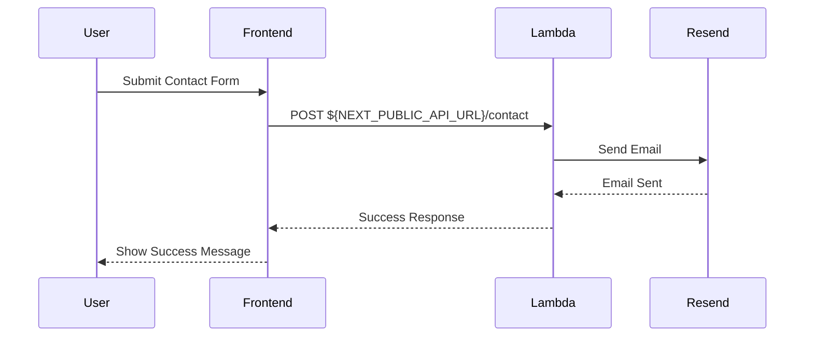
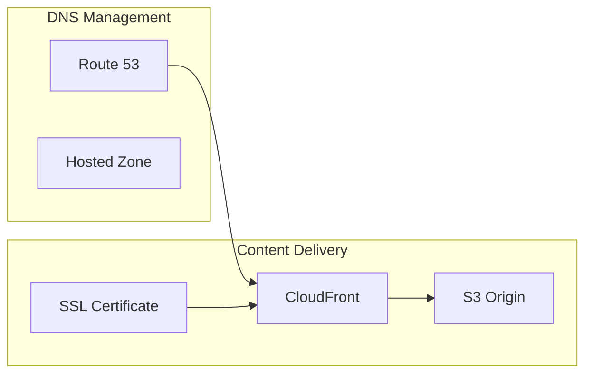

# bjornmelin-platform-io

Cloud-native portfolio platform powering bjornmelin.io. Static export built with React 19, Next.js 16,
and AWS CDK infrastructure. Deployed to S3 with CloudFront CDN. Requires Node.js 24.x LTS.

[](https://choosealicense.com/licenses/mit/)
[](https://github.com/bjornmelin/bjornmelin-platform-io/actions/workflows/ci.yml)
[](https://github.com/bjornmelin/bjornmelin-platform-io/actions/workflows/security-audit.yml)
[](https://github.com/bjornmelin/bjornmelin-platform-io/actions/workflows/codeql.yml)
[](https://react.dev)
[](https://nextjs.org/)
[](https://github.com/BjornMelin)
[](https://www.linkedin.com/in/bjorn-melin)
[](https://medium.com/@bjornmelin)

## Table of Contents

- [Features](#features)
- [Documentation](#documentation)
- [Architecture](#architecture)
- [Project Structure](#project-structure)
- [Getting Started](#getting-started)
- [Tech Stack](#tech-stack)
- [AWS Services](#aws-services)
- [Development Scripts](#development-scripts)
- [Docker](#docker)
- [Releasing](#releasing)
- [Infrastructure Tests](#infrastructure-tests)
- [Author](#author)
- [License](#license)

## Features

### Platform

- **AWS Infrastructure**: S3, CloudFront, Route 53, ACM, Lambda via AWS CDK
- **CI/CD**: GitHub Actions with OIDC-based AWS role assumption
- **Multi-Environment**: Development, staging, and production configurations
- **Static Export**: Pre-rendered HTML with optimized assets

### Frontend

- **Next.js 16 App Router**: Server Components (build-time), static export (`output: 'export'`)
- **React 19**: Modern React features with smaller client bundles
- **TypeScript**: Strict mode with Zod runtime validation
- **Tailwind CSS v4**: CSS-first config in `src/app/globals.css` (`@theme`, `@plugin`,
  `@import "tailwindcss"`) via PostCSS (`@tailwindcss/postcss`)

### Performance Optimization

- **Image Optimization**: Pre-generated WebP variants via Sharp (static export compatible)
- **Bundle Analysis**: Next.js built-in analyzer (`pnpm analyze`)
- **Modern Targets**: Browserslist configured for ES6 module support

## Documentation

- [Docs index](docs/docs-index.md)

### Development

- [Getting Started](docs/development/getting-started.md)
- [Development Overview](docs/development/README.md)
- [Testing Strategies](docs/development/testing.md)
- [Releasing](docs/development/releasing.md)

### Deployment

- [Overview](docs/deployment/README.md)
- [CI/CD Pipeline](docs/deployment/ci-cd.md)
- [Environments](docs/deployment/environments.md)

### Architecture

- [Overview](docs/architecture/README.md)
- [Frontend](docs/architecture/frontend.md)
- [ADRs](docs/architecture/adr/README.md)
- [Specs](docs/specs/README.md)
- [Requirements registry](docs/specs/requirements.md)

## Architecture

### System Architecture


### Contact Form Flow



### DNS and CDN Setup



## Project Structure

```bash
bjornmelin-platform-io/
├── .github/                # GitHub Actions workflows
├── docs/                   # Project documentation
│   ├── api/               # API documentation
│   ├── architecture/      # Architecture docs
│   ├── deployment/        # Deployment guides
│   └── development/       # Development guides
├── infrastructure/         # CDK infrastructure code
│   ├── bin/               # CDK app entry
│   └── lib/               # Infrastructure code
│       ├── functions/     # Lambda functions
│       ├── stacks/        # CDK stacks
│       └── types/         # Stack types
├── public/                # Static assets
│   ├── certifications/    # AWS certifications
│   ├── headshot/          # Profile images
│   └── projects/          # Project images
├── src/                   # Application source
│   ├── app/               # Next.js 16 App Router
│   │   └── fonts/         # Custom fonts
│   ├── components/        # React components
│   ├── data/              # Static data
│   ├── hooks/             # Custom hooks
│   ├── lib/               # Utilities
│   └── types/             # TypeScript types
├── image-loader.ts        # next/image custom loader (static export)
├── scripts/               # Build/deploy utilities (includes image generation)
└── next.config.mjs        # Next.js configuration
```

### Core Components

- **Frontend**: Next.js 16 static export with App Router
- **Infrastructure**: AWS CDK for resource provisioning
- **CI/CD**: GitHub Actions for automated deployments
- **CDN**: CloudFront with Route 53 DNS
- **API**: Lambda function with Resend for contact form (infrastructure-deployed)

## Getting Started

### Prerequisites

```bash
Node.js >= 24.0.0 (LTS)
pnpm (via Corepack)
AWS CLI configured
```

Enable Corepack and activate the pinned pnpm version from package.json:

```bash
corepack enable
corepack use $(node -p "require('./package.json').packageManager")
```

### Initial Setup

```bash
# Clone repository
git clone https://github.com/bjornmelin/bjornmelin-platform-io.git
cd bjornmelin-platform-io

# Install dependencies
pnpm install

# Configure AWS credentials
aws configure

# Configure local environment (local-only values)
cp .env.example .env.local
# Note: Production configuration is provided by the GitHub Environment (vars)
# and AWS SSM/Secrets. No .env.production is used.
```

### Infrastructure Deployment

```bash
# Deploy infrastructure (from repo root)
pnpm -C infrastructure install
pnpm -C infrastructure cdk deploy
```

### Local Development

```bash
# Start development server
pnpm dev
```

## Tech Stack

```yaml
Frontend:
  Core:
    - React 19.2.3
    - Next.js 16.1.3
    - TypeScript 5.9.3

  UI:
    - Tailwind CSS
    - shadcn/ui
    - GeistVF Font

  Build:
    - Sharp-based WebP variants (static export)
    - Next.js built-in analyzer (`pnpm analyze`)
    - Browserslist (ES6 module targets)

Infrastructure:
  AWS:
    - CDK
    - CloudFront
    - S3
    - Route 53
    - ACM
    - Lambda
  Email:
    - Resend

Development:
  Tools:
    - pnpm 10.28.0 (Corepack)
    - Biome (lint + format)
    - Vitest (unit tests)
    - Playwright (E2E tests)
```

## AWS Services

### Content Delivery

- **CloudFront**: CDN distribution with custom domain
- **Route 53**: DNS management and domain routing
- **ACM**: SSL/TLS certificate management
- **S3**: Static asset hosting

### Compute and Email

- **Lambda**: Contact form handler
- **Resend**: Email delivery (via API)

### Operations

- **CDK**: Infrastructure as code
- **CloudWatch**: Logging and monitoring
- **IAM**: Role-based access control

## Development Scripts

```bash
# Development
pnpm dev          # Start development server
pnpm build        # Build and optimize images
pnpm start        # Serve static export
pnpm serve        # Serve static export (alternative)

# Quality
pnpm lint         # Run Biome lint/format checks
pnpm format:check # Run Biome format check
pnpm type-check   # TypeScript type checking

# Testing
pnpm test         # Run unit tests
pnpm test:coverage # Run unit tests with coverage
pnpm test:e2e     # Run E2E tests
pnpm test:e2e:ui  # Run Playwright in UI mode
pnpm test:e2e:report # Open Playwright HTML report

# Analysis
pnpm analyze      # Build with bundle analyzer

# Infrastructure
pnpm -C infrastructure cdk deploy   # Deploy AWS infrastructure
```

## Docker

Build the production image (requires Docker Desktop/daemon running):

```bash
docker build -t platform-io:node24 .
```

Run the container and serve the exported site on port 8080:

```bash
docker run --rm -p 8080:80 platform-io:node24
```

Open <http://localhost:8080> in your browser. Use Ctrl+C to stop the container.

## Releasing

Releases are automated using [release-please](https://github.com/googleapis/release-please).
Push commits with [Conventional Commits](https://www.conventionalcommits.org/) format to `main`,
and release-please will open a Release PR. Merge it to create a tagged GitHub Release.

See [docs/development/releasing.md](docs/development/releasing.md) for full details.

## Infrastructure Tests

CDK assertions are available under `infrastructure/test/` using Vitest.
See [infrastructure/README.md#tests](infrastructure/README.md#tests) for commands.

## Author

### Bjorn Melin

[](https://www.credly.com/org/amazon-web-services/badge/aws-certified-solutions-architect-associate)
[](https://www.credly.com/org/amazon-web-services/badge/aws-certified-developer-associate)
[](https://www.credly.com/org/amazon-web-services/badge/aws-certified-sysops-administrator-associate)
[](https://www.credly.com/org/amazon-web-services/badge/aws-certified-machine-learning-engineer-associate)
[](https://www.credly.com/org/amazon-web-services/badge/aws-certified-ai-practitioner)
[](https://www.credly.com/org/amazon-web-services/badge/aws-certified-cloud-practitioner)

AWS-certified Solutions Architect, Developer, SysOps Administrator, and Machine
Learning Engineer. Connect on:

- [GitHub](https://github.com/BjornMelin)
- [LinkedIn](https://www.linkedin.com/in/bjorn-melin)
- [Coursera](https://www.coursera.org/learner/bjorn-melin)
- [Medium](https://medium.com/@bjornmelin)

## License

This project is licensed under the MIT License. See the [LICENSE](LICENSE) file
for details.

## Star History

[](https://star-history.com/#bjornmelin/bjornmelin-platform-io&Date)

## Citation

If you use this project in your research or work:

```bibtex
@misc{melin2026portfolio,
  author = {Melin, Bjorn},
  title = {bjornmelin-platform-io: Portfolio Platform},
  year = {2026},
  publisher = {GitHub},
  journal = {GitHub repository},
  howpublished = {\url{https://github.com/bjornmelin/bjornmelin-platform-io}},
  commit = {main}
}
```

## Acknowledgments

- AWS Documentation
- AWS CDK Patterns Community
- Next.js Documentation

---

Built with React 19 + Next.js 16 by [Bjorn Melin](https://bjornmelin.io).
