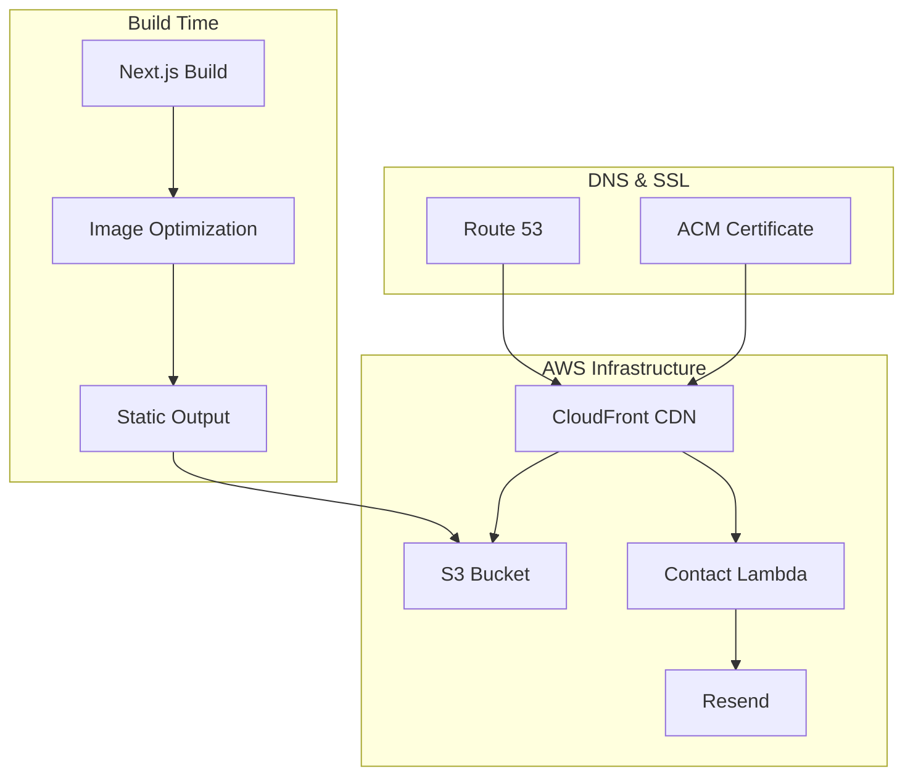
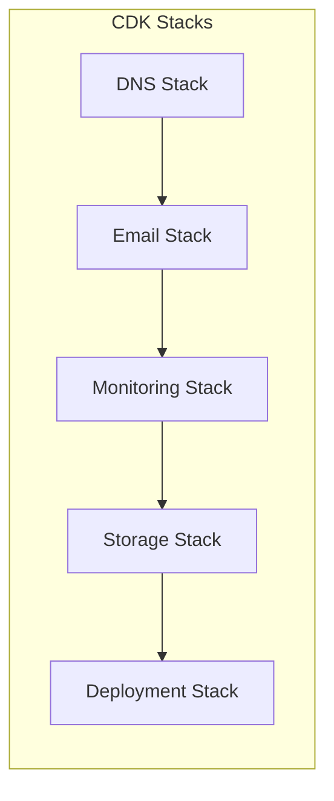

# Architecture Overview

## Table of Contents

- [System Architecture](#system-architecture)
- [Core Components](#core-components)
- [AWS Services](#aws-services)
- [Design Decisions](#design-decisions)

## System Architecture

### High-Level Overview



### Infrastructure Architecture



## Core Components

### Frontend (Next.js 14)

- **Output**: Static export (`output: 'export'`)
- **Features**:
  - React Server Components (build-time)
  - App Router
  - Static Site Generation
  - LazyMotion for optimized animations
  - WebP image optimization

Note: API routes in `src/app/api/` are available during local development only.
In production, the contact form is handled by an AWS Lambda function.

### Email Service

- **Provider**: AWS Lambda + Resend
- **Deployment**: AWS CDK infrastructure
- **Features**:
  - Contact form processing
  - Email validation
  - Error handling

### Static Assets

- **Storage**: S3 bucket via CloudFront
- **Optimization**:
  - WebP image conversion
  - Responsive image variants
  - CDN caching

## AWS Services

### Content Delivery

```yaml
CloudFront:
  Purpose: Global CDN distribution
  Features:
    - Custom domain (bjornmelin.io)
    - SSL/TLS termination
    - Cache optimization
    - Lambda@Edge integration
```

### Storage

```yaml
S3:
  Purpose: Static asset hosting
  Contents:
    - HTML pages
    - JavaScript bundles
    - Optimized images (WebP)
    - Fonts and static assets
```

### Email

```yaml
Resend:
  Purpose: Contact form email delivery
  Integration: Lambda function
```

### Infrastructure

```yaml
CDK Stacks:
  - DNS Stack (Route 53)
  - Email Stack (Resend + Lambda)
  - Monitoring Stack (CloudWatch)
  - Storage Stack (S3)
  - Deployment Stack (CloudFront)
```

## Design Decisions

### Static Export

- **Rationale**: Reduced infrastructure complexity, lower costs, fast global delivery
- **Implementation**: `output: 'export'` in next.config.mjs
- **Trade-offs**: No server-side runtime; API routes are dev-only
- **Constraints**: Avoid request-time APIs (cookies/headers), redirects/rewrites,
  Server Actions, ISR, and request-dependent Route Handlers (see ADR-0005).

### LazyMotion for Animations

- **Rationale**: Reduce JavaScript bundle by 27KB
- **Implementation**: Lazy-load domAnimation feature set
- **Usage**: `m.*` components instead of `motion.*`

### Image Optimization at Build Time

- **Rationale**: Static export cannot use Next.js runtime image optimization
- **Implementation**: next-export-optimize-images
- **Output**: WebP images with responsive variants

### Serverless API

- **Rationale**: Contact form requires server-side processing
- **Implementation**: AWS Lambda deployed via CDK
- **Integration**: CloudFront routes `/api/*` to Lambda

### Infrastructure as Code

- **Rationale**: Reproducible, version-controlled infrastructure
- **Implementation**: AWS CDK with TypeScript
- **Location**: `/infrastructure` directory

For detailed information about specific components:

- [Frontend Architecture](./frontend.md)
- [Backend Architecture](./backend.md)
- [Infrastructure Design](./infrastructure.md)
- [AWS Services Documentation](./aws-services.md)
