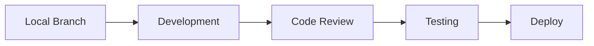

# Development Overview

## Introduction

Development documentation for the bjornmelin-platform-io project.

## Documentation Structure

- [Getting Started](./getting-started.md) - Setup and initial development guide
- [Coding Standards](./coding-standards.md) - Code style and practices
- [Testing Strategies](./testing.md) - Testing methodologies and tools
- [Releasing](./releasing.md) - Automated releases with release-please

## Development Environment

### Prerequisites

- Node.js 24.x LTS (pinned via `.nvmrc` and enforced by the `engines` field)
- pnpm package manager (enable via `corepack enable pnpm`)
- AWS CLI configured with appropriate credentials
- Git

### Core Technologies

#### Frontend

- Next.js 16.1.3 (App Router, static export)
- React 19.2.3
- TypeScript 5.9.3
- Tailwind CSS 4.1.18 (CSS-first config)
- shadcn/ui components

#### Build Optimization

- sharp (generate WebP variants)
- Next.js built-in analyzer (`pnpm analyze`)
- Browserslist (ES6 module targets)

#### Infrastructure

- AWS CDK
- AWS S3
- Resend (email delivery)

#### Development Tools

- Biome (linting and formatting)
- Zod for validation
- Vitest (unit tests)
- Playwright (E2E tests)

## Development Workflow

### 1. Local Development



### 2. Code Quality

- TypeScript for type safety
- Biome for linting and formatting
- Git hooks for pre-commit checks

### 3. Testing Requirements

- Component testing with Vitest
- E2E testing with Playwright
- Type checking with `pnpm type-check`

### 4. Static Export Constraints

This project ships as a static export (`output: "export"`). Do not introduce
features that require a server runtime (cookies/headers, redirects/rewrites,
Server Actions, ISR, or request-dependent Route Handlers).

## Code Organization

```text
src/
├── app/          # Next.js 16 App Router pages
├── components/   # React components
├── lib/          # Utilities and services
├── types/        # TypeScript types
└── data/         # Static data
```

## Performance

- Server Components where applicable
- Static generation (`output: 'export'`)
- Image optimization (WebP via sharp-generated variants)
- Bundle size monitoring (`pnpm analyze`)

## Type Safety

- Strict TypeScript configuration
- Zod for runtime validation
- Type-safe environment variables (`src/env.mjs`)

## Component Development

- Functional components with React Server Components
- Custom hooks in `/hooks`
- Shared utilities in `/lib`
- Error boundaries for graceful degradation

## State Management

- React Server Components for server state
- Local component state with `useState`
- Form state with react-hook-form

## Security

- Input validation with Zod
- Environment variable validation (`@t3-oss/env-nextjs`)
- Secure data handling

## Development Commands

```bash
# Start development server
pnpm dev

# Build for production (includes image optimization)
pnpm build

# Run type checking
pnpm type-check

# Run linting
pnpm lint

# Run format checks
pnpm format:check

# Run unit tests
pnpm test

# Run E2E tests
pnpm test:e2e

# Analyze bundle size
pnpm analyze
```

## Release Process

Releases are automated using [release-please](https://github.com/googleapis/release-please):

1. Write commits using [Conventional Commits](https://www.conventionalcommits.org/) format
2. Release-please opens/updates a Release PR automatically
3. Merge the Release PR to create a git tag and GitHub Release

See the full guide at [Releasing](./releasing.md).

## Infrastructure Development

- AWS CDK for infrastructure provisioning
- Infrastructure code in `/infrastructure`
- CDK tests with Vitest

## Continuous Integration

- Code quality checks (Biome)
- Type checking
- Unit and E2E test execution
- Build verification
- Lighthouse performance checks

For detailed information, refer to the specific guides in each section.
