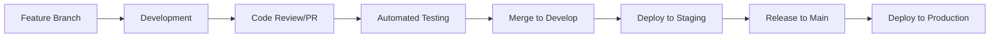

# Development Overview

## Introduction

This section provides comprehensive documentation for developers working on the bjornmelin-platform-io project. Our development process emphasizes code quality, performance, and maintainable architecture.

## Documentation Structure

- [Getting Started](./getting-started.md) - Setup and initial development guide
- [Onboarding Checklist](./onboarding-checklist.md) - New team member onboarding
- [Branching Strategy](./branching-strategy.md) - Git workflow and branch management
- [Conventional Commits](./conventional-commits.md) - Commit message standards
- [Coding Standards](./coding-standards.md) - Code style and best practices
- [Testing Strategies](./testing.md) - Testing methodologies and tools
- [Git Workflow Guide](./git-workflow-guide.md) - Day-to-day Git operations

## Development Environment

### Prerequisites

- Node.js (v18 or higher)
- pnpm package manager (v9 or higher)
- AWS CLI configured with appropriate credentials
- Git

### Core Technologies

#### Frontend

- Next.js 13+ (App Router)
- React 18
- TypeScript
- Tailwind CSS
- shadcn/ui components

#### Infrastructure

- AWS CDK
- AWS SES
- AWS S3

#### Development Tools

- Biome (linting and formatting)
- Zod for validation
- Vitest for unit testing
- Playwright for E2E testing
- React Testing Library

## Development Workflow

### 1. Git-Based Development Flow



### 2. Branch-Based Workflow

- **Feature Development**: Create feature branches from `develop`
- **Code Reviews**: All changes require PR approval
- **Automated Testing**: CI/CD runs on every PR
- **Staging Deployment**: Automatic from `develop` branch
- **Production Release**: Tagged releases from `main`

### 3. Code Quality Gates

- **Pre-commit Hooks**: Format and lint before commit
- **Conventional Commits**: Enforced commit message format
- **Type Safety**: Strict TypeScript checking
- **Test Coverage**: Minimum 80% coverage required
- **Security Scanning**: Automated vulnerability checks

### 4. Testing Requirements

- **Unit Tests**: All business logic and utilities
- **Component Tests**: React component behavior
- **Integration Tests**: API routes and services
- **E2E Tests**: Critical user journeys
- **Type Checking**: No TypeScript errors

## Best Practices

### Code Organization

```
src/
├── app/          # Next.js 13+ pages and API routes
├── components/   # React components
├── lib/          # Utilities and services
├── types/        # TypeScript types
└── data/         # Static data
```

### Performance

- Server Components when possible
- Static generation for applicable pages
- Image optimization
- Code splitting
- Bundle size monitoring

### Type Safety

- Strict TypeScript configuration
- Zod for runtime validation
- Type-safe API routes
- Proper error handling

### Component Development

- Functional components
- React Server Components
- Custom hooks
- Shared utilities
- Proper error boundaries

### State Management

- React Server Components
- Local component state
- Form state management
- Server state handling

### Security

- Input validation
- API route protection
- Environment variable management
- Secure data handling

## Development Commands

```bash
# Start development server
pnpm dev

# Build for production
pnpm build

# Run type checking
pnpm type-check

# Run linting
pnpm lint

# Run formatting
pnpm format

# Run tests
pnpm test
```

## Infrastructure Development

- AWS CDK for infrastructure
- Local testing of AWS services
- Infrastructure as Code practices
- Environment-based configurations

## Continuous Integration

- Code quality checks
- Type checking
- Test execution
- Build verification

## Documentation

- Inline code documentation
- Component documentation
- API documentation
- Infrastructure documentation

For more detailed information, refer to the specific guides in each section of the development documentation.
