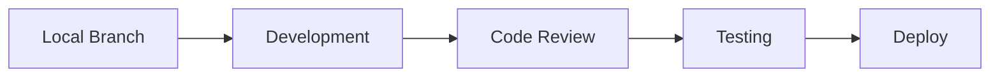

# Development Overview

## Introduction

Development documentation for the bjornmelin-platform-io project.

## Documentation Structure

- [Getting Started](./getting-started.md): setup + first dev
- [Coding Standards](./coding-standards.md): coding style + practices
- [Testing Strategies](./testing.md): tests + tools
- [Releasing](./releasing.md): release-please automation

## Development Environment

### Prerequisites

- Node.js 24.x LTS (pinned via `.nvmrc` and enforced by the `engines` field)
- pnpm package manager (enable via `corepack enable pnpm`)
- AWS CLI configured with appropriate credentials
- Git

### Core Technologies

#### Frontend

- Next.js 16.2.4 (App Router, static export)
- React 19.2.5
- TypeScript 6.0.3
- Tailwind CSS 4.2.2 (CSS-first)
- shadcn/ui

#### Build Optimization

- sharp (generate WebP variants)
- Next.js built-in analyzer (`pnpm analyze`)
- Browserslist (ES6 modules)

#### Infrastructure

- AWS CDK 2.250.x
- AWS S3
- Resend (email)

#### Development Tools

- Biome (lint + format)
- Zod
- Vitest unit + integration tests
- Playwright E2E tests
- `@types/node` pinned to latest `24.x` while runtime stays Node 24 LTS

## Development Workflow

### 1. Local Development


```mermaid
graph LR
    A[Local Branch] --> B[Development]
    B --> C[Code Review]
    C --> D[Testing]
    D --> E[Deploy]
```

### 2. Code Quality

- Strict TS type safety
- Lint/format: Biome
- Git hooks (pre-commit)

### 3. Testing Requirements

- Vitest unit + integration tests + Playwright E2E tests
- `pnpm type-check`

### 4. Static Export Constraints

Static export (`output: "export"`). Do NOT add server-runtime features: cookies/headers, redirects/rewrites,
Server Actions, ISR, request-dependent Route Handlers.

## Code Organization

```text
src/
├── app/          # Next.js 16 App Router pages
├── components/   # React components
├── lib/          # Utilities and services
├── types/        # TypeScript types
└── data/         # Static data
```

## Performance

- Server Components where fit
- Static generation (`output: 'export'`)
- Images: WebP via sharp variants
- Bundle: `pnpm analyze`

## Type Safety

- Strict TS
- Zod (runtime validation + schemas)
- Typed env (`src/env.mjs`)

## Component Development

- Functional components + RSC
- Hooks in `/hooks`
- Shared utils in `/lib`
- Error boundaries

## State Management

- RSC for server state
- Local state: `useState`
- Forms: `react-hook-form`

## Security

- Validation: Zod (see Type Safety)
- Environment variable validation (`@t3-oss/env-nextjs`)
- Safe data handling

## Development Commands

```bash
pnpm dev           # Start development server
pnpm build         # Build for production (includes image optimization)
pnpm type-check    # Run type checking
pnpm lint          # Run Biome linting
pnpm format:check  # Run Biome formatting
pnpm test          # Run unit tests
pnpm test:e2e      # Run E2E tests
pnpm analyze       # Build with bundle analyzer
```

## Release Process

Automated via [release-please](https://github.com/googleapis/release-please):

1. Commits: [Conventional Commits](https://www.conventionalcommits.org/)
2. release-please opens/updates Release PR
3. Merge Release PR → git tag + GitHub Release

Full guide: [Releasing](./releasing.md).

## Infrastructure Development

- AWS CDK IaC
- Code: `/infrastructure`
- CDK tests: Vitest

## Continuous Integration

Same gates as local: Biome, `pnpm type-check`, Vitest, Playwright, production build, Lighthouse CI.

See section guides for detail.
