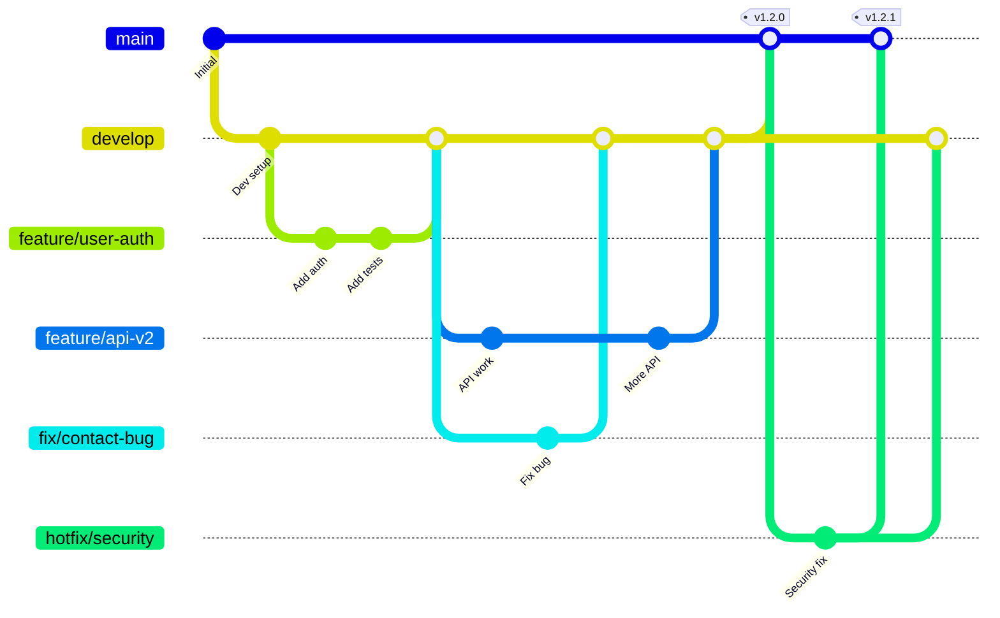

# Git Branching Strategy

This document outlines our Git branching strategy and workflow for the bjornmelin-platform-io project.

## 🎯 Overview

We follow a simplified Git Flow model that balances structure with development velocity. Our strategy is designed to:

- Maintain a stable production branch
- Enable parallel feature development
- Facilitate easy releases
- Support hotfixes when needed
- Integrate with CI/CD pipelines

## 🌳 Branch Structure



## 📌 Branch Types

### 1. Main Branches

#### `main`
- **Purpose**: Production-ready code
- **Protection**: Required PR reviews, passing tests
- **Deployment**: Auto-deploys to production
- **Direct commits**: Never allowed

#### `develop`
- **Purpose**: Integration branch for features
- **Protection**: Passing tests required
- **Deployment**: Auto-deploys to staging
- **Direct commits**: Only for emergencies

### 2. Supporting Branches

#### Feature Branches (`feature/*`)
- **Created from**: `develop`
- **Merged to**: `develop`
- **Naming**: `feature/description-with-hyphens`
- **Examples**: 
  - `feature/user-authentication`
  - `feature/payment-integration`
  - `feature/api-v2`

#### Bug Fix Branches (`fix/*`)
- **Created from**: `develop`
- **Merged to**: `develop`
- **Naming**: `fix/description-with-hyphens`
- **Examples**:
  - `fix/contact-form-validation`
  - `fix/memory-leak`

#### Hotfix Branches (`hotfix/*`)
- **Created from**: `main`
- **Merged to**: `main` AND `develop`
- **Naming**: `hotfix/description-with-hyphens`
- **Use case**: Critical production bugs
- **Examples**:
  - `hotfix/security-vulnerability`
  - `hotfix/payment-processing`

#### Release Branches (`release/*`)
- **Created from**: `develop`
- **Merged to**: `main` AND `develop`
- **Naming**: `release/version-number`
- **Examples**:
  - `release/1.2.0`
  - `release/2.0.0-beta.1`

#### Documentation Branches (`docs/*`)
- **Created from**: `develop`
- **Merged to**: `develop`
- **Naming**: `docs/description`
- **No deployment triggered**

#### Chore Branches (`chore/*`)
- **Created from**: `develop`
- **Merged to**: `develop`
- **Naming**: `chore/description`
- **Examples**:
  - `chore/update-dependencies`
  - `chore/cleanup-code`

## 🔄 Workflows

### Feature Development Workflow

```bash
# 1. Start from updated develop
git checkout develop
git pull origin develop

# 2. Create feature branch
git checkout -b feature/new-awesome-feature

# 3. Work on feature
# ... make changes ...
git add .
git commit -m "feat: add awesome feature"

# 4. Keep branch updated
git fetch origin
git rebase origin/develop

# 5. Push feature branch
git push origin feature/new-awesome-feature

# 6. Create Pull Request to develop
# Via GitHub UI
```

### Hotfix Workflow

```bash
# 1. Create from main
git checkout main
git pull origin main
git checkout -b hotfix/critical-bug

# 2. Fix the issue
# ... make changes ...
git add .
git commit -m "fix: resolve critical bug"

# 3. Push and create PR to main
git push origin hotfix/critical-bug

# 4. After merging to main, merge to develop
git checkout develop
git pull origin develop
git merge main
git push origin develop
```

### Release Workflow

```bash
# 1. Create release branch
git checkout develop
git pull origin develop
git checkout -b release/1.2.0

# 2. Bump version, update changelog
# ... version updates ...
git add .
git commit -m "chore: prepare release 1.2.0"

# 3. Test and fix any issues
# ... testing ...

# 4. Merge to main
git checkout main
git merge --no-ff release/1.2.0
git tag -a v1.2.0 -m "Release version 1.2.0"
git push origin main --tags

# 5. Back-merge to develop
git checkout develop
git merge --no-ff release/1.2.0
git push origin develop

# 6. Delete release branch
git branch -d release/1.2.0
git push origin --delete release/1.2.0
```

## 🏷️ Version Tagging

### Semantic Versioning

We follow [Semantic Versioning](https://semver.org/):

- **MAJOR.MINOR.PATCH** (e.g., 2.4.1)
- **MAJOR**: Breaking changes
- **MINOR**: New features (backward compatible)
- **PATCH**: Bug fixes

### Tag Format

```bash
# Production releases
v1.0.0
v1.2.3

# Pre-releases
v2.0.0-beta.1
v2.0.0-rc.1

# Creating tags
git tag -a v1.2.3 -m "Release version 1.2.3"
git push origin v1.2.3
```

## 🚦 Branch Rules & Policies

### Protection Rules

| Branch | Rule | Enforcement |
|--------|------|-------------|
| `main` | Require PR reviews (1+) | ✅ |
| `main` | Require status checks | ✅ |
| `main` | Dismiss stale reviews | ✅ |
| `main` | No force push | ✅ |
| `main` | No deletion | ✅ |
| `develop` | Require status checks | ✅ |
| `develop` | No force push | ✅ |

### Status Checks

Required checks before merging:
- ✅ Build passes
- ✅ Unit tests pass
- ✅ E2E tests pass
- ✅ Type checking passes
- ✅ Linting passes
- ✅ Security scan passes

## 🔀 Merge Strategies

### Feature → Develop
- **Strategy**: Squash and merge
- **Reason**: Clean history, single commit per feature
- **Commit message**: Use PR title

### Develop → Main
- **Strategy**: Create merge commit
- **Reason**: Preserve feature history
- **Commit message**: `chore: merge develop to main for release X.Y.Z`

### Hotfix → Main
- **Strategy**: Squash and merge
- **Reason**: Clean history for fixes
- **Commit message**: Use conventional format

### Main → Develop (back-merge)
- **Strategy**: Create merge commit
- **Reason**: Track production changes
- **Commit message**: `chore: back-merge main to develop`

## 📊 Best Practices

### 1. Branch Hygiene

```bash
# Delete local branches that are merged
git branch --merged | grep -v "\*\|main\|develop" | xargs -n 1 git branch -d

# Prune remote tracking branches
git remote prune origin

# List branches by last commit date
git for-each-ref --sort=-committerdate refs/heads/ --format='%(committerdate:short) %(refname:short)'
```

### 2. Rebasing vs Merging

- **Rebase**: For updating feature branches
- **Merge**: For integrating completed features

```bash
# Update feature branch (rebase)
git checkout feature/my-feature
git rebase develop

# Integrate feature (merge)
git checkout develop
git merge --no-ff feature/my-feature
```

### 3. Commit Organization

- Keep commits atomic and focused
- Use conventional commit format
- Squash WIP commits before PR

### 4. Branch Lifespan

- **Feature branches**: < 2 weeks
- **Release branches**: < 1 week
- **Hotfix branches**: < 1 day
- Delete branches after merging

## 🚨 Emergency Procedures

### Production Hotfix

1. **Identify**: Critical bug in production
2. **Create**: `hotfix/description` from `main`
3. **Fix**: Minimal changes only
4. **Test**: Manual verification
5. **Deploy**: Merge to `main`, tag, deploy
6. **Sync**: Merge to `develop`

### Rollback

```bash
# Revert last merge to main
git checkout main
git revert -m 1 HEAD
git push origin main

# Or reset to previous tag (dangerous!)
git checkout main
git reset --hard v1.2.2
git push --force-with-lease origin main
```

## 🔍 Troubleshooting

### Merge Conflicts

```bash
# During rebase
git rebase develop
# ... resolve conflicts ...
git add .
git rebase --continue

# Abort if needed
git rebase --abort
```

### Diverged Branches

```bash
# Feature branch diverged from develop
git checkout feature/my-feature
git rebase origin/develop
git push --force-with-lease origin feature/my-feature
```

### Wrong Base Branch

```bash
# Change base from main to develop
git rebase --onto develop main feature/my-feature
```

## 📈 Metrics & Monitoring

### Branch Health Indicators

- **Age**: Feature branches > 2 weeks need attention
- **Commits**: > 50 commits suggest branch is too large
- **Conflicts**: Frequent conflicts indicate poor coordination
- **Failed builds**: Address immediately

### Automation

Our CI/CD pipeline enforces:
- Branch naming conventions
- Commit message format
- Required reviews
- Automated testing
- Security scanning

## 🎯 Summary

This branching strategy provides:
1. **Clear structure** for different types of work
2. **Stable main branch** for production
3. **Integration branch** for feature development
4. **Quick hotfix** capability
5. **Clean history** through proper merging
6. **Automated enforcement** via CI/CD

Remember: The best branching strategy is one that the team follows consistently!