# Git Workflow Visual Guide

Visual representations of our Git workflow and development process.

## 🔄 Complete Development Workflow

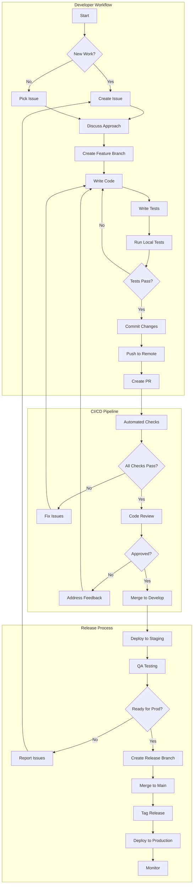

## 🌳 Git Branching Model

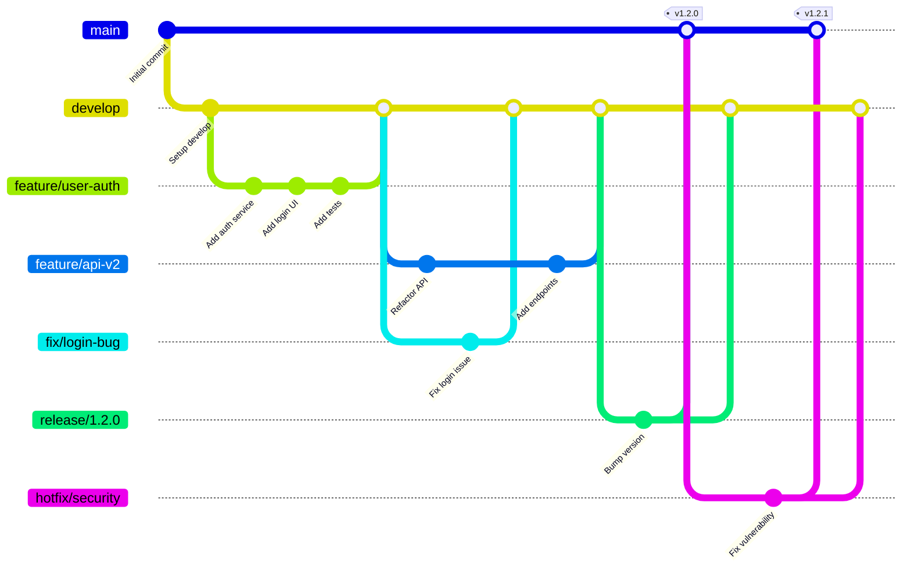

## 📊 PR Lifecycle

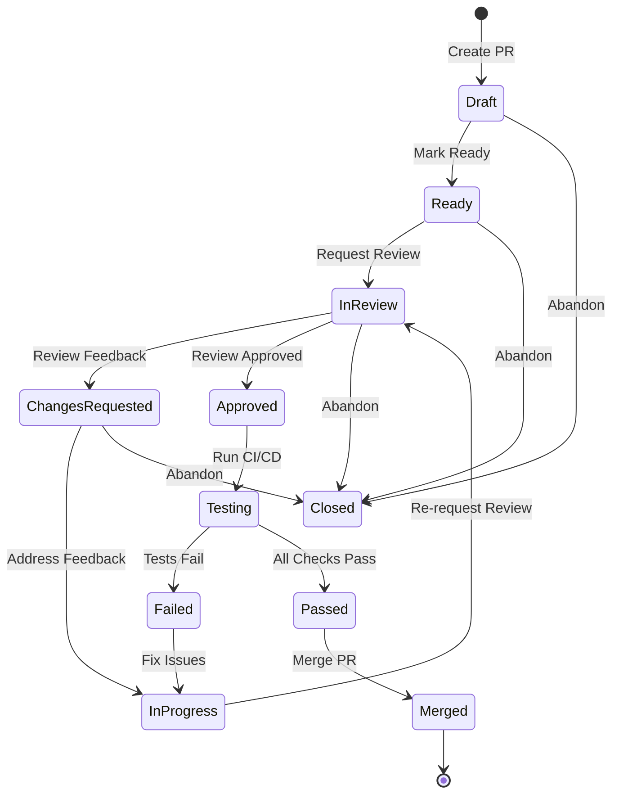

## 🚀 Deployment Pipeline

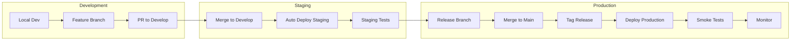

## 🔍 Code Review Process

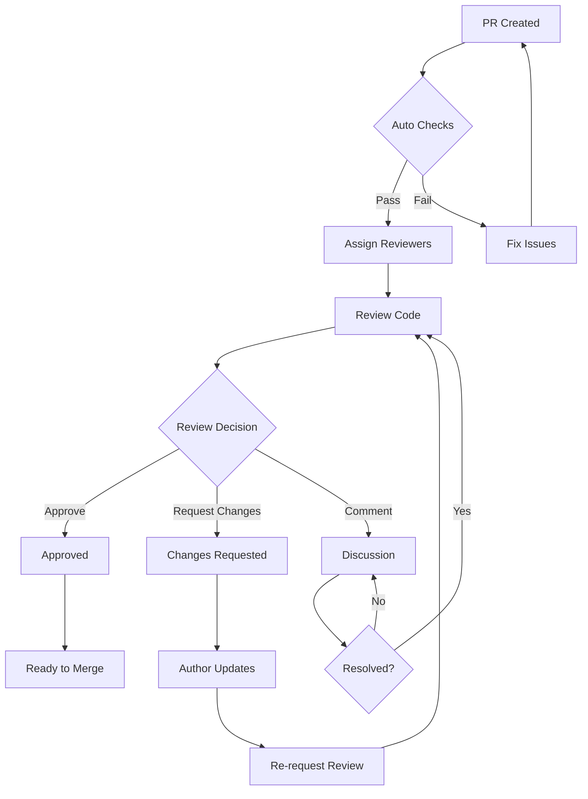

## 🧪 Testing Strategy

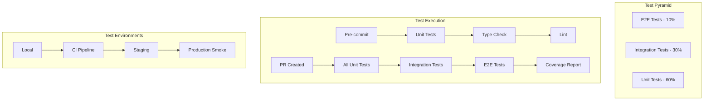

## 🔄 Hotfix Process

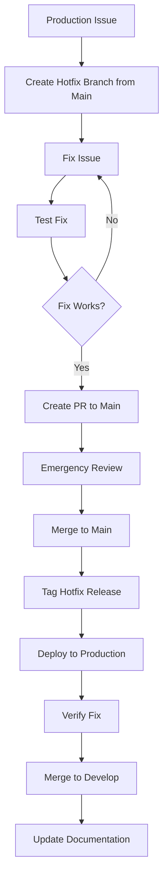

## 📈 Release Process

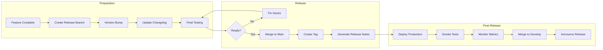

## 🎯 Commit Flow

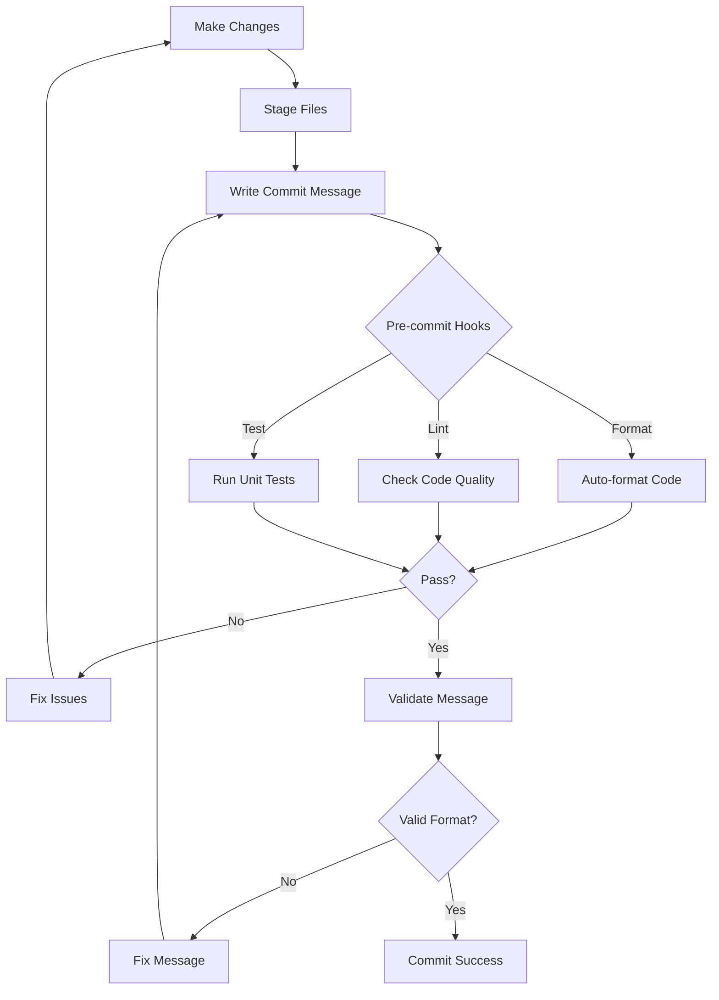

## 🔐 Security Workflow

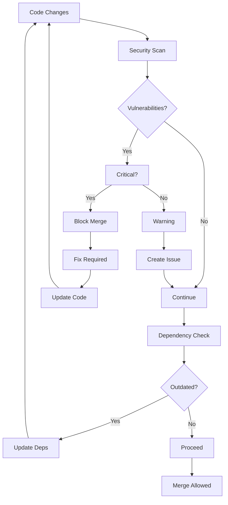

## 📋 Task Management Flow

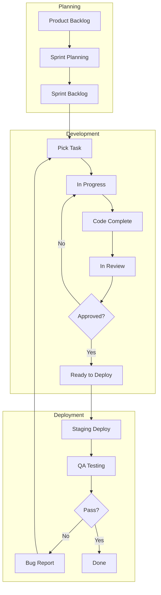

## 🏁 Quick Decision Tree

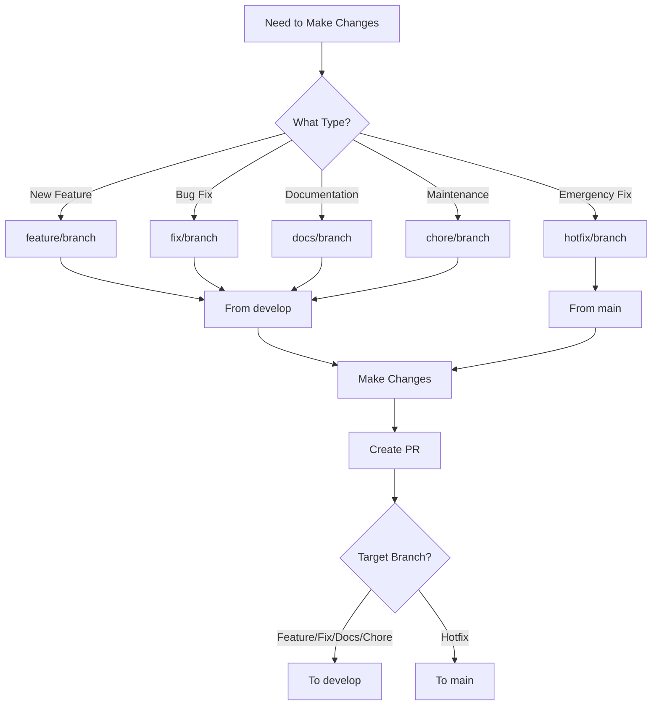

These diagrams provide a visual understanding of our development workflow, making it easier for team members to understand and follow our processes.