# API Gateway + Lambda Architecture - bjornmelin.io

## Overview

This document details the serverless API architecture for bjornmelin.io, focusing on the API Gateway and Lambda integration for handling contact form submissions. The architecture follows AWS serverless best practices with emphasis on security, performance, and cost optimization.

## High-Level API Architecture

```mermaid
graph TB
    %% API Gateway + Lambda Architecture
    subgraph ClientApplications ["Client Applications"]
        WebBrowser["Web Browser<br/>bjornmelin.io<br/>Contact Form UI"]
        MobileApp["Mobile App<br/>Future Implementation<br/>Cross-platform"]
        CLITools["CLI Tools<br/>Testing & Development<br/>API Integration"]
    end
    
    %% Transport Security Layer
    subgraph TransportSecurity ["Transport Security Layer"]
        HTTPS["HTTPS/TLS 1.2+<br/>End-to-End Encryption<br/>Certificate Validation"]
    end
    
    %% CloudFront CDN Layer
    subgraph CloudFrontCDN ["CloudFront CDN Layer"]
        CloudFront["CloudFront Distribution<br/>Global Edge Locations<br/>Performance & Security"]
        WAFIntegration["WAF Integration<br/>Web Application Firewall<br/>Attack Protection"]
        DDoSProtection["DDoS Protection<br/>AWS Shield Standard<br/>Traffic Filtering"]
        SSLTermination["SSL/TLS Termination<br/>Certificate Management<br/>ACM Integration"]
    end
    
    %% API Gateway Layer
    subgraph APIGatewayLayer ["API Gateway Layer"]
        APIGateway["API Gateway<br/>api.bjornmelin.io<br/>Regional Endpoint"]
        
        subgraph RequestPipeline ["Request Processing Pipeline"]
            Authentication["Authentication<br/>Future Implementation<br/>API Key Support"]
            Authorization["Authorization<br/>Future Role-based Access<br/>Permission Control"]
            RequestValidation["Request Validation<br/>Schema Validation<br/>Content-Type Checks"]
            RateLimiting["Rate Limiting<br/>2000 req/sec API<br/>100 req/sec per client"]
            CORSHandling["CORS Handling<br/>Origin Validation<br/>Preflight Support"]
            RequestTransformation["Request Transformation<br/>Header Injection<br/>Payload Processing"]
            Routing["Routing<br/>Path-based Routing<br/>Method Validation"]
        end
    end
    
    %% Lambda Function Layer
    subgraph LambdaLayer ["Lambda Function Layer"]
        LambdaFunction["Lambda Function<br/>Contact Form Handler<br/>Node.js 20.x ARM64"]
        InputValidation["Input Validation<br/>Sanitization & Schema<br/>XSS Prevention"]
        CSRFVerification["CSRF Token Verification<br/>Rolling Tokens<br/>Session Validation"]
        RateLimitCheck["Rate Limit Check<br/>Per-IP Tracking<br/>Sliding Window"]
        SpamDetection["Spam Detection<br/>Honeypot Fields<br/>Behavioral Analysis"]
        ConfigRetrieval["Config Retrieval<br/>Parameter Store Access<br/>KMS Decryption"]
        EmailIntegration["Email Service Integration<br/>Resend API Client<br/>Template Rendering"]
        ErrorHandling["Error Handling<br/>Structured Logging<br/>Graceful Degradation"]
        ResponseFormatting["Response Formatting<br/>JSON Structure<br/>CORS Headers"]
    end
    
    %% Backend Services Layer
    subgraph BackendServices ["Backend Services Layer"]
        ParameterStore["Parameter Store<br/>Secure Configuration<br/>Standard Tier"]
        CloudWatchMonitoring["CloudWatch<br/>Metrics & Logs<br/>Performance Tracking"]
        ResendAPI["Resend API<br/>External Email Service<br/>3k emails/month"]
    end
    
    %% Flow Connections - Client to Transport
    WebBrowser --> HTTPS
    MobileApp --> HTTPS
    CLITools --> HTTPS
    
    %% Transport to CloudFront
    HTTPS --> CloudFront
    
    %% CloudFront Internal Flow
    CloudFront --> WAFIntegration
    WAFIntegration --> DDoSProtection
    DDoSProtection --> SSLTermination
    
    %% CloudFront to API Gateway
    SSLTermination --> APIGateway
    
    %% API Gateway Processing Pipeline
    APIGateway --> RequestPipeline
    Authentication --> Authorization
    Authorization --> RequestValidation
    RequestValidation --> RateLimiting
    RateLimiting --> CORSHandling
    CORSHandling --> RequestTransformation
    RequestTransformation --> Routing
    
    %% API Gateway to Lambda
    Routing --> LambdaFunction
    
    %% Lambda Processing Pipeline
    LambdaFunction --> InputValidation
    InputValidation --> CSRFVerification
    CSRFVerification --> RateLimitCheck
    RateLimitCheck --> SpamDetection
    SpamDetection --> ConfigRetrieval
    ConfigRetrieval --> EmailIntegration
    EmailIntegration --> ErrorHandling
    ErrorHandling --> ResponseFormatting
    
    %% Lambda to Backend Services
    ConfigRetrieval --> ParameterStore
    LambdaFunction --> CloudWatchMonitoring
    EmailIntegration --> ResendAPI
    
    %% Response Flow (dotted lines)
    ResponseFormatting -.->|Success Response| APIGateway
    APIGateway -.->|JSON Response| CloudFront
    CloudFront -.->|HTTPS Response| ClientApplications
    
    %% Monitoring Flow
    CloudWatchMonitoring -.->|Metrics| APIGateway
    CloudWatchMonitoring -.->|Logs| LambdaFunction
    
    %% Styling
    classDef client fill:#e3f2fd,stroke:#1565c0,stroke-width:2px
    classDef security fill:#ffebee,stroke:#c62828,stroke-width:2px
    classDef cdn fill:#fff3e0,stroke:#ef6c00,stroke-width:2px
    classDef api fill:#f3e5f5,stroke:#6a1b9a,stroke-width:2px
    classDef lambda fill:#e8f5e8,stroke:#2e7d32,stroke-width:2px
    classDef backend fill:#fff8e1,stroke:#f57c00,stroke-width:2px
    
    class WebBrowser,MobileApp,CLITools client
    class HTTPS,WAFIntegration,DDoSProtection,SSLTermination security
    class CloudFront cdn
    class APIGateway,Authentication,Authorization,RequestValidation,RateLimiting,CORSHandling,RequestTransformation,Routing api
    class LambdaFunction,InputValidation,CSRFVerification,RateLimitCheck,SpamDetection,ConfigRetrieval,EmailIntegration,ErrorHandling,ResponseFormatting lambda
    class ParameterStore,CloudWatchMonitoring,ResendAPI backend
```



## API Gateway Configuration

### 1. REST API Setup

```text
┌─────────────────────────────────────────────────────────────────┐
│                      API Gateway Configuration                  │
├─────────────────────────────────────────────────────────────────┤
│                                                                 │
│  API Details:                                                   │
│  ┌─────────────────────────────────────────────────────────────┐ │
│  │ Name: prod-portfolio-api                                    │ │
│  │ Type: REST API (Regional)                                   │ │
│  │ Endpoint Type: Regional (cost optimized)                    │ │
│  │ Custom Domain: api.bjornmelin.io                            │ │
│  │ Certificate: ACM Certificate (*.bjornmelin.io)              │ │
│  │ Base Path Mapping: /                                        │ │
│  └─────────────────────────────────────────────────────────────┘ │
│                                                                 │
│  Resource Structure:                                            │
│  ┌─────────────────────────────────────────────────────────────┐ │
│  │ /                                                           │ │
│  │ ├── /contact                                                │ │
│  │ │   ├── POST (Lambda Integration)                           │ │
│  │ │   └── OPTIONS (CORS Preflight)                            │ │
│  │ ├── /health (Future)                                        │ │
│  │ │   └── GET (Health Check)                                  │ │
│  │ └── /api-docs (Future)                                      │ │
│  │     └── GET (OpenAPI Specification)                         │ │
│  └─────────────────────────────────────────────────────────────┘ │
│                                                                 │
│  Stage Configuration:                                           │
│  ┌─────────────────────────────────────────────────────────────┐ │
│  │ Stage Name: prod                                            │ │
│  │ Deployment: Automatic via CDK                               │ │
│  │ Cache: Disabled (dynamic content)                           │ │
│  │ Throttling:                                                 │ │
│  │ ├─ Burst Limit: 5000 requests                              │ │
│  │ ├─ Rate Limit: 2000 requests/second                        │ │
│  │ └─ Per-client: 100 requests/second                         │ │
│  │                                                             │ │
│  │ Logging:                                                    │ │
│  │ ├─ Access Logging: Enabled                                 │ │
│  │ ├─ Execution Logging: Enabled (INFO level)                 │ │
│  │ ├─ Data Trace: Disabled (no sensitive data logging)        │ │
│  │ └─ Metrics: Enabled                                         │ │
│  │                                                             │ │
│  │ X-Ray Tracing: Enabled                                      │ │
│  │ WAF: Associated (future enhancement)                        │ │
│  └─────────────────────────────────────────────────────────────┘ │
│                                                                 │
└─────────────────────────────────────────────────────────────────┘
```

### 2. Method Configuration Details

```text
┌─────────────────────────────────────────────────────────────────┐
│                    POST /contact Method                         │
├─────────────────────────────────────────────────────────────────┤
│                                                                 │
│  Method Request:                                                │
│  ┌─────────────────────────────────────────────────────────────┐ │
│  │ HTTP Method: POST                                           │ │
│  │ Authorization: None (handled in Lambda)                     │ │
│  │ API Key Required: No                                        │ │
│  │                                                             │ │
│  │ Request Headers:                                            │ │
│  │ ├─ Content-Type: Required (application/json)               │ │
│  │ ├─ X-CSRF-Token: Required                                  │ │
│  │ ├─ User-Agent: Optional (for spam detection)               │ │
│  │ └─ X-Forwarded-For: Captured (IP tracking)                 │ │
│  │                                                             │ │
│  │ Request Body Model:                                         │ │
│  │ {                                                           │ │
│  │   "$schema": "http://json-schema.org/draft-04/schema#",     │ │
│  │   "type": "object",                                         │ │
│  │   "properties": {                                           │ │
│  │     "name": {                                               │ │
│  │       "type": "string",                                     │ │
│  │       "minLength": 2,                                       │ │
│  │       "maxLength": 100                                      │ │
│  │     },                                                      │ │
│  │     "email": {                                              │ │
│  │       "type": "string",                                     │ │
│  │       "format": "email",                                    │ │
│  │       "maxLength": 100                                      │ │
│  │     },                                                      │ │
│  │     "message": {                                            │ │
│  │       "type": "string",                                     │ │
│  │       "minLength": 10,                                      │ │
│  │       "maxLength": 5000                                     │ │
│  │     },                                                      │ │
│  │     "csrfToken": {                                          │ │
│  │       "type": "string"                                      │ │
│  │     },                                                      │ │
│  │     "gdprConsent": {                                        │ │
│  │       "type": "boolean",                                    │ │
│  │       "enum": [true]                                        │ │
│  │     },                                                      │ │
│  │     "honeypot": {                                           │ │
│  │       "type": "string",                                     │ │
│  │       "maxLength": 0                                        │ │
│  │     }                                                       │ │
│  │   },                                                        │ │
│  │   "required": ["name", "email", "message", "csrfToken", "gdprConsent"] │ │
│  │ }                                                           │ │
│  └─────────────────────────────────────────────────────────────┘ │
│                                                                 │
│  Integration Request:                                           │
│  ┌─────────────────────────────────────────────────────────────┐ │
│  │ Integration Type: Lambda Proxy                              │ │
│  │ Lambda Function: contact-form-handler                       │ │
│  │ Integration Timeout: 29 seconds                             │ │
│  │ Passthrough Behavior: When no templates defined             │ │
│  │                                                             │ │
│  │ Request Templates: None (proxy integration)                 │ │
│  │ Request Parameters:                                         │ │
│  │ ├─ integration.request.header.X-Forwarded-For: context.identity.sourceIp │ │
│  │ └─ integration.request.header.User-Agent: context.identity.userAgent     │ │
│  └─────────────────────────────────────────────────────────────┘ │
│                                                                 │
│  Method Response:                                               │
│  ┌─────────────────────────────────────────────────────────────┐ │
│  │ Status Codes:                                               │ │
│  │ ├─ 200: Success                                             │ │
│  │ ├─ 400: Bad Request                                         │ │
│  │ ├─ 429: Too Many Requests                                   │ │
│  │ └─ 500: Internal Server Error                               │ │
│  │                                                             │ │
│  │ Response Headers:                                           │ │
│  │ ├─ Access-Control-Allow-Origin                              │ │
│  │ ├─ Access-Control-Allow-Methods                             │ │
│  │ ├─ Access-Control-Allow-Headers                             │ │
│  │ ├─ Content-Type                                             │ │
│  │ └─ X-Request-ID                                             │ │
│  │                                                             │ │
│  │ Response Models:                                            │ │
│  │ ├─ 200: SuccessResponse                                     │ │
│  │ ├─ 400: ErrorResponse                                       │ │
│  │ ├─ 429: RateLimitResponse                                   │ │
│  │ └─ 500: ErrorResponse                                       │ │
│  └─────────────────────────────────────────────────────────────┘ │
│                                                                 │
└─────────────────────────────────────────────────────────────────┘
```

### 3. CORS Configuration

```text
┌─────────────────────────────────────────────────────────────────┐
│                     CORS Configuration                          │
├─────────────────────────────────────────────────────────────────┤
│                                                                 │
│  OPTIONS /contact Method:                                       │
│  ┌─────────────────────────────────────────────────────────────┐ │
│  │ Purpose: CORS Preflight Request Handling                    │ │
│  │ Integration Type: Mock Integration                           │ │
│  │                                                             │ │
│  │ Integration Response:                                        │ │
│  │ ├─ Status Code: 200                                         │ │
│  │ ├─ Response Parameters:                                     │ │
│  │ │   ├─ Access-Control-Allow-Origin: 'https://bjornmelin.io' │ │
│  │ │   ├─ Access-Control-Allow-Methods: 'POST,OPTIONS'          │ │
│  │ │   ├─ Access-Control-Allow-Headers: 'Content-Type,X-CSRF-Token,X-Amz-Date,Authorization,X-Api-Key,X-Amz-Security-Token' │ │
│  │ │   ├─ Access-Control-Max-Age: '3600'                       │ │
│  │ │   └─ Access-Control-Allow-Credentials: 'false'            │ │
│  │ └─ Response Templates:                                      │ │
│  │     └─ application/json: '{}'                               │ │
│  └─────────────────────────────────────────────────────────────┘ │
│                                                                 │
│  CORS Policy Details:                                          │
│  ┌─────────────────────────────────────────────────────────────┐ │
│  │ Allowed Origins:                                            │ │
│  │ ├─ https://bjornmelin.io (Production)                       │ │
│  │ ├─ https://www.bjornmelin.io (WWW redirect)                 │ │
│  │ └─ http://localhost:3000 (Development - env specific)       │ │
│  │                                                             │ │
│  │ Allowed Methods:                                            │ │
│  │ ├─ POST (Form submissions)                                  │ │
│  │ └─ OPTIONS (Preflight requests)                             │ │
│  │                                                             │ │
│  │ Allowed Headers:                                            │ │
│  │ ├─ Content-Type (Required for JSON)                         │ │
│  │ ├─ X-CSRF-Token (CSRF protection)                           │ │
│  │ ├─ Authorization (Future authentication)                    │ │
│  │ └─ X-Api-Key (Future API key authentication)               │ │
│  │                                                             │ │
│  │ Security Considerations:                                    │ │
│  │ ├─ No wildcard origins (explicit domain list)              │ │
│  │ ├─ Credentials not allowed (credentials: false)             │ │
│  │ ├─ Limited headers (only necessary headers)                 │ │
│  │ └─ Short max-age (1 hour cache)                            │ │
│  └─────────────────────────────────────────────────────────────┘ │
│                                                                 │
└─────────────────────────────────────────────────────────────────┘
```

## Lambda Function Architecture

### 1. Function Configuration

```text
┌─────────────────────────────────────────────────────────────────┐
│                   Lambda Function Configuration                 │
├─────────────────────────────────────────────────────────────────┤
│                                                                 │
│  Basic Configuration:                                           │
│  ┌─────────────────────────────────────────────────────────────┐ │
│  │ Function Name: contact-form-handler                         │ │
│  │ Runtime: nodejs20.x                                         │ │
│  │ Architecture: arm64 (cost optimized)                        │ │
│  │ Handler: index.handler                                      │ │
│  │ Memory: 256 MB                                              │ │
│  │ Timeout: 30 seconds                                         │ │
│  │ Ephemeral Storage: 512 MB (default)                         │ │
│  │ Description: Handles contact form submissions               │ │
│  └─────────────────────────────────────────────────────────────┘ │
│                                                                 │
│  Environment Variables:                                         │
│  ┌─────────────────────────────────────────────────────────────┐ │
│  │ RESEND_PARAMETER_NAME: /portfolio/prod/resend/api-key       │ │
│  │ ENVIRONMENT: prod                                           │ │
│  │ AWS_REGION: us-east-1                                       │ │
│  │ NODE_ENV: production                                        │ │
│  │ LOG_LEVEL: INFO                                             │ │
│  │ RATE_LIMIT_ENABLED: true                                    │ │
│  │ SPAM_DETECTION_ENABLED: true                                │ │
│  │ CSRF_ENABLED: true                                          │ │
│  └─────────────────────────────────────────────────────────────┘ │
│                                                                 │
│  VPC Configuration:                                             │
│  ┌─────────────────────────────────────────────────────────────┐ │
│  │ VPC: None (public subnet not required)                      │ │
│  │ Subnet: N/A                                                 │ │
│  │ Security Groups: N/A                                        │ │
│  │ Note: Uses NAT Gateway for internet access if VPC required  │ │
│  └─────────────────────────────────────────────────────────────┘ │
│                                                                 │
│  Dead Letter Queue:                                             │
│  ┌─────────────────────────────────────────────────────────────┐ │
│  │ Type: SQS Queue                                             │ │
│  │ Name: contact-form-dlq                                      │ │
│  │ Purpose: Failed invocation handling                         │ │
│  │ Retention: 14 days                                          │ │
│  │ Redrive Policy: 3 attempts                                  │ │
│  └─────────────────────────────────────────────────────────────┘ │
│                                                                 │
│  Reserved Concurrency:                                         │
│  ┌─────────────────────────────────────────────────────────────┐ │
│  │ Concurrency Limit: 10 (cost control)                       │ │
│  │ Purpose: Prevent runaway costs                              │ │
│  │ Reasoning: Contact form doesn't need high concurrency       │ │
│  │ Provisioned Concurrency: None (cost optimization)           │ │
│  └─────────────────────────────────────────────────────────────┘ │
│                                                                 │
└─────────────────────────────────────────────────────────────────┘
```

### 2. Function Code Architecture

```text
┌─────────────────────────────────────────────────────────────────┐
│                    Lambda Function Code Structure               │
├─────────────────────────────────────────────────────────────────┤
│                                                                 │
│  File Structure:                                                │
│  ┌─────────────────────────────────────────────────────────────┐ │
│  │ lambda/                                                     │ │
│  │ ├── index.ts                    // Main handler             │ │
│  │ ├── lib/                                                    │ │
│  │ │   ├── email-service.ts         // Email service wrapper   │ │
│  │ │   ├── validation.ts            // Input validation        │ │
│  │ │   ├── security.ts              // Security utilities      │ │
│  │ │   ├── rate-limiter.ts          // Rate limiting logic     │ │
│  │ │   ├── spam-detector.ts         // Spam detection          │ │
│  │ │   ├── csrf.ts                  // CSRF token handling     │ │
│  │ │   ├── logger.ts                // Structured logging      │ │
│  │ │   └── metrics.ts               // CloudWatch metrics      │ │
│  │ ├── types/                                                  │ │
│  │ │   ├── api.ts                   // API type definitions    │ │
│  │ │   ├── email.ts                 // Email type definitions  │ │
│  │ │   └── security.ts              // Security type definitions │ │
│  │ ├── config/                                                 │ │
│  │ │   ├── environment.ts           // Environment configuration │ │
│  │ │   └── constants.ts             // Application constants   │ │
│  │ ├── __tests__/                                              │ │
│  │ │   ├── index.test.ts            // Handler tests           │ │
│  │ │   ├── email-service.test.ts    // Email service tests     │ │
│  │ │   ├── validation.test.ts       // Validation tests        │ │
│  │ │   └── security.test.ts         // Security tests          │ │
│  │ ├── package.json                                            │ │
│  │ ├── tsconfig.json                                           │ │
│  │ └── webpack.config.js            // Build configuration     │ │
│  └─────────────────────────────────────────────────────────────┘ │
│                                                                 │
│  Main Handler Flow:                                             │
│  ┌─────────────────────────────────────────────────────────────┐ │
│  │ export const handler = async (event, context) => {          │ │
│  │   // 1. Initialize services and logging                     │ │
│  │   const logger = new Logger(context);                       │ │
│  │   const metrics = new Metrics();                            │ │
│  │                                                             │ │
│  │   try {                                                     │ │
│  │     // 2. CORS handling for OPTIONS requests               │ │
│  │     if (event.httpMethod === 'OPTIONS') {                  │ │
│  │       return createCorsResponse();                          │ │
│  │     }                                                       │ │
│  │                                                             │ │
│  │     // 3. Method validation                                 │ │
│  │     if (event.httpMethod !== 'POST') {                     │ │
│  │       return createErrorResponse(405, 'Method not allowed'); │ │
│  │     }                                                       │ │
│  │                                                             │ │
│  │     // 4. Parse and validate request body                   │ │
│  │     const body = JSON.parse(event.body || '{}');           │ │
│  │     const validation = validateContactForm(body);           │ │
│  │     if (!validation.isValid) {                             │ │
│  │       return createErrorResponse(400, validation.errors);   │ │
│  │     }                                                       │ │
│  │                                                             │ │
│  │     // 5. Security checks                                   │ │
│  │     await performSecurityChecks(body, event, logger);       │ │
│  │                                                             │ │
│  │     // 6. Rate limiting                                     │ │
│  │     await checkRateLimit(event.requestContext.identity.sourceIp); │ │
│  │                                                             │ │
│  │     // 7. Spam detection                                    │ │
│  │     const spamScore = await detectSpam(body);               │ │
│  │     if (spamScore > SPAM_THRESHOLD) {                       │ │
│  │       logger.warn('Spam detected', { spamScore });          │ │
│  │       return createErrorResponse(400, 'Invalid submission'); │ │
│  │     }                                                       │ │
│  │                                                             │ │
│  │     // 8. Send email                                        │ │
│  │     const emailService = EmailService.getInstance();        │ │
│  │     const result = await emailService.sendContactFormEmail(body); │ │
│  │                                                             │ │
│  │     // 9. Record metrics and log success                    │ │
│  │     metrics.recordEmailSent();                              │ │
│  │     logger.info('Email sent successfully', { messageId: result.messageId }); │ │
│  │                                                             │ │
│  │     // 10. Return success response                          │ │
│  │     return createSuccessResponse({                          │ │
│  │       message: 'Thank you for your message!',              │ │
│  │       messageId: result.messageId                           │ │
│  │     });                                                     │ │
│  │                                                             │ │
│  │   } catch (error) {                                         │ │
│  │     // Error handling and logging                           │ │
│  │     logger.error('Handler error', error);                   │ │
│  │     metrics.recordError(error);                             │ │
│  │     return createErrorResponse(500, 'Internal server error'); │ │
│  │   }                                                         │ │
│  │ };                                                          │ │
│  └─────────────────────────────────────────────────────────────┘ │
│                                                                 │
└─────────────────────────────────────────────────────────────────┘
```

### 3. Performance Optimization

```text
┌─────────────────────────────────────────────────────────────────┐
│                     Performance Optimization                    │
├─────────────────────────────────────────────────────────────────┤
│                                                                 │
│  Cold Start Optimization:                                       │
│  ┌─────────────────────────────────────────────────────────────┐ │
│  │ ARM64 Architecture:                                         │ │
│  │ ├─ 20% better price performance vs x86                      │ │
│  │ ├─ Faster cold start times                                  │ │
│  │ └─ Lower memory usage                                       │ │
│  │                                                             │ │
│  │ Bundle Optimization:                                        │ │
│  │ ├─ Webpack bundle minimization                              │ │
│  │ ├─ Tree shaking for unused code removal                     │ │
│  │ ├─ ES modules for better optimization                       │ │
│  │ └─ External dependencies as layers (future)                 │ │
│  │                                                             │ │
│  │ Code Optimization:                                          │ │
│  │ ├─ Async/await for non-blocking I/O                        │ │
│  │ ├─ Connection pooling for HTTP clients                      │ │
│  │ ├─ Singleton pattern for service instances                  │ │
│  │ └─ Lazy loading of non-critical modules                     │ │
│  └─────────────────────────────────────────────────────────────┘ │
│                                                                 │
│  Memory Optimization:                                           │
│  ┌─────────────────────────────────────────────────────────────┐ │
│  │ Memory Allocation: 256 MB                                   │ │
│  │ ├─ Sufficient for JSON processing                           │ │
│  │ ├─ Adequate for HTTP client operations                      │ │
│  │ ├─ Buffer for Parameter Store caching                       │ │
│  │ └─ Cost-optimized for expected workload                     │ │
│  │                                                             │ │
│  │ Memory Management:                                          │ │
│  │ ├─ Garbage collection optimization                          │ │
│  │ ├─ Object pooling for frequent allocations                  │ │
│  │ ├─ Stream processing for large payloads                     │ │
│  │ └─ Memory profiling in development                          │ │
│  └─────────────────────────────────────────────────────────────┘ │
│                                                                 │
│  Caching Strategy:                                              │
│  ┌─────────────────────────────────────────────────────────────┐ │
│  │ Parameter Store Configuration:                              │ │
│  │ ├─ Cache Duration: 1 hour                                   │ │
│  │ ├─ In-memory cache with expiration                          │ │
│  │ ├─ Global variable reuse across invocations                 │ │
│  │ └─ Cache invalidation on errors                             │ │
│  │                                                             │ │
│  │ HTTP Client Caching:                                        │ │
│  │ ├─ Keep-alive connections                                   │ │
│  │ ├─ DNS lookup caching                                       │ │
│  │ ├─ Connection pool reuse                                    │ │
│  │ └─ TLS session resumption                                   │ │
│  │                                                             │ │
│  │ Rate Limiting Cache:                                        │ │
│  │ ├─ In-memory sliding window                                 │ │
│  │ ├─ Efficient cleanup of expired entries                     │ │
│  │ ├─ Memory-bounded cache size                                │ │
│  │ └─ Fallback to DynamoDB (future)                           │ │
│  └─────────────────────────────────────────────────────────────┘ │
│                                                                 │
└─────────────────────────────────────────────────────────────────┘
```

## Integration Patterns

### 1. Parameter Store Integration

```text
┌─────────────────────────────────────────────────────────────────┐
│                  Parameter Store Integration                     │
├─────────────────────────────────────────────────────────────────┤
│                                                                 │
│  Configuration Retrieval Pattern:                              │
│  ┌─────────────────────────────────────────────────────────────┐ │
│  │ class ConfigurationService {                                │ │
│  │   private static instance: ConfigurationService;            │ │
│  │   private config: EmailConfig | null = null;               │ │
│  │   private configExpiry = 0;                                │ │
│  │   private readonly CACHE_DURATION = 3600000; // 1 hour     │ │
│  │                                                             │ │
│  │   static getInstance(): ConfigurationService {              │ │
│  │     if (!ConfigurationService.instance) {                  │ │
│  │       ConfigurationService.instance = new ConfigurationService(); │ │
│  │     }                                                       │ │
│  │     return ConfigurationService.instance;                  │ │
│  │   }                                                         │ │
│  │                                                             │ │
│  │   async getEmailConfig(): Promise<EmailConfig> {           │ │
│  │     const now = Date.now();                                │ │
│  │                                                             │ │
│  │     // Return cached config if still valid                 │ │
│  │     if (this.config && now < this.configExpiry) {          │ │
│  │       return this.config;                                  │ │
│  │     }                                                       │ │
│  │                                                             │ │
│  │     // Fetch fresh config from Parameter Store             │ │
│  │     try {                                                   │ │
│  │       const parameterName = process.env.RESEND_PARAMETER_NAME; │ │
│  │       const command = new GetParameterCommand({            │ │
│  │         Name: parameterName,                               │ │
│  │         WithDecryption: true                               │ │
│  │       });                                                  │ │
│  │                                                             │ │
│  │       const response = await this.ssmClient.send(command); │ │
│  │       this.config = JSON.parse(response.Parameter!.Value!); │ │
│  │       this.configExpiry = now + this.CACHE_DURATION;       │ │
│  │                                                             │ │
│  │       return this.config;                                  │ │
│  │     } catch (error) {                                      │ │
│  │       logger.error('Failed to retrieve configuration', error); │ │
│  │       throw new Error('Configuration service unavailable'); │ │
│  │     }                                                       │ │
│  │   }                                                         │ │
│  │ }                                                           │ │
│  └─────────────────────────────────────────────────────────────┘ │
│                                                                 │
│  Error Handling Strategy:                                       │
│  ┌─────────────────────────────────────────────────────────────┐ │
│  │ Retry Logic:                                                │ │
│  │ ├─ Exponential backoff: 100ms, 200ms, 400ms                │ │
│  │ ├─ Maximum retries: 3 attempts                             │ │
│  │ ├─ Jitter: Random delay to prevent thundering herd         │ │
│  │ └─ Circuit breaker: Stop retries after consecutive failures │ │
│  │                                                             │ │
│  │ Fallback Strategy:                                          │ │
│  │ ├─ Use cached config if available (even expired)           │ │
│  │ ├─ Graceful degradation: Disable email service             │ │
│  │ ├─ User-friendly error messages                             │ │
│  │ └─ Alert operators via CloudWatch alarms                   │ │
│  │                                                             │ │
│  │ Security Considerations:                                    │ │
│  │ ├─ Never log decrypted parameter values                    │ │
│  │ ├─ Clear sensitive data from memory on error               │ │
│  │ ├─ Validate parameter format before use                    │ │
│  │ └─ Monitor for unusual access patterns                     │ │
│  └─────────────────────────────────────────────────────────────┘ │
│                                                                 │
└─────────────────────────────────────────────────────────────────┘
```

### 2. Email Service Integration

```text
┌─────────────────────────────────────────────────────────────────┐
│                    Email Service Integration                     │
├─────────────────────────────────────────────────────────────────┤
│                                                                 │
│  Resend API Integration Pattern:                                │
│  ┌─────────────────────────────────────────────────────────────┐ │
│  │ class EmailService {                                        │ │
│  │   private resendClient: Resend | null = null;              │ │
│  │   private configService: ConfigurationService;             │ │
│  │                                                             │ │
│  │   constructor() {                                           │ │
│  │     this.configService = ConfigurationService.getInstance(); │ │
│  │   }                                                         │ │
│  │                                                             │ │
│  │   private async getResendClient(): Promise<Resend> {        │ │
│  │     if (!this.resendClient) {                              │ │
│  │       const config = await this.configService.getEmailConfig(); │ │
│  │       this.resendClient = new Resend(config.apiKey);       │ │
│  │     }                                                       │ │
│  │     return this.resendClient;                              │ │
│  │   }                                                         │ │
│  │                                                             │ │
│  │   async sendContactFormEmail(data: ContactFormData): Promise<EmailResult> { │ │
│  │     const config = await this.configService.getEmailConfig(); │ │
│  │     const resend = await this.getResendClient();           │ │
│  │                                                             │ │
│  │     const emailPayload = {                                 │ │
│  │       from: config.fromEmail,                              │ │
│  │       to: ['bjornmelin16@gmail.com'],                      │ │
│  │       subject: `Contact Form: Message from ${data.name}`,  │ │
│  │       html: this.generateEmailHtml(data),                  │ │
│  │       text: this.generateEmailText(data),                  │ │
│  │       reply_to: data.email                                 │ │
│  │     };                                                      │ │
│  │                                                             │ │
│  │     try {                                                   │ │
│  │       const result = await this.sendWithRetry(resend, emailPayload); │ │
│  │       return {                                              │ │
│  │         success: true,                                      │ │
│  │         messageId: result.id,                               │ │
│  │         timestamp: new Date().toISOString()                 │ │
│  │       };                                                    │ │
│  │     } catch (error) {                                      │ │
│  │       logger.error('Email sending failed', error);         │ │
│  │       throw new EmailServiceError('Failed to send email'); │ │
│  │     }                                                       │ │
│  │   }                                                         │ │
│  │                                                             │ │
│  │   private async sendWithRetry(resend: Resend, payload: any): Promise<any> { │ │
│  │     const maxRetries = 3;                                   │ │
│  │     let lastError: Error;                                   │ │
│  │                                                             │ │
│  │     for (let attempt = 1; attempt <= maxRetries; attempt++) { │ │
│  │       try {                                                 │ │
│  │         return await resend.emails.send(payload);          │ │
│  │       } catch (error) {                                    │ │
│  │         lastError = error as Error;                        │ │
│  │                                                             │ │
│  │         // Don't retry on 4xx errors (client errors)       │ │
│  │         if (error.status && error.status >= 400 && error.status < 500) { │ │
│  │           throw error;                                      │ │
│  │         }                                                   │ │
│  │                                                             │ │
│  │         // Wait before retry with exponential backoff      │ │
│  │         if (attempt < maxRetries) {                        │ │
│  │           const delay = Math.pow(2, attempt) * 1000;       │ │
│  │           await new Promise(resolve => setTimeout(resolve, delay)); │ │
│  │         }                                                   │ │
│  │       }                                                     │ │
│  │     }                                                       │ │
│  │                                                             │ │
│  │     throw lastError!;                                       │ │
│  │   }                                                         │ │
│  │ }                                                           │ │
│  └─────────────────────────────────────────────────────────────┘ │
│                                                                 │
└─────────────────────────────────────────────────────────────────┘
```

### 3. Monitoring Integration

```text
┌─────────────────────────────────────────────────────────────────┐
│                    Monitoring Integration                        │
├─────────────────────────────────────────────────────────────────┤
│                                                                 │
│  CloudWatch Metrics Integration:                                │
│  ┌─────────────────────────────────────────────────────────────┐ │
│  │ class MetricsService {                                      │ │
│  │   private cloudWatchClient: CloudWatchClient;              │ │
│  │   private readonly namespace = 'Portfolio/EmailService';   │ │
│  │                                                             │ │
│  │   constructor() {                                           │ │
│  │     this.cloudWatchClient = new CloudWatchClient({         │ │
│  │       region: process.env.AWS_REGION                       │ │
│  │     });                                                     │ │
│  │   }                                                         │ │
│  │                                                             │ │
│  │   async recordEmailSent(success: boolean = true): Promise<void> { │ │
│  │     const metricData = [                                    │ │
│  │       {                                                     │ │
│  │         MetricName: success ? 'EmailsSent' : 'EmailsFailed', │ │
│  │         Value: 1,                                           │ │
│  │         Unit: 'Count',                                      │ │
│  │         Dimensions: [                                       │ │
│  │           {                                                 │ │
│  │             Name: 'Environment',                            │ │
│  │             Value: process.env.ENVIRONMENT || 'unknown'     │ │
│  │           },                                                │ │
│  │           {                                                 │ │
│  │             Name: 'Service',                                │ │
│  │             Value: 'ContactForm'                            │ │
│  │           }                                                 │ │
│  │         ],                                                  │ │
│  │         Timestamp: new Date()                               │ │
│  │       }                                                     │ │
│  │     ];                                                      │ │
│  │                                                             │ │
│  │     try {                                                   │ │
│  │       await this.cloudWatchClient.send(                    │ │
│  │         new PutMetricDataCommand({                          │ │
│  │           Namespace: this.namespace,                        │ │
│  │           MetricData: metricData                            │ │
│  │         })                                                  │ │
│  │       );                                                    │ │
│  │     } catch (error) {                                      │ │
│  │       // Don't throw - metrics failures shouldn't break the main flow │ │
│  │       logger.warn('Failed to record metrics', error);      │ │
│  │     }                                                       │ │
│  │   }                                                         │ │
│  │                                                             │ │
│  │   async recordResponseTime(duration: number): Promise<void> { │ │
│  │     const metricData = [{                                   │ │
│  │       MetricName: 'ResponseTime',                           │ │
│  │       Value: duration,                                      │ │
│  │       Unit: 'Milliseconds',                                 │ │
│  │       Dimensions: [                                         │ │
│  │         {                                                   │ │
│  │           Name: 'Environment',                              │ │
│  │           Value: process.env.ENVIRONMENT || 'unknown'       │ │
│  │         }                                                   │ │
│  │       ],                                                    │ │
│  │       Timestamp: new Date()                                 │ │
│  │     }];                                                     │ │
│  │                                                             │ │
│  │     try {                                                   │ │
│  │       await this.cloudWatchClient.send(                    │ │
│  │         new PutMetricDataCommand({                          │ │
│  │           Namespace: this.namespace,                        │ │
│  │           MetricData: metricData                            │ │
│  │         })                                                  │ │
│  │       );                                                    │ │
│  │     } catch (error) {                                      │ │
│  │       logger.warn('Failed to record response time', error); │ │
│  │     }                                                       │ │
│  │   }                                                         │ │
│  │ }                                                           │ │
│  └─────────────────────────────────────────────────────────────┘ │
│                                                                 │
│  X-Ray Tracing Integration:                                     │
│  ┌─────────────────────────────────────────────────────────────┐ │
│  │ import AWSXRay from 'aws-xray-sdk-core';                   │ │
│  │ import AWS from 'aws-sdk';                                  │ │
│  │                                                             │ │
│  │ // Instrument AWS SDK calls                                 │ │
│  │ const AWSCaptured = AWSXRay.captureAWS(AWS);               │ │
│  │                                                             │ │
│  │ // Create custom subsegments for business logic             │ │
│  │ const segment = AWSXRay.getSegment();                       │ │
│  │ const subsegment = segment?.addNewSubsegment('EmailService'); │ │
│  │                                                             │ │
│  │ try {                                                       │ │
│  │   // Your business logic here                               │ │
│  │   const result = await emailService.sendEmail(data);       │ │
│  │   subsegment?.addMetadata('email', {                        │ │
│  │     messageId: result.messageId,                            │ │
│  │     success: true                                           │ │
│  │   });                                                       │ │
│  │ } catch (error) {                                          │ │
│  │   subsegment?.addError(error);                              │ │
│  │   throw error;                                              │ │
│  │ } finally {                                                 │ │
│  │   subsegment?.close();                                      │ │
│  │ }                                                           │ │
│  └─────────────────────────────────────────────────────────────┘ │
│                                                                 │
└─────────────────────────────────────────────────────────────────┘
```

## Error Handling & Resilience

### 1. Error Response Patterns

```text
┌─────────────────────────────────────────────────────────────────┐
│                      Error Handling Patterns                    │
├─────────────────────────────────────────────────────────────────┤
│                                                                 │
│  API Gateway Error Responses:                                   │
│  ┌─────────────────────────────────────────────────────────────┐ │
│  │ function createErrorResponse(statusCode: number, message: string) { │ │
│  │   return {                                                  │ │
│  │     statusCode,                                             │ │
│  │     headers: {                                              │ │
│  │       'Content-Type': 'application/json',                  │ │
│  │       'Access-Control-Allow-Origin': 'https://bjornmelin.io', │ │
│  │       'Access-Control-Allow-Methods': 'POST, OPTIONS',      │ │
│  │       'Access-Control-Allow-Headers': 'Content-Type, X-CSRF-Token', │ │
│  │       'X-Request-ID': context.awsRequestId                  │ │
│  │     },                                                      │ │
│  │     body: JSON.stringify({                                  │ │
│  │       error: {                                              │ │
│  │         code: getErrorCode(statusCode),                     │ │
│  │         message: message,                                   │ │
│  │         timestamp: new Date().toISOString(),                │ │
│  │         requestId: context.awsRequestId                     │ │
│  │       }                                                     │ │
│  │     })                                                      │ │
│  │   };                                                        │ │
│  │ }                                                           │ │
│  │                                                             │ │
│  │ Error Code Mapping:                                         │ │
│  │ ├─ 400: VALIDATION_ERROR                                    │ │
│  │ ├─ 401: AUTHENTICATION_REQUIRED                             │ │
│  │ ├─ 403: FORBIDDEN                                           │ │
│  │ ├─ 405: METHOD_NOT_ALLOWED                                  │ │
│  │ ├─ 429: RATE_LIMIT_EXCEEDED                                 │ │
│  │ ├─ 500: INTERNAL_SERVER_ERROR                               │ │
│  │ ├─ 502: BAD_GATEWAY                                         │ │
│  │ ├─ 503: SERVICE_UNAVAILABLE                                 │ │
│  │ └─ 504: GATEWAY_TIMEOUT                                     │ │
│  └─────────────────────────────────────────────────────────────┘ │
│                                                                 │
│  Circuit Breaker Pattern:                                       │
│  ┌─────────────────────────────────────────────────────────────┐ │
│  │ class CircuitBreaker {                                      │ │
│  │   private failureCount = 0;                                 │ │
│  │   private lastFailureTime = 0;                              │ │
│  │   private state: 'CLOSED' | 'OPEN' | 'HALF_OPEN' = 'CLOSED'; │ │
│  │                                                             │ │
│  │   private readonly failureThreshold = 5;                   │ │
│  │   private readonly timeout = 60000; // 1 minute            │ │
│  │                                                             │ │
│  │   async execute<T>(operation: () => Promise<T>): Promise<T> { │ │
│  │     if (this.state === 'OPEN') {                           │ │
│  │       if (Date.now() - this.lastFailureTime > this.timeout) { │ │
│  │         this.state = 'HALF_OPEN';                           │ │
│  │       } else {                                              │ │
│  │         throw new Error('Circuit breaker is OPEN');        │ │
│  │       }                                                     │ │
│  │     }                                                       │ │
│  │                                                             │ │
│  │     try {                                                   │ │
│  │       const result = await operation();                    │ │
│  │       this.onSuccess();                                     │ │
│  │       return result;                                        │ │
│  │     } catch (error) {                                      │ │
│  │       this.onFailure();                                     │ │
│  │       throw error;                                          │ │
│  │     }                                                       │ │
│  │   }                                                         │ │
│  │                                                             │ │
│  │   private onSuccess(): void {                               │ │
│  │     this.failureCount = 0;                                 │ │
│  │     this.state = 'CLOSED';                                 │ │
│  │   }                                                         │ │
│  │                                                             │ │
│  │   private onFailure(): void {                               │ │
│  │     this.failureCount++;                                   │ │
│  │     this.lastFailureTime = Date.now();                     │ │
│  │                                                             │ │
│  │     if (this.failureCount >= this.failureThreshold) {      │ │
│  │       this.state = 'OPEN';                                 │ │
│  │     }                                                       │ │
│  │   }                                                         │ │
│  │ }                                                           │ │
│  └─────────────────────────────────────────────────────────────┘ │
│                                                                 │
└─────────────────────────────────────────────────────────────────┘
```

## Cost Optimization

### Monthly Cost Analysis

```text
Component                    | Cost    | Notes
----------------------------|---------|---------------------------
API Gateway Requests        | $0.00   | Free tier: 1M requests/month
Lambda Invocations          | $0.00   | Free tier: 1M invocations/month
Lambda Duration (ARM64)     | $0.20   | ARM64 20% cost reduction
API Gateway Data Transfer   | $0.50   | Minimal data transfer
CloudWatch Logs            | $0.30   | 7-day retention
X-Ray Tracing              | $0.10   | Minimal trace volume
Dead Letter Queue (SQS)    | $0.00   | Free tier coverage
Custom Domain Certificate  | $0.00   | ACM certificates free
----------------------------|---------|---------------------------
Total Monthly Cost         | $1.10   | Estimated API/Lambda costs
```

### Scaling Considerations

- **Request Volume**: Current architecture supports 2,000 requests/second
- **Concurrency**: Limited to 10 concurrent executions (cost control)
- **Memory**: 256 MB optimal for current workload
- **Cold Starts**: ARM64 and optimization reduce cold start impact
- **Cost Alerts**: CloudWatch billing alarms at $5/month threshold

## Related Documentation

This API Gateway + Lambda architecture document is part of a comprehensive documentation suite:

### Architecture Documentation Suite

- **[Architecture Overview](./architecture-overview.md)** - Comprehensive system architecture and design principles
- **[Email Service Architecture](./email-service-architecture.md)** - Detailed email service flow and technical specifications
- **[Security Architecture](./security-architecture.md)** - Defense-in-depth security layers and compliance
- **[DNS Configuration Guide](./dns-configuration-guide.md)** - Complete DNS setup and email authentication

### Implementation Guides

- **[Email Infrastructure Guide](./email-infrastructure-guide.md)** - Complete email service implementation with AWS
- **[Application Integration Examples](./application-integration-examples.md)** - Code examples for Lambda and frontend integration
- **[Resend Complete Setup Guide](../deployment/resend-complete-setup-guide.md)** - Comprehensive deployment instructions

### Operational Documentation

- **[Security Audit Checklist](./security-audit-checklist.md)** - Security review and compliance checklist
- **[AWS Free Tier Optimization Guide](./aws-free-tier-optimization-2025.md)** - Cost optimization strategies

---

*This API Gateway + Lambda architecture documentation provides comprehensive technical details for the serverless API implementation. For deployment instructions, see the CDK infrastructure code and deployment guides.*
