# Application Integration Examples

> **📋 Architecture Reference**: For detailed implementation patterns and security considerations, see the [Email Service Architecture](./email-service-architecture.md) and [API Gateway + Lambda Architecture](./api-lambda-architecture.md) documentation.

## Application Integration Architecture

The following diagram shows the comprehensive application integration architecture and data flow:


### Email Service Processing Flow

```mermaid
sequenceDiagram
    participant Client as 🌐 Client Application
    participant API as 🚪 API Gateway
    participant Lambda as ⚡ Lambda Function
    participant EmailSvc as 📧 EmailService
    participant ParamStore as 🔒 Parameter Store
    participant KMS as 🔑 KMS
    participant Resend as 📨 Resend API
    participant Recipient as 📬 Email Recipient
    participant CW as 📊 CloudWatch
    
    Note over Client,CW: Contact Form Submission & Email Processing Flow
    
    %% Request Processing
    Client->>+API: POST /contact<br/>Contact Form Data
    API->>API: Validate Request<br/>CORS & Schema Check
    API->>+Lambda: Invoke Handler<br/>Event Processing
    
    %% Email Service Initialization
    Lambda->>+EmailSvc: getInstance()<br/>Singleton Pattern
    EmailSvc->>EmailSvc: Check Config Cache<br/>1-hour TTL
    
    alt Config Cache Miss
        EmailSvc->>+ParamStore: GetParameter<br/>WithDecryption=true
        ParamStore->>+KMS: Decrypt Parameter<br/>Customer-Managed Key
        KMS-->>-ParamStore: Decrypted Value
        ParamStore-->>-EmailSvc: Configuration Object
        EmailSvc->>EmailSvc: Cache Config<br/>Set Expiry
        EmailSvc->>EmailSvc: Initialize Resend Client
    else Config Cache Hit
        EmailSvc->>EmailSvc: Use Cached Config
    end
    
    %% Email Processing
    EmailSvc->>+Resend: Send Email<br/>Template & Recipients
    Resend->>Resend: Process Request<br/>Validate & Queue
    Resend-->>-EmailSvc: Email ID<br/>Success Response
    EmailSvc-->>-Lambda: Email Result<br/>Success/Failure
    
    %% Response & Logging
    Lambda->>+CW: Log Success<br/>Structured Logging
    Lambda-->>-API: Success Response<br/>Email ID & Message
    API-->>-Client: HTTP 200<br/>Success Confirmation
    
    %% Async Email Delivery
    Resend->>+Recipient: Deliver Email<br/>SMTP Processing
    Recipient-->>-Resend: Delivery Status<br/>Success/Bounce
    
    %% Error Handling Flows
    alt Parameter Store Error
        ParamStore-->>EmailSvc: Error Response
        EmailSvc-->>Lambda: Configuration Error
        Lambda->>CW: Log Error<br/>Parameter Access Failed
        Lambda-->>API: HTTP 500<br/>Service Error
    end
    
    alt Resend API Error
        Resend-->>EmailSvc: API Error<br/>Rate Limit/Auth
        EmailSvc-->>Lambda: Email Service Error
        Lambda->>CW: Log Error<br/>Email Delivery Failed
        Lambda-->>API: HTTP 500<br/>Email Service Error
    end
    
    alt Email Delivery Failure
        Recipient-->>Resend: Bounce/Rejection
        Note over Resend: Future: Webhook Integration<br/>for Delivery Status
    end
```



## Lambda Function Integration

### Basic Email Service Integration

```typescript
// lib/email-service.ts
import { SSMClient, GetParameterCommand } from "@aws-sdk/client-ssm";
import { Resend } from "resend";

interface EmailConfig {
  apiKey: string;
  domain: string;
  fromEmail: string;
}

export class EmailService {
  private static instance: EmailService;
  private ssmClient: SSMClient;
  private resendClient: Resend | null = null;
  private config: EmailConfig | null = null;
  private configExpiry = 0;
  private readonly CACHE_DURATION = 3600000; // 1 hour

  private constructor() {
    this.ssmClient = new SSMClient({
      region: process.env.AWS_REGION || "us-east-1",
    });
  }

  static getInstance(): EmailService {
    if (!EmailService.instance) {
      EmailService.instance = new EmailService();
    }
    return EmailService.instance;
  }

  private async getConfig(): Promise<EmailConfig> {
    const now = Date.now();
    
    // Return cached config if still valid
    if (this.config && now < this.configExpiry) {
      return this.config;
    }

    // Fetch fresh config from Parameter Store
    const parameterName = process.env.RESEND_PARAMETER_NAME;
    if (!parameterName) {
      throw new Error("RESEND_PARAMETER_NAME environment variable not set");
    }

    try {
      const command = new GetParameterCommand({
        Name: parameterName,
        WithDecryption: true,
      });

      const response = await this.ssmClient.send(command);
      
      if (!response.Parameter?.Value) {
        throw new Error("Parameter value is empty");
      }

      this.config = JSON.parse(response.Parameter.Value) as EmailConfig;
      this.configExpiry = now + this.CACHE_DURATION;
      
      // Initialize Resend client with new config
      this.resendClient = new Resend(this.config.apiKey);
      
      return this.config;
    } catch (error) {
      console.error("Failed to retrieve parameter:", error);
      throw new Error("Unable to initialize email service");
    }
  }

  async sendEmail(params: {
    to: string | string[];
    subject: string;
    html?: string;
    text?: string;
    replyTo?: string;
  }) {
    const config = await this.getConfig();
    
    if (!this.resendClient) {
      throw new Error("Resend client not initialized");
    }

    try {
      const result = await this.resendClient.emails.send({
        from: config.fromEmail,
        to: params.to,
        subject: params.subject,
        html: params.html,
        text: params.text,
        reply_to: params.replyTo,
      });

      return {
        success: true,
        messageId: result.id,
      };
    } catch (error) {
      console.error("Failed to send email:", error);
      throw error;
    }
  }

  async sendContactFormEmail(params: {
    name: string;
    email: string;
    message: string;
  }) {
    const html = `
      <h2>New Contact Form Submission</h2>
      <p><strong>Name:</strong> ${params.name}</p>
      <p><strong>Email:</strong> ${params.email}</p>
      <p><strong>Message:</strong></p>
      <p>${params.message.replace(/\n/g, "<br>")}</p>
    `;

    const text = `
New Contact Form Submission

Name: ${params.name}
Email: ${params.email}
Message:
${params.message}
    `;

    return this.sendEmail({
      to: "bjorn@bjornmelin.io", // Your email
      subject: `Contact Form: Message from ${params.name}`,
      html,
      text,
      replyTo: params.email,
    });
  }
}
```

### Lambda Handler Example

```typescript
// lambda/contact-form-handler.ts
import { APIGatewayProxyHandler } from "aws-lambda";
import { EmailService } from "./lib/email-service";

interface ContactFormBody {
  name: string;
  email: string;
  message: string;
}

export const handler: APIGatewayProxyHandler = async (event) => {
  // Enable CORS
  const headers = {
    "Access-Control-Allow-Origin": "https://bjornmelin.io",
    "Access-Control-Allow-Methods": "POST, OPTIONS",
    "Access-Control-Allow-Headers": "Content-Type",
    "Content-Type": "application/json",
  };

  // Handle OPTIONS request for CORS
  if (event.httpMethod === "OPTIONS") {
    return {
      statusCode: 200,
      headers,
      body: "",
    };
  }

  // Validate request method
  if (event.httpMethod !== "POST") {
    return {
      statusCode: 405,
      headers,
      body: JSON.stringify({ error: "Method not allowed" }),
    };
  }

  try {
    // Parse and validate request body
    const body: ContactFormBody = JSON.parse(event.body || "{}");
    
    if (!body.name || !body.email || !body.message) {
      return {
        statusCode: 400,
        headers,
        body: JSON.stringify({ error: "Missing required fields" }),
      };
    }

    // Basic email validation
    const emailRegex = /^[^\s@]+@[^\s@]+\.[^\s@]+$/;
    if (!emailRegex.test(body.email)) {
      return {
        statusCode: 400,
        headers,
        body: JSON.stringify({ error: "Invalid email address" }),
      };
    }

    // Send email
    const emailService = EmailService.getInstance();
    const result = await emailService.sendContactFormEmail({
      name: body.name,
      email: body.email,
      message: body.message,
    });

    return {
      statusCode: 200,
      headers,
      body: JSON.stringify({
        success: true,
        messageId: result.messageId,
        message: "Thank you for your message. I'll get back to you soon!",
      }),
    };
  } catch (error) {
    console.error("Contact form error:", error);
    
    return {
      statusCode: 500,
      headers,
      body: JSON.stringify({
        error: "Failed to send message. Please try again later.",
      }),
    };
  }
};
```

### CDK Lambda Configuration

```typescript
// lib/stacks/api-stack.ts
import * as cdk from "aws-cdk-lib";
import * as lambda from "aws-cdk-lib/aws-lambda";
import * as apigateway from "aws-cdk-lib/aws-apigateway";
import * as logs from "aws-cdk-lib/aws-logs";
import type { Construct } from "constructs";

export interface ApiStackProps extends BaseStackProps {
  // Other base properties inherited
}

export class ApiStack extends cdk.Stack {
  constructor(scope: Construct, id: string, props: ApiStackProps) {
    super(scope, id, props);

    // Contact Form Lambda
    const contactFormLambda = new lambda.Function(this, "ContactFormHandler", {
      runtime: lambda.Runtime.NODEJS_20_X,
      code: lambda.Code.fromAsset("lambda"),
      handler: "contact-form-handler.handler",
      environment: {
        RESEND_PARAMETER_NAME: "/prod/portfolio/resend-api-key",
        ENVIRONMENT: props.environment,
      },
      timeout: cdk.Duration.seconds(30),
      memorySize: 256,
      logRetention: logs.RetentionDays.ONE_WEEK,
      description: "Handles contact form submissions",
    });

    // Grant parameter read access
    contactFormLambda.addToRolePolicy(new iam.PolicyStatement({
      actions: ["ssm:GetParameter"],
      resources: [`arn:aws:ssm:${this.region}:${this.account}:parameter/prod/portfolio/resend-api-key`],
    }));

    // Grant KMS decrypt permissions
    contactFormLambda.addToRolePolicy(new iam.PolicyStatement({
      actions: ["kms:Decrypt"],
      resources: [props.kmsKeyArn], // Pass KMS key ARN from props
      conditions: {
        StringEquals: {
          "kms:ViaService": `ssm.${this.region}.amazonaws.com`
        }
      }
    }));

    // API Gateway
    const api = new apigateway.RestApi(this, "PortfolioApi", {
      restApiName: `${props.environment}-portfolio-api`,
      description: "API for portfolio website",
      deployOptions: {
        stageName: props.environment,
        tracingEnabled: true,
        loggingLevel: apigateway.MethodLoggingLevel.INFO,
        dataTraceEnabled: false, // Don't log request/response bodies
        metricsEnabled: true,
      },
      defaultCorsPreflightOptions: {
        allowOrigins: [
          `https://${props.domainName}`,
          `https://www.${props.domainName}`,
        ],
        allowMethods: ["POST", "OPTIONS"],
        allowHeaders: ["Content-Type"],
        maxAge: cdk.Duration.hours(1),
      },
    });

    // Contact endpoint
    const contactResource = api.root.addResource("contact");
    contactResource.addMethod("POST", new apigateway.LambdaIntegration(contactFormLambda));

    // Output
    new cdk.CfnOutput(this, "ApiEndpoint", {
      value: api.url,
      description: "API Gateway endpoint URL",
    });
  }
}
```

## Frontend Integration

### React Contact Form Example

```typescript
// components/ContactForm.tsx
import React, { useState } from 'react';

interface FormData {
  name: string;
  email: string;
  message: string;
}

interface FormStatus {
  type: 'idle' | 'loading' | 'success' | 'error';
  message?: string;
}

const API_ENDPOINT = import.meta.env.VITE_API_ENDPOINT || 'https://api.bjornmelin.io';

export const ContactForm: React.FC = () => {
  const [formData, setFormData] = useState<FormData>({
    name: '',
    email: '',
    message: '',
  });
  
  const [status, setStatus] = useState<FormStatus>({ type: 'idle' });

  const handleSubmit = async (e: React.FormEvent) => {
    e.preventDefault();
    setStatus({ type: 'loading' });

    try {
      const response = await fetch(`${API_ENDPOINT}/contact`, {
        method: 'POST',
        headers: {
          'Content-Type': 'application/json',
        },
        body: JSON.stringify(formData),
      });

      const data = await response.json();

      if (!response.ok) {
        throw new Error(data.error || 'Failed to send message');
      }

      setStatus({
        type: 'success',
        message: data.message || 'Message sent successfully!',
      });
      
      // Reset form
      setFormData({ name: '', email: '', message: '' });
    } catch (error) {
      console.error('Contact form error:', error);
      setStatus({
        type: 'error',
        message: error instanceof Error ? error.message : 'Failed to send message',
      });
    }
  };

  const handleChange = (
    e: React.ChangeEvent<HTMLInputElement | HTMLTextAreaElement>
  ) => {
    setFormData((prev) => ({
      ...prev,
      [e.target.name]: e.target.value,
    }));
  };

  return (
    <form onSubmit={handleSubmit} className="contact-form">
      <div className="form-group">
        <label htmlFor="name">Name</label>
        <input
          type="text"
          id="name"
          name="name"
          value={formData.name}
          onChange={handleChange}
          required
          disabled={status.type === 'loading'}
        />
      </div>

      <div className="form-group">
        <label htmlFor="email">Email</label>
        <input
          type="email"
          id="email"
          name="email"
          value={formData.email}
          onChange={handleChange}
          required
          disabled={status.type === 'loading'}
        />
      </div>

      <div className="form-group">
        <label htmlFor="message">Message</label>
        <textarea
          id="message"
          name="message"
          value={formData.message}
          onChange={handleChange}
          rows={5}
          required
          disabled={status.type === 'loading'}
        />
      </div>

      <button
        type="submit"
        disabled={status.type === 'loading'}
        className={`submit-button ${status.type}`}
      >
        {status.type === 'loading' ? 'Sending...' : 'Send Message'}
      </button>

      {status.message && (
        <div className={`status-message ${status.type}`}>
          {status.message}
        </div>
      )}
    </form>
  );
};
```

## Environment Variables

### Development (.env.development)
```bash
# API Configuration
VITE_API_ENDPOINT=https://api-dev.bjornmelin.io

# Feature Flags
VITE_ENABLE_CONTACT_FORM=true
```

### Production (.env.production)
```bash
# API Configuration
VITE_API_ENDPOINT=https://api.bjornmelin.io

# Feature Flags
VITE_ENABLE_CONTACT_FORM=true
```

### Lambda Environment Variables (Set via CDK)
```typescript
{
  RESEND_PARAMETER_NAME: "/prod/portfolio/resend-api-key",
  ENVIRONMENT: "prod",
  AWS_REGION: "us-east-1"
}
```

## Testing

### Unit Tests for Email Service

```typescript
// __tests__/email-service.test.ts
import { EmailService } from "../lib/email-service";
import { SSMClient, GetParameterCommand } from "@aws-sdk/client-ssm";
import { mockClient } from "aws-sdk-client-mock";

const ssmMock = mockClient(SSMClient);

describe("EmailService", () => {
  beforeEach(() => {
    ssmMock.reset();
    process.env.RESEND_PARAMETER_NAME = "/test/resend-api-key";
  });

  it("should cache parameter for one hour", async () => {
    const mockConfig = {
      apiKey: "test-api-key",
      domain: "test.com",
      fromEmail: "noreply@test.com",
    };

    ssmMock.on(GetParameterCommand).resolves({
      Parameter: {
        Value: JSON.stringify(mockConfig),
      },
    });

    const service = EmailService.getInstance();
    
    // First call - should fetch from Secrets Manager
    await service.sendEmail({
      to: "test@example.com",
      subject: "Test",
      text: "Test message",
    });

    // Second call - should use cache
    await service.sendEmail({
      to: "test@example.com",
      subject: "Test 2",
      text: "Test message 2",
    });

    // Verify Parameter Store was only called once
    expect(ssmMock.calls()).toHaveLength(1);
  });
});
```

## Monitoring & Debugging

### CloudWatch Insights Query Examples

```sql
-- Find all failed email sends
fields @timestamp, @message
| filter @message like /Failed to send email/
| sort @timestamp desc
| limit 20

-- Track parameter access patterns
fields @timestamp, userIdentity.principalId, requestParameters.name
| filter eventName = "GetParameter"
| stats count() by bin(1h)

-- Monitor API latency
fields @timestamp, @duration
| filter @type = "REPORT"
| stats avg(@duration), max(@duration), min(@duration) by bin(5m)
```

### Debugging Tips

1. **Check Lambda Logs**
   ```bash
   aws logs tail /aws/lambda/ContactFormHandler --follow
   ```

2. **Verify Parameter Access**
   ```bash
   aws ssm get-parameter \
     --name "/prod/portfolio/resend-api-key" \
     --with-decryption \
     --query Parameter.Value \
     --output text | jq .
   ```

3. **Test DNS Records**
   ```bash
   # Check SPF record
   dig TXT bjornmelin.io +short
   
   # Check DKIM records
   dig TXT resend._domainkey.bjornmelin.io +short
   ```

4. **Monitor Email Delivery**
   - Check Resend dashboard for delivery status
   - Review CloudWatch metrics for failures
   - Verify no emails in spam folders