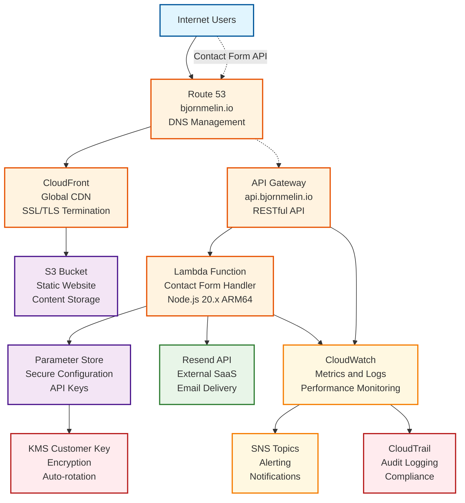
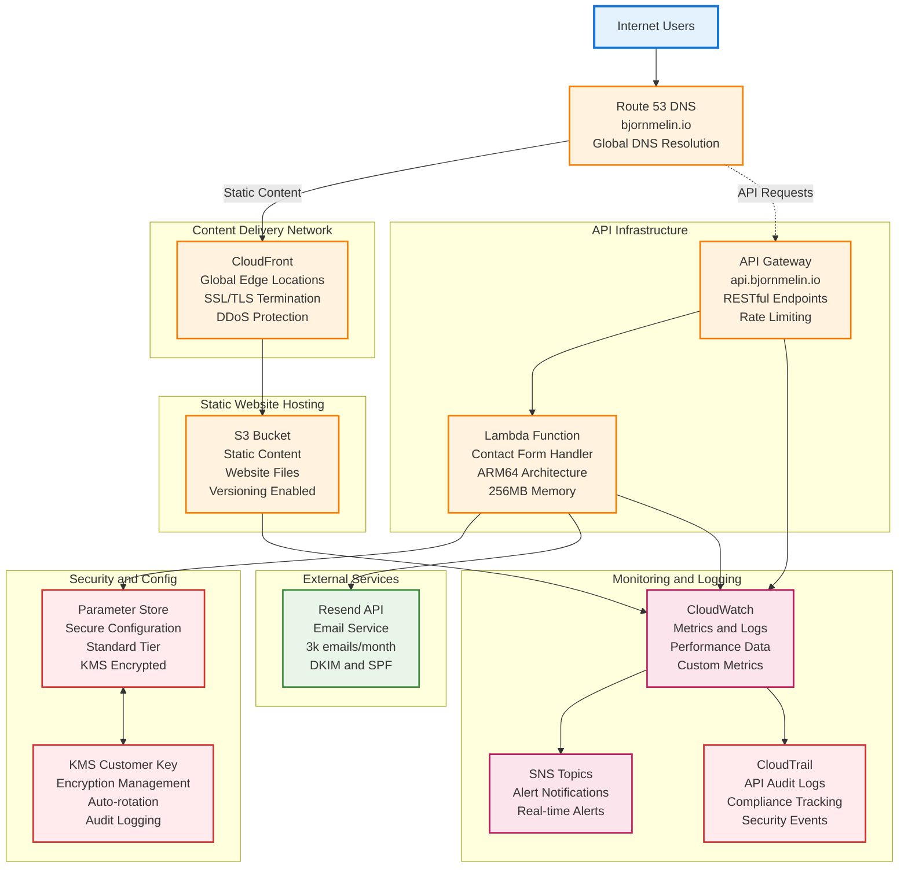
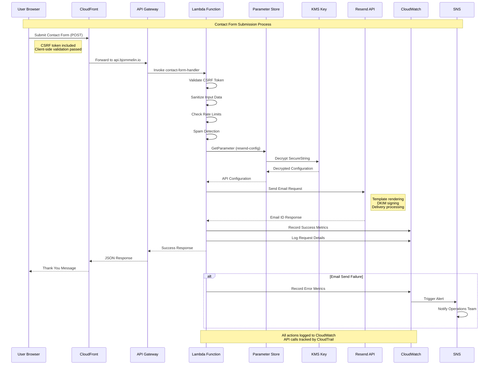
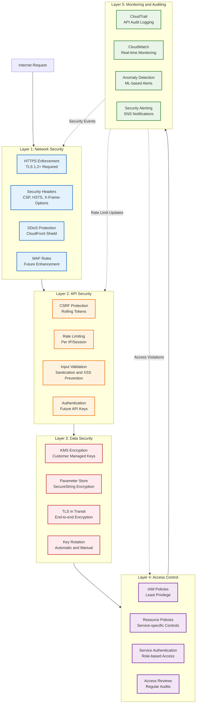

# bjornmelin.io Infrastructure Architecture Overview

## Executive Summary

This document provides a comprehensive overview of the AWS infrastructure architecture for the bjornmelin.io portfolio website. The architecture follows AWS Well-Architected Framework principles with a focus on security, reliability, performance efficiency, cost optimization, and operational excellence.

## High-Level Architecture



## Architecture Components

### 1. Frontend Infrastructure

- **Route 53 Hosted Zone**: DNS management for bjornmelin.io domain
- **CloudFront Distribution**: Global CDN for static content delivery
- **S3 Bucket**: Static website hosting with versioning enabled
- **SSL/TLS Certificate**: ACM certificate for HTTPS encryption

### 2. API Infrastructure

- **API Gateway**: RESTful API endpoint for contact form submissions
- **Lambda Function**: Serverless compute for processing contact form data
- **Parameter Store**: Secure storage for Resend API configuration
- **KMS Customer Managed Key**: Encryption for sensitive parameters

### 3. Email Service Integration

- **Resend API**: External email service for transactional emails
- **DNS Records**: SPF, DKIM, and domain verification records
- **Email Authentication**: Comprehensive email security configuration

### 4. Security & Compliance

- **IAM Roles & Policies**: Least privilege access control
- **CloudTrail**: Comprehensive audit logging
- **KMS Encryption**: Customer-managed keys for data protection
- **Security Headers**: HTTPS enforcement and security headers

### 5. Monitoring & Observability

- **CloudWatch**: Metrics, logs, and dashboards
- **SNS**: Alerting and notifications
- **Custom Metrics**: Application-specific monitoring

## Core Design Principles

### Security First

- All data encrypted in transit and at rest
- Customer-managed KMS keys for sensitive data
- Least privilege IAM policies
- Comprehensive audit logging with CloudTrail
- Regular security reviews and rotation schedules

### Cost Optimization

- Serverless architecture reduces operational costs
- Parameter Store vs. Secrets Manager (saves $0.40/month)
- Optimized log retention policies
- Free tier utilization where appropriate
- ARM64 Lambda architecture for cost efficiency

### Reliability & Performance

- Multi-AZ deployment for high availability
- CloudFront edge locations for global performance
- Automated retry logic and error handling
- Parameter caching to reduce API calls
- Monitoring and alerting for proactive issue resolution

### Operational Excellence

- Infrastructure as Code using AWS CDK
- Automated deployment pipelines
- Comprehensive monitoring and dashboards
- Documentation and runbooks
- Automated rotation capabilities

## Regional Deployment Strategy

### Primary Region: us-east-1

- **Why**: Required for CloudFront certificate validation
- **Components**: All core infrastructure deployed here
- **Compliance**: Meets data residency requirements

### Global Services

- **CloudFront**: Global edge locations for performance
- **Route 53**: Global DNS with health checks
- **Certificate Manager**: Global certificate distribution

## Network Architecture



## Data Flow Analysis

### Contact Form Submission Flow



## Security Architecture

### Defense in Depth



### Encryption Strategy

- **Data at Rest**: Customer-managed KMS keys
- **Data in Transit**: TLS 1.2+ enforcement
- **Parameter Store**: SecureString with KMS encryption
- **Key Rotation**: Automatic KMS key rotation enabled
- **API Keys**: Quarterly manual rotation schedule

## Performance Optimization

### CDN Strategy

- **CloudFront Distribution**: Global edge locations
- **Cache Behaviors**: Optimized for static content
- **Compression**: Gzip/Brotli compression enabled
- **Origin Access Control**: Secure S3 access

### API Performance

- **Lambda**: ARM64 architecture for cost/performance
- **Parameter Caching**: 1-hour cache for configuration
- **Connection Reuse**: HTTP connection pooling
- **Error Handling**: Exponential backoff for retries

### Monitoring Metrics

- **Response Times**: 95th percentile tracking
- **Error Rates**: Real-time error monitoring
- **Throughput**: Requests per minute/hour
- **Cost Tracking**: Resource utilization metrics

## Disaster Recovery & Business Continuity

### Backup Strategy

- **S3 Versioning**: Automatic version management
- **Parameter History**: 100 versions retained
- **CloudFormation**: Infrastructure as Code backup
- **Configuration**: Git-based version control

### Recovery Procedures

- **RTO (Recovery Time Objective)**: < 30 minutes
- **RPO (Recovery Point Objective)**: < 5 minutes
- **Automated Rollback**: CDK stack rollback capabilities
- **Manual Procedures**: Documented emergency procedures

### Testing Schedule

- **Monthly**: Backup verification
- **Quarterly**: Full recovery testing
- **Annually**: Disaster recovery simulation
- **Continuous**: Automated monitoring validation

## Cost Analysis & Optimization

### Monthly Cost Breakdown

```text
Service                    | Estimated Cost | Notes
---------------------------|----------------|------------------------
Route 53 Hosted Zone      | $0.50         | Standard DNS hosting
CloudFront Distribution   | $0.10         | Low traffic volume
S3 Static Website        | $0.05         | Minimal storage/requests
API Gateway              | $0.00         | Free tier coverage
Lambda Function          | $0.00         | Free tier coverage
Parameter Store          | $0.00         | Standard parameters free
KMS Customer Key         | $1.00         | Monthly key charge
KMS API Calls           | $0.03         | Minimal API usage
CloudWatch Logs         | $0.30         | Optimized retention
SNS Notifications      | $0.00         | Low volume
Resend API              | $0.00         | Free tier (3k emails/month)
---------------------------|----------------|------------------------
Total Monthly Cost      | ~$1.98        | Plus any overage charges
```

### Cost Optimization Strategies

1. **Free Tier Utilization**: Maximize AWS free tier benefits
2. **Resource Right-sizing**: Optimal Lambda memory allocation
3. **Log Retention**: 7-day retention for non-critical logs
4. **Parameter Store**: Standard tier vs. advanced tier
5. **Monitoring**: Essential metrics only to reduce costs

## Compliance & Governance

### Data Protection

- **GDPR Compliance**: Data processing transparency
- **Data Retention**: Configurable retention policies
- **Data Portability**: Export capabilities for user data
- **Right to Deletion**: Automated data removal procedures

### Audit Requirements

- **CloudTrail Logging**: All API calls logged
- **Access Logging**: Comprehensive access tracking
- **Change Management**: All changes via Infrastructure as Code
- **Security Reviews**: Quarterly security assessments

### Documentation Standards

- **Architecture Documentation**: This document and diagrams
- **Operational Runbooks**: Step-by-step procedures
- **Security Policies**: Clear security guidelines
- **Incident Response**: Emergency response procedures

## Future Roadmap

### Phase 1 (Current): Core Infrastructure

- ✅ Static website hosting
- ✅ Contact form functionality
- ✅ Security implementation
- ✅ Monitoring setup

### Phase 2 (Q1 2024): Enhanced Features

- 🔄 Enhanced email templates
- 🔄 Form analytics and tracking
- 🔄 Additional security hardening
- 🔄 Performance optimization

### Phase 3 (Q2 2024): Advanced Capabilities

- ⏳ Multi-language support
- ⏳ Advanced monitoring dashboards
- ⏳ Automated security scanning
- ⏳ Enhanced backup strategies

### Phase 4 (Q3 2024): Scale & Optimization

- ⏳ Global deployment optimization
- ⏳ Advanced caching strategies
- ⏳ Cost optimization review
- ⏳ Security posture enhancement

## Contact & Support

For questions about this architecture or infrastructure changes, please contact:

- **Primary Contact**: Bjorn Melin (<bjornmelin16@gmail.com>)
- **Documentation**: Located in `/docs/infrastructure/`
- **Emergency Procedures**: See disaster recovery documentation
- **Change Requests**: Use GitHub issues for infrastructure changes

## Related Documentation

This architecture overview is part of a comprehensive documentation suite:

### Architecture Documentation Suite

- **[Email Service Architecture](./email-service-architecture.md)** - Detailed email service flow and technical specifications
- **[Security Architecture](./security-architecture.md)** - Defense-in-depth security layers and compliance
- **[API Gateway + Lambda Architecture](./api-lambda-architecture.md)** - Serverless API architecture and performance
- **[DNS Configuration Guide](./dns-configuration-guide.md)** - Complete DNS setup and email authentication

### Implementation Guides

- **[Email Infrastructure Guide](./email-infrastructure-guide.md)** - Complete email service implementation with AWS
- **[Application Integration Examples](./application-integration-examples.md)** - Code examples for Lambda and frontend integration
- **[Resend Complete Setup Guide](../deployment/resend-complete-setup-guide.md)** - Comprehensive setup guide for email service

### Operational Documentation

- **[Security Audit Checklist](./security-audit-checklist.md)** - Security review and compliance checklist
- **[AWS Free Tier Optimization Guide](./aws-free-tier-optimization-2025.md)** - Cost optimization strategies
- **[Parameter Store Migration Guide](./parameter-store-migration-guide.md)** - Migration from Secrets Manager

---

> *This document is part of the bjornmelin.io infrastructure documentation suite. Last updated: 2024-12-23*
