# DNS Configuration Guide - bjornmelin.io

## Overview

This document provides a comprehensive guide to the DNS configuration for bjornmelin.io, including domain management, email authentication, subdomain routing, and security considerations. The DNS architecture supports static website hosting, API services, and email service integration with proper security and performance optimization.

## DNS Architecture Overview

```mermaid
graph TB
    %% External DNS Resolution
    subgraph Internet ["Internet DNS Resolution"]
        Users["Internet Users"]
        PublicDNS["Public DNS Resolvers<br/>8.8.8.8, 1.1.1.1, etc."]
    end
    
    %% Route 53 Infrastructure
    subgraph Route53Infrastructure ["Route 53 Global Infrastructure"]
        AuthoritativeNS["Authoritative Name Servers<br/>ns-1234.awsdns-12.com<br/>ns-5678.awsdns-34.co.uk<br/>ns-9012.awsdns-56.net<br/>ns-3456.awsdns-78.org"]
        HealthChecks["Health Checks<br/>30-second intervals<br/>Multi-region monitoring"]
        TrafficPolicy["Traffic Policy<br/>Future: Weighted routing<br/>Failover capabilities"]
    end
    
    %% Primary Domain Records
    subgraph PrimaryDomain ["Primary Domain: bjornmelin.io"]
        ApexA["A Record<br/>Alias: CloudFront Distribution<br/>TTL: Alias AWS managed"]
        ApexAAAA["AAAA Record<br/>Alias: CloudFront Distribution<br/>IPv6 Support"]
        WWWCname["CNAME Record<br/>www to bjornmelin.io<br/>TTL: 300 seconds"]
    end
    
    %% API Subdomain
    subgraph APISubdomain ["API Subdomain: api.bjornmelin.io"]
        APIA["A Record<br/>Alias: API Gateway<br/>Custom Domain"]
        APIAAAA["AAAA Record<br/>Alias: API Gateway<br/>IPv6 Support"]
    end
    
    %% Email Authentication
    subgraph EmailAuth ["Email Authentication Records"]
        SPF["SPF Record TXT<br/>v=spf1 include:_spf.resend.com ~all<br/>TTL: 300 seconds"]
        DKIM1["DKIM Record 1 TXT<br/>resend._domainkey<br/>RSA-2048 Public Key"]
        DKIM2["DKIM Record 2 TXT<br/>resend2._domainkey<br/>Backup Key"]
        DMARC["DMARC Policy TXT<br/>v=DMARC1; p=none; rua=...<br/>Monitor Mode"]
        DomainVerify["Domain Verification TXT<br/>_resend.bjornmelin.io<br/>Ownership Proof"]
    end
    
    %% Security Records
    subgraph SecurityRecords ["Security & Compliance"]
        CAA["CAA Record<br/>0 issue amazon.com<br/>Certificate Authority Authorization"]
        TLSPolicy["TLS Policy Future<br/>_443._tcp TXT Record<br/>Certificate Transparency"]
        SecurityContact["Security Contact Future<br/>_security TXT Record<br/>Incident Response"]
    end
    
    %% AWS Services
    subgraph AWSServices ["AWS Services"]
        CloudFront["CloudFront Distribution<br/>Global CDN<br/>SSL/TLS Termination"]
        APIGateway["API Gateway<br/>Custom Domain<br/>Regional Endpoint"]
        S3["S3 Static Website<br/>Origin for CloudFront"]
        ACM["ACM Certificate<br/>*.bjornmelin.io<br/>Auto-renewal"]
    end
    
    %% External Email Service
    subgraph EmailService ["External Email Service"]
        ResendAPI["Resend API<br/>Email Service Provider<br/>DKIM Signing"]
        EmailDelivery["Email Delivery<br/>SPF/DKIM Validation<br/>DMARC Compliance"]
    end
    
    %% DNS Resolution Flow
    Users --> PublicDNS
    PublicDNS --> AuthoritativeNS
    AuthoritativeNS --> PrimaryDomain
    AuthoritativeNS --> APISubdomain
    AuthoritativeNS --> EmailAuth
    AuthoritativeNS --> SecurityRecords
    
    %% Health Monitoring
    HealthChecks --> CloudFront
    HealthChecks --> APIGateway
    TrafficPolicy -.->|Future| HealthChecks
    
    %% Service Mapping
    ApexA --> CloudFront
    ApexAAAA --> CloudFront
    WWWCname --> ApexA
    APIA --> APIGateway
    APIAAAA --> APIGateway
    CloudFront --> S3
    
    %% Email Flow
    SPF -.->|Authorizes| ResendAPI
    DKIM1 -.->|Verifies| EmailDelivery
    DKIM2 -.->|Backup| EmailDelivery
    DMARC -.->|Policy| EmailDelivery
    
    %% Security Enforcement
    CAA -.->|Restricts| ACM
    
    %% Styling
    classDef internet fill:#e3f2fd,stroke:#1565c0,stroke-width:2px
    classDef route53 fill:#fff3e0,stroke:#ef6c00,stroke-width:2px
    classDef domain fill:#f3e5f5,stroke:#6a1b9a,stroke-width:2px
    classDef email fill:#e8f5e8,stroke:#2e7d32,stroke-width:2px
    classDef security fill:#ffebee,stroke:#c62828,stroke-width:2px
    classDef aws fill:#fff8e1,stroke:#f57c00,stroke-width:2px
    classDef external fill:#fce4ec,stroke:#c2185b,stroke-width:2px
    
    class Users,PublicDNS internet
    class AuthoritativeNS,HealthChecks,TrafficPolicy route53
    class ApexA,ApexAAAA,WWWCname,APIA,APIAAAA domain
    class SPF,DKIM1,DKIM2,DMARC,DomainVerify email
    class CAA,TLSPolicy,SecurityContact security
    class CloudFront,APIGateway,S3,ACM aws
    class ResendAPI,EmailDelivery external
```



## Hosted Zone Configuration

### 1. Route 53 Hosted Zone Setup

```text
┌─────────────────────────────────────────────────────────────────┐
│                    Route 53 Hosted Zone                         │
├─────────────────────────────────────────────────────────────────┤
│                                                                 │
│  Zone Details:                                                  │
│  ┌─────────────────────────────────────────────────────────────┐ │
│  │ Domain Name: bjornmelin.io                                  │ │
│  │ Zone Type: Public Hosted Zone                               │ │
│  │ Zone ID: Z07194313GZBE9EXAMPLE                              │ │
│  │ Created: 2024-12-23                                         │ │
│  │ Record Count: 12 active records                             │ │
│  │ Monthly Queries: ~1,000 (estimated)                         │ │
│  │ Monthly Cost: $0.50 (base hosted zone cost)                 │ │
│  └─────────────────────────────────────────────────────────────┘ │
│                                                                 │
│  Name Servers (AWS Assigned):                                  │
│  ┌─────────────────────────────────────────────────────────────┐ │
│  │ ns-1234.awsdns-12.com                                       │ │
│  │ ns-5678.awsdns-34.co.uk                                     │ │
│  │ ns-9012.awsdns-56.net                                       │ │
│  │ ns-3456.awsdns-78.org                                       │ │
│  │                                                             │ │
│  │ Note: These must be configured at your domain registrar     │ │
│  └─────────────────────────────────────────────────────────────┘ │
│                                                                 │
│  Default Records (AWS Created):                                │
│  ┌─────────────────────────────────────────────────────────────┐ │
│  │ NS Record: bjornmelin.io                                    │ │
│  │ ├─ Value: AWS Name Servers (above)                          │ │
│  │ └─ TTL: 172800 (48 hours)                                  │ │
│  │                                                             │ │
│  │ SOA Record: bjornmelin.io                                   │ │
│  │ ├─ Primary NS: ns-1234.awsdns-12.com                       │ │
│  │ ├─ Admin Email: awsdns-hostmaster.amazon.com               │ │
│  │ ├─ Serial: 1                                               │ │
│  │ ├─ Refresh: 7200                                           │ │
│  │ ├─ Retry: 900                                              │ │
│  │ ├─ Expire: 1209600                                         │ │
│  │ └─ TTL: 86400                                              │ │
│  └─────────────────────────────────────────────────────────────┘ │
│                                                                 │
└─────────────────────────────────────────────────────────────────┘
```

### 2. DNS Record Types and Configuration

```text
┌─────────────────────────────────────────────────────────────────┐
│                      DNS Record Configuration                   │
├─────────────────────────────────────────────────────────────────┤
│                                                                 │
│  Primary Website Records:                                       │
│  ┌─────────────────────────────────────────────────────────────┐ │
│  │ Record Name: bjornmelin.io                                  │ │
│  │ Type: A (IPv4 Address)                                      │ │
│  │ Alias: Yes                                                  │ │
│  │ Alias Target: CloudFront Distribution                       │ │
│  │ ├─ Distribution ID: E1234567890ABC                          │ │
│  │ ├─ Domain: d1234567890abc.cloudfront.net                   │ │
│  │ └─ Evaluate Target Health: No                               │ │
│  │ TTL: N/A (alias record)                                     │ │
│  │ Routing Policy: Simple                                      │ │
│  │                                                             │ │
│  │ Record Name: bjornmelin.io                                  │ │
│  │ Type: AAAA (IPv6 Address)                                   │ │
│  │ Alias: Yes                                                  │ │
│  │ Alias Target: CloudFront Distribution                       │ │
│  │ ├─ Same distribution as A record                            │ │
│  │ └─ Evaluate Target Health: No                               │ │
│  │ TTL: N/A (alias record)                                     │ │
│  │ Routing Policy: Simple                                      │ │
│  │                                                             │ │
│  │ Record Name: www.bjornmelin.io                              │ │
│  │ Type: CNAME (Canonical Name)                                │ │
│  │ Value: bjornmelin.io                                        │ │
│  │ TTL: 300 seconds                                            │ │
│  │ Routing Policy: Simple                                      │ │
│  │ Purpose: Redirect www to apex domain                        │ │
│  └─────────────────────────────────────────────────────────────┘ │
│                                                                 │
│  API Subdomain Records:                                         │
│  ┌─────────────────────────────────────────────────────────────┐ │
│  │ Record Name: api.bjornmelin.io                              │ │
│  │ Type: A (IPv4 Address)                                      │ │
│  │ Alias: Yes                                                  │ │
│  │ Alias Target: API Gateway Custom Domain                     │ │
│  │ ├─ Domain Name: api.bjornmelin.io                           │ │
│  │ ├─ Target Domain: d-1234567890.execute-api.us-east-1...    │ │
│  │ └─ Evaluate Target Health: Yes                              │ │
│  │ TTL: N/A (alias record)                                     │ │
│  │ Routing Policy: Simple                                      │ │
│  │                                                             │ │
│  │ Record Name: api.bjornmelin.io                              │ │
│  │ Type: AAAA (IPv6 Address)                                   │ │
│  │ Alias: Yes                                                  │ │
│  │ Alias Target: API Gateway Custom Domain                     │ │
│  │ ├─ Same target as A record                                  │ │
│  │ └─ Evaluate Target Health: Yes                              │ │
│  │ TTL: N/A (alias record)                                     │ │
│  │ Routing Policy: Simple                                      │ │
│  └─────────────────────────────────────────────────────────────┘ │
│                                                                 │
└─────────────────────────────────────────────────────────────────┘
```

## Email Authentication Configuration

### 1. SPF (Sender Policy Framework)

```text
┌─────────────────────────────────────────────────────────────────┐
│                       SPF Configuration                          │
├─────────────────────────────────────────────────────────────────┤
│                                                                 │
│  SPF Record Details:                                            │
│  ┌─────────────────────────────────────────────────────────────┐ │
│  │ Record Name: bjornmelin.io                                  │ │
│  │ Type: TXT                                                   │ │
│  │ Value: "v=spf1 include:_spf.resend.com ~all"               │ │
│  │ TTL: 300 seconds (5 minutes)                               │ │
│  │                                                             │ │
│  │ SPF Mechanism Breakdown:                                    │ │
│  │ ├─ v=spf1: SPF version 1 (current standard)                │ │
│  │ ├─ include:_spf.resend.com: Include Resend's SPF record    │ │
│  │ └─ ~all: Soft fail for unauthorized senders               │ │
│  │                                                             │ │
│  │ Policy Options:                                             │ │
│  │ ├─ +all: Pass (not recommended - too permissive)           │ │
│  │ ├─ ?all: Neutral (no policy)                               │ │
│  │ ├─ ~all: Soft fail (recommended for initial deployment)    │ │
│  │ └─ -all: Hard fail (strictest, use after testing)         │ │
│  └─────────────────────────────────────────────────────────────┘ │
│                                                                 │
│  Resend SPF Record (_spf.resend.com):                          │
│  ┌─────────────────────────────────────────────────────────────┐ │
│  │ Included Mechanisms:                                        │ │
│  │ ├─ ip4:192.0.2.0/24 (Example Resend IP ranges)             │ │
│  │ ├─ ip4:203.0.113.0/24                                      │ │
│  │ ├─ ip6:2001:db8::/32 (IPv6 ranges)                         │ │
│  │ └─ include:_spf2.resend.com (Additional includes)          │ │
│  │                                                             │ │
│  │ Total DNS Lookups: 3 (well under the 10 lookup limit)      │ │
│  │ Effective Policy: Authorize only Resend mail servers       │ │
│  └─────────────────────────────────────────────────────────────┘ │
│                                                                 │
│  Validation Commands:                                           │
│  ┌─────────────────────────────────────────────────────────────┐ │
│  │ # Check SPF record                                          │ │
│  │ dig TXT bjornmelin.io +short | grep "v=spf1"              │ │
│  │                                                             │ │
│  │ # Validate SPF syntax                                       │ │
│  │ nslookup -type=TXT bjornmelin.io                           │ │
│  │                                                             │ │
│  │ # Test SPF with online tools                                │ │
│  │ # https://www.kitterman.com/spf/validate.html              │ │
│  │ # https://mxtoolbox.com/spf.aspx                           │ │
│  └─────────────────────────────────────────────────────────────┘ │
│                                                                 │
└─────────────────────────────────────────────────────────────────┘
```

### 2. DKIM (DomainKeys Identified Mail)

```text
┌─────────────────────────────────────────────────────────────────┐
│                      DKIM Configuration                          │
├─────────────────────────────────────────────────────────────────┤
│                                                                 │
│  DKIM Record 1:                                                 │
│  ┌─────────────────────────────────────────────────────────────┐ │
│  │ Record Name: resend._domainkey.bjornmelin.io                │ │
│  │ Type: TXT                                                   │ │
│  │ Value: "k=rsa; p=MIIBIjANBgkqhkiG9w0BAQEFAAOCAQ8AMI..."    │ │
│  │ TTL: 300 seconds                                            │ │
│  │                                                             │ │
│  │ DKIM Tag Explanation:                                       │ │
│  │ ├─ k=rsa: Key type (RSA encryption)                         │ │
│  │ ├─ p=: Public key data (base64 encoded)                     │ │
│  │ ├─ v=: Version (optional, defaults to DKIM1)               │ │
│  │ ├─ t=: Testing flag (optional, y for testing)              │ │
│  │ └─ s=: Service type (optional, email for email only)       │ │
│  │                                                             │ │
│  │ Key Properties:                                             │ │
│  │ ├─ Algorithm: RSA-SHA256                                    │ │
│  │ ├─ Key Length: 2048 bits                                   │ │
│  │ ├─ Selector: resend                                         │ │
│  │ └─ Rotation: Managed by Resend                              │ │
│  └─────────────────────────────────────────────────────────────┘ │
│                                                                 │
│  DKIM Record 2 (if provided by Resend):                        │
│  ┌─────────────────────────────────────────────────────────────┐ │
│  │ Record Name: resend2._domainkey.bjornmelin.io               │ │
│  │ Type: TXT                                                   │ │
│  │ Value: "k=rsa; p=MIIBIjANBgkqhkiG9w0BAQEFAAOCAQ8AMI..."    │ │
│  │ TTL: 300 seconds                                            │ │
│  │                                                             │ │
│  │ Purpose:                                                    │ │
│  │ ├─ Key rotation support                                     │ │
│  │ ├─ Redundancy for high availability                         │ │
│  │ ├─ Different key for different message types                │ │
│  │ └─ Geographic distribution                                  │ │
│  └─────────────────────────────────────────────────────────────┘ │
│                                                                 │
│  DKIM Validation:                                               │
│  ┌─────────────────────────────────────────────────────────────┐ │
│  │ # Check DKIM records                                        │ │
│  │ dig TXT resend._domainkey.bjornmelin.io +short             │ │
│  │ dig TXT resend2._domainkey.bjornmelin.io +short            │ │
│  │                                                             │ │
│  │ # Validate DKIM key format                                  │ │
│  │ nslookup -type=TXT resend._domainkey.bjornmelin.io         │ │
│  │                                                             │ │
│  │ # Test DKIM signature validation                            │ │
│  │ # Send test email and check headers                         │ │
│  │ # Look for DKIM-Signature header in received emails        │ │
│  │                                                             │ │
│  │ # Online DKIM testing tools                                 │ │
│  │ # https://dkimvalidator.com/                               │ │
│  │ # https://www.mail-tester.com/                             │ │
│  └─────────────────────────────────────────────────────────────┘ │
│                                                                 │
└─────────────────────────────────────────────────────────────────┘
```

### 3. DMARC (Domain-based Message Authentication)

```text
┌─────────────────────────────────────────────────────────────────┐
│                      DMARC Configuration                        │
├─────────────────────────────────────────────────────────────────┤
│                                                                 │
│  DMARC Policy Record:                                           │
│  ┌─────────────────────────────────────────────────────────────┐ │
│  │ Record Name: _dmarc.bjornmelin.io                           │ │
│  │ Type: TXT                                                   │ │
│  │ Value: "v=DMARC1; p=none; rua=mailto:dmarc@bjornmelin.io;   │ │
│  │         ruf=mailto:dmarc@bjornmelin.io; pct=100; aspf=r;    │ │
│  │         adkim=r; fo=1"                                      │ │
│  │ TTL: 300 seconds                                            │ │
│  │                                                             │ │
│  │ DMARC Tag Explanation:                                      │ │
│  │ ├─ v=DMARC1: DMARC version 1                                │ │
│  │ ├─ p=none: Policy for domain (none|quarantine|reject)       │ │
│  │ ├─ rua=: Aggregate report URI (email address)              │ │
│  │ ├─ ruf=: Forensic report URI (email address)               │ │
│  │ ├─ pct=100: Percentage of emails to apply policy (1-100)   │ │
│  │ ├─ aspf=r: SPF alignment mode (r=relaxed, s=strict)         │ │
│  │ ├─ adkim=r: DKIM alignment mode (r=relaxed, s=strict)       │ │
│  │ └─ fo=1: Forensic options (0=all fail, 1=any fail)         │ │
│  └─────────────────────────────────────────────────────────────┘ │
│                                                                 │
│  DMARC Policy Progression:                                      │
│  ┌─────────────────────────────────────────────────────────────┐ │
│  │ Phase 1: Monitor Mode (Current)                             │ │
│  │ ├─ Policy: p=none                                           │ │
│  │ ├─ Action: Monitor and collect reports                      │ │
│  │ ├─ Duration: 2-4 weeks                                      │ │
│  │ └─ Goal: Understand legitimate email sources                │ │
│  │                                                             │ │
│  │ Phase 2: Quarantine Mode (Future)                          │ │
│  │ ├─ Policy: p=quarantine                                     │ │
│  │ ├─ Action: Quarantine suspicious emails                     │ │
│  │ ├─ Duration: 2-4 weeks                                      │ │
│  │ └─ Goal: Test impact without rejecting emails              │ │
│  │                                                             │ │
│  │ Phase 3: Reject Mode (Long-term)                           │ │
│  │ ├─ Policy: p=reject                                         │ │
│  │ ├─ Action: Reject unauthorized emails                       │ │
│  │ ├─ Duration: Permanent                                      │ │
│  │ └─ Goal: Maximum protection against spoofing                │ │
│  └─────────────────────────────────────────────────────────────┘ │
│                                                                 │
│  Report Processing:                                             │
│  ┌─────────────────────────────────────────────────────────────┐ │
│  │ Aggregate Reports (RUA):                                    │ │
│  │ ├─ Frequency: Daily                                         │ │
│  │ ├─ Format: XML                                              │ │
│  │ ├─ Content: Statistical data about email authentication     │ │
│  │ └─ Analysis: Use DMARC analyzer tools                       │ │
│  │                                                             │ │
│  │ Forensic Reports (RUF):                                     │ │
│  │ ├─ Frequency: Real-time (per failure)                       │ │
│  │ ├─ Format: Email with headers                               │ │
│  │ ├─ Content: Detailed failure information                    │ │
│  │ └─ Privacy: May contain sensitive data                      │ │
│  │                                                             │ │
│  │ Report Analysis Tools:                                      │ │
│  │ ├─ DMARC Analyzer: https://www.dmarcanalyzer.com/          │ │
│  │ ├─ Postmark DMARC: https://dmarc.postmarkapp.com/          │ │
│  │ ├─ MXToolbox: https://mxtoolbox.com/dmarc/                 │ │
│  │ └─ Custom scripts for XML parsing                           │ │
│  └─────────────────────────────────────────────────────────────┘ │
│                                                                 │
└─────────────────────────────────────────────────────────────────┘
```

### 4. Domain Verification

```text
┌─────────────────────────────────────────────────────────────────┐
│                    Domain Verification Records                  │
├─────────────────────────────────────────────────────────────────┤
│                                                                 │
│  Resend Domain Verification:                                    │
│  ┌─────────────────────────────────────────────────────────────┐ │
│  │ Record Name: _resend.bjornmelin.io                          │ │
│  │ Type: TXT                                                   │ │
│  │ Value: "resend-verification-123abc456def789"                │ │
│  │ TTL: 300 seconds                                            │ │
│  │                                                             │ │
│  │ Purpose:                                                    │ │
│  │ ├─ Prove domain ownership to Resend                        │ │
│  │ ├─ Enable domain for sending emails                         │ │
│  │ ├─ Activate DKIM signing                                    │ │
│  │ └─ Access advanced Resend features                          │ │
│  │                                                             │ │
│  │ Verification Process:                                       │ │
│  │ 1. Add domain in Resend dashboard                          │ │
│  │ 2. Copy verification code                                   │ │
│  │ 3. Add TXT record with code                                 │ │
│  │ 4. Wait for DNS propagation (5-60 minutes)                 │ │
│  │ 5. Click verify in Resend dashboard                        │ │
│  │ 6. Status changes to "Verified"                            │ │
│  └─────────────────────────────────────────────────────────────┘ │
│                                                                 │
│  SSL Certificate Validation (ACM):                             │
│  ┌─────────────────────────────────────────────────────────────┐ │
│  │ Certificate: *.bjornmelin.io                                │ │
│  │ Validation Method: DNS                                      │ │
│  │                                                             │ │
│  │ Validation Records (Auto-managed by ACM):                  │ │
│  │ ├─ Record Name: _abc123.bjornmelin.io                      │ │
│  │ ├─ Type: CNAME                                             │ │
│  │ ├─ Value: _def456.acm-validations.aws.                     │ │
│  │ └─ TTL: 300 seconds                                        │ │
│  │                                                             │ │
│  │ Certificate Subjects:                                       │ │
│  │ ├─ Primary: bjornmelin.io                                  │ │
│  │ ├─ SAN 1: www.bjornmelin.io                                │ │
│  │ └─ SAN 2: api.bjornmelin.io                                │ │
│  │                                                             │ │
│  │ Renewal: Automatic (ACM managed)                           │ │
│  │ Validity: 13 months                                        │ │
│  │ Algorithm: RSA-2048 or ECDSA P-256                         │ │
│  └─────────────────────────────────────────────────────────────┘ │
│                                                                 │
└─────────────────────────────────────────────────────────────────┘
```

## Security Records

### 1. CAA (Certificate Authority Authorization)

```text
┌─────────────────────────────────────────────────────────────────┐
│                       CAA Record Configuration                  │
├─────────────────────────────────────────────────────────────────┤
│                                                                 │
│  CAA Record Details:                                            │
│  ┌─────────────────────────────────────────────────────────────┐ │
│  │ Record Name: bjornmelin.io                                  │ │
│  │ Type: CAA                                                   │ │
│  │ Value: 0 issue "amazon.com"                                 │ │
│  │ TTL: 3600 seconds (1 hour)                                 │ │
│  │                                                             │ │
│  │ CAA Tag Breakdown:                                          │ │
│  │ ├─ Flag: 0 (non-critical)                                  │ │
│  │ ├─ Tag: issue (certificate issuance)                       │ │
│  │ └─ Value: amazon.com (authorized CA)                       │ │
│  │                                                             │ │
│  │ Additional CAA Records (Optional):                          │ │
│  │ ├─ 0 issuewild "amazon.com" (wildcard certificates)        │ │
│  │ ├─ 0 iodef "mailto:security@bjornmelin.io" (violation reports) │ │
│  │ └─ 128 issue ";" (critical flag, forbid all others)        │ │
│  │                                                             │ │
│  │ Security Benefits:                                          │ │
│  │ ├─ Prevent unauthorized certificate issuance               │ │
│  │ ├─ Reduce risk of mis-issued certificates                  │ │
│  │ ├─ Compliance with security best practices                 │ │
│  │ └─ Enhanced protection against domain hijacking            │ │
│  └─────────────────────────────────────────────────────────────┘ │
│                                                                 │
└─────────────────────────────────────────────────────────────────┘
```

### 2. Additional Security Records

```text
┌─────────────────────────────────────────────────────────────────┐
│                    Additional Security Records                  │
├─────────────────────────────────────────────────────────────────┤
│                                                                 │
│  Security Policy Records:                                       │
│  ┌─────────────────────────────────────────────────────────────┐ │
│  │ HTTPS/TLS Policy:                                           │ │
│  │ ├─ Record Name: _https._tcp.bjornmelin.io                   │ │
│  │ ├─ Type: TXT                                               │ │
│  │ ├─ Value: "v=TLSRPTv1; rua=mailto:tlsrpt@bjornmelin.io"    │ │
│  │ └─ Purpose: TLS reporting policy (future enhancement)       │ │
│  │                                                             │ │
│  │ DNS-over-HTTPS Policy (Future):                             │ │
│  │ ├─ Record Name: _doh.bjornmelin.io                          │ │
│  │ ├─ Type: TXT                                               │ │
│  │ ├─ Value: "doh=https://cloudflare-dns.com/dns-query"       │ │
│  │ └─ Purpose: Specify DoH resolver                            │ │
│  │                                                             │ │
│  │ Security Contact:                                           │ │
│  │ ├─ Record Name: _security.bjornmelin.io                     │ │
│  │ ├─ Type: TXT                                               │ │
│  │ ├─ Value: "v=sec1; contact=mailto:security@bjornmelin.io"  │ │
│  │ └─ Purpose: Security contact information                    │ │
│  └─────────────────────────────────────────────────────────────┘ │
│                                                                 │
│  Subdomain Security:                                            │
│  ┌─────────────────────────────────────────────────────────────┐ │
│  │ API Subdomain Protection:                                   │ │
│  │ ├─ CAA for api.bjornmelin.io: 0 issue "amazon.com"         │ │
│  │ ├─ HSTS for API endpoints via headers                       │ │
│  │ └─ Certificate transparency monitoring                      │ │
│  │                                                             │ │
│  │ Wildcard Protection:                                        │ │
│  │ ├─ CAA issuewild policy                                     │ │
│  │ ├─ Prevent subdomain takeover                               │ │
│  │ └─ Monitor for unauthorized DNS changes                     │ │
│  └─────────────────────────────────────────────────────────────┘ │
│                                                                 │
└─────────────────────────────────────────────────────────────────┘
```

## DNS Management & Operations

### 1. Change Management Process

```text
┌─────────────────────────────────────────────────────────────────┐
│                    DNS Change Management                         │
├─────────────────────────────────────────────────────────────────┤
│                                                                 │
│  Change Process Workflow:                                       │
│  ┌─────────────────────────────────────────────────────────────┐ │
│  │ 1. Planning Phase:                                          │ │
│  │    ├─ Document required changes                             │ │
│  │    ├─ Assess impact and dependencies                        │ │
│  │    ├─ Plan rollback procedures                              │ │
│  │    └─ Schedule maintenance window                           │ │
│  │                                                             │ │
│  │ 2. Testing Phase:                                           │ │
│  │    ├─ Test in development environment                       │ │
│  │    ├─ Validate DNS syntax                                   │ │
│  │    ├─ Check TTL implications                                │ │
│  │    └─ Verify propagation timing                             │ │
│  │                                                             │ │
│  │ 3. Implementation Phase:                                    │ │
│  │    ├─ Deploy via Infrastructure as Code (CDK)               │ │
│  │    ├─ Monitor propagation status                            │ │
│  │    ├─ Verify resolution from multiple locations             │ │
│  │    └─ Update documentation                                  │ │
│  │                                                             │ │
│  │ 4. Validation Phase:                                        │ │
│  │    ├─ Test all affected services                            │ │
│  │    ├─ Monitor error rates                                   │ │
│  │    ├─ Verify certificate validity                           │ │
│  │    └─ Confirm email authentication                          │ │
│  └─────────────────────────────────────────────────────────────┘ │
│                                                                 │
│  Infrastructure as Code (CDK):                                 │
│  ┌─────────────────────────────────────────────────────────────┐ │
│  │ // DNS Stack Example                                        │ │
│  │ export class DnsStack extends cdk.Stack {                   │ │
│  │   constructor(scope: Construct, id: string, props: DnsStackProps) { │ │
│  │     super(scope, id, props);                                │ │
│  │                                                             │ │
│  │     // Primary domain A record                              │ │
│  │     new route53.ARecord(this, 'ApexRecord', {               │ │
│  │       zone: props.hostedZone,                               │ │
│  │       recordName: props.domainName,                         │ │
│  │       target: route53.RecordTarget.fromAlias(               │ │
│  │         new targets.CloudFrontTarget(props.distribution)    │ │
│  │       )                                                     │ │
│  │     });                                                     │ │
│  │                                                             │ │
│  │     // SPF record                                           │ │
│  │     new route53.TxtRecord(this, 'SpfRecord', {              │ │
│  │       zone: props.hostedZone,                               │ │
│  │       recordName: props.domainName,                         │ │
│  │       values: ['v=spf1 include:_spf.resend.com ~all'],      │ │
│  │       ttl: cdk.Duration.minutes(5)                          │ │
│  │     });                                                     │ │
│  │                                                             │ │
│  │     // API subdomain                                        │ │
│  │     new route53.ARecord(this, 'ApiRecord', {                │ │
│  │       zone: props.hostedZone,                               │ │
│  │       recordName: 'api',                                    │ │
│  │       target: route53.RecordTarget.fromAlias(               │ │
│  │         new targets.ApiGateway(props.api)                   │ │
│  │       )                                                     │ │
│  │     });                                                     │ │
│  │   }                                                         │ │
│  │ }                                                           │ │
│  └─────────────────────────────────────────────────────────────┘ │
│                                                                 │
└─────────────────────────────────────────────────────────────────┘
```

### 2. Monitoring & Alerting

```text
┌─────────────────────────────────────────────────────────────────┐
│                    DNS Monitoring & Alerting                    │
├─────────────────────────────────────────────────────────────────┤
│                                                                 │
│  Route 53 Health Checks:                                       │
│  ┌─────────────────────────────────────────────────────────────┐ │
│  │ Website Health Check:                                       │ │
│  │ ├─ URL: https://bjornmelin.io                               │ │
│  │ ├─ Type: HTTPS                                              │ │
│  │ ├─ Port: 443                                                │ │
│  │ ├─ Path: /                                                  │ │
│  │ ├─ Interval: 30 seconds                                     │ │
│  │ ├─ Failure Threshold: 3 consecutive failures               │ │
│  │ ├─ Timeout: 10 seconds                                      │ │
│  │ └─ Status Code: 200                                         │ │
│  │                                                             │ │
│  │ API Health Check:                                           │ │
│  │ ├─ URL: https://api.bjornmelin.io/health                    │ │
│  │ ├─ Type: HTTPS                                              │ │
│  │ ├─ Port: 443                                                │ │
│  │ ├─ Path: /health                                            │ │
│  │ ├─ Interval: 30 seconds                                     │ │
│  │ ├─ Failure Threshold: 2 consecutive failures               │ │
│  │ ├─ Response Body Contains: "healthy"                        │ │
│  │ └─ Geographic Locations: 3 regions                          │ │
│  └─────────────────────────────────────────────────────────────┘ │
│                                                                 │
│  CloudWatch Alarms:                                            │
│  ┌─────────────────────────────────────────────────────────────┐ │
│  │ DNS Query Volume Alarm:                                     │ │
│  │ ├─ Metric: Route53 Query Count                              │ │
│  │ ├─ Threshold: >10,000 queries/hour                         │ │
│  │ ├─ Period: 1 hour                                           │ │
│  │ ├─ Evaluation: 1 out of 1 datapoints                       │ │
│  │ └─ Action: SNS notification                                 │ │
│  │                                                             │ │
│  │ Health Check Failure Alarm:                                 │ │
│  │ ├─ Metric: Route53 Health Check Status                      │ │
│  │ ├─ Threshold: Status = 0 (failed)                          │ │
│  │ ├─ Period: 1 minute                                         │ │
│  │ ├─ Evaluation: 2 out of 3 datapoints                       │ │
│  │ └─ Action: SNS notification + PagerDuty                     │ │
│  │                                                             │ │
│  │ Certificate Expiration Alarm:                               │ │
│  │ ├─ Metric: ACM Certificate Days to Expiry                   │ │
│  │ ├─ Threshold: <30 days                                      │ │
│  │ ├─ Period: 1 day                                            │ │
│  │ ├─ Evaluation: 1 out of 1 datapoints                       │ │
│  │ └─ Action: SNS notification                                 │ │
│  └─────────────────────────────────────────────────────────────┘ │
│                                                                 │
│  External Monitoring:                                           │
│  ┌─────────────────────────────────────────────────────────────┐ │
│  │ Third-Party DNS Monitoring:                                 │ │
│  │ ├─ Service: Pingdom, UptimeRobot, or StatusPage             │ │
│  │ ├─ Check Frequency: 1 minute                                │ │
│  │ ├─ Locations: Multiple global locations                     │ │
│  │ ├─ Alerts: Email, Slack, PagerDuty                         │ │
│  │ └─ SLA Tracking: 99.9% uptime target                       │ │
│  │                                                             │ │
│  │ DNS Propagation Monitoring:                                 │ │
│  │ ├─ Check multiple DNS resolvers globally                    │ │
│  │ ├─ Monitor TTL compliance                                   │ │
│  │ ├─ Detect DNS hijacking attempts                            │ │
│  │ └─ Verify DNSSEC validation (future)                       │ │
│  └─────────────────────────────────────────────────────────────┘ │
│                                                                 │
└─────────────────────────────────────────────────────────────────┘
```

## DNS Performance Optimization

### 1. TTL Strategy

```text
┌─────────────────────────────────────────────────────────────────┐
│                        TTL Optimization                         │
├─────────────────────────────────────────────────────────────────┤
│                                                                 │
│  TTL Configuration Strategy:                                    │
│  ┌─────────────────────────────────────────────────────────────┐ │
│  │ Record Type              | TTL Value | Reasoning             │ │
│  │ ------------------------|-----------|----------------------- │ │
│  │ A/AAAA (Apex Domain)    | 300 sec   | Alias record (AWS managed) │ │
│  │ CNAME (www)            | 300 sec   | Flexible for changes   │ │
│  │ A/AAAA (API Subdomain) | 300 sec   | Alias record (AWS managed) │ │
│  │ TXT (SPF)              | 300 sec   | May need quick updates │ │
│  │ TXT (DKIM)             | 300 sec   | Managed by Resend      │ │
│  │ TXT (DMARC)            | 300 sec   | Policy may evolve      │ │
│  │ TXT (Domain Verify)    | 300 sec   | One-time verification  │ │
│  │ CAA                    | 3600 sec  | Stable security policy │ │
│  │ MX                     | 3600 sec  | Stable mail routing    │ │
│  │ NS                     | 172800 sec| AWS default (stable)   │ │
│  │ SOA                    | 86400 sec | AWS default (stable)   │ │
│  └─────────────────────────────────────────────────────────────┘ │
│                                                                 │
│  TTL Best Practices:                                            │
│  ┌─────────────────────────────────────────────────────────────┐ │
│  │ Short TTL (300 seconds):                                    │ │
│  │ ├─ Use for records that may change frequently               │ │
│  │ ├─ During migrations or major updates                       │ │
│  │ ├─ For A/AAAA records pointing to CDN                      │ │
│  │ └─ Security-related records (DMARC, SPF)                   │ │
│  │                                                             │ │
│  │ Medium TTL (3600 seconds):                                  │ │
│  │ ├─ Use for stable configuration records                     │ │
│  │ ├─ CAA records (rarely change)                              │ │
│  │ ├─ MX records (stable mail routing)                         │ │
│  │ └─ Service discovery records                                │ │
│  │                                                             │ │
│  │ Long TTL (86400+ seconds):                                  │ │
│  │ ├─ Use for very stable records                              │ │
│  │ ├─ NS records (delegated zones)                             │ │
│  │ ├─ SOA records (zone metadata)                              │ │
│  │ └─ Records that never change                                │ │
│  └─────────────────────────────────────────────────────────────┘ │
│                                                                 │
└─────────────────────────────────────────────────────────────────┘
```

### 2. Performance Monitoring

```text
┌─────────────────────────────────────────────────────────────────┐
│                    DNS Performance Monitoring                   │
├─────────────────────────────────────────────────────────────────┤
│                                                                 │
│  Route 53 Resolver Query Logging:                              │
│  ┌─────────────────────────────────────────────────────────────┐ │
│  │ Configuration:                                              │ │
│  │ ├─ Enable query logging for hosted zone                     │ │
│  │ ├─ Destination: CloudWatch Logs                             │ │
│  │ ├─ Log Group: /aws/route53/bjornmelin.io                   │ │
│  │ ├─ Retention: 7 days (cost optimized)                      │ │
│  │ └─ Query logging captures:                                  │ │
│  │     ├─ Query timestamp                                      │ │
│  │     ├─ Query name and type                                  │ │
│  │     ├─ Response code                                        │ │
│  │     ├─ Resolver IP address                                  │ │
│  │     └─ Edge location                                        │ │
│  │                                                             │ │
│  │ Analysis Queries (CloudWatch Insights):                    │ │
│  │ # Top queried records                                       │ │
│  │ fields @timestamp, queryName, queryType                    │ │
│  │ | stats count() by queryName                               │ │
│  │ | sort count desc                                           │ │
│  │ | limit 20                                                  │ │
│  │                                                             │ │
│  │ # Error rate analysis                                       │ │
│  │ fields @timestamp, queryName, responseCode                 │ │
│  │ | filter responseCode != "NOERROR"                          │ │
│  │ | stats count() by responseCode                             │ │
│  └─────────────────────────────────────────────────────────────┘ │
│                                                                 │
│  Performance Metrics:                                          │
│  ┌─────────────────────────────────────────────────────────────┐ │
│  │ Key Performance Indicators:                                 │ │
│  │ ├─ Query Response Time: <50ms (Route 53 target)            │ │
│  │ ├─ Query Success Rate: >99.9%                              │ │
│  │ ├─ DNS Propagation Time: <300 seconds globally             │ │
│  │ ├─ TTL Compliance: >95% of resolvers respect TTL           │ │
│  │ └─ Uptime: 100% (Route 53 SLA)                             │ │
│  │                                                             │ │
│  │ Performance Dashboard Widgets:                              │ │
│  │ ├─ Query volume over time (24h, 7d, 30d views)             │ │
│  │ ├─ Response time percentiles (P50, P95, P99)               │ │
│  │ ├─ Error rate by response code                              │ │
│  │ ├─ Geographic query distribution                            │ │
│  │ ├─ Most queried records                                     │ │
│  │ └─ Health check status                                      │ │
│  └─────────────────────────────────────────────────────────────┘ │
│                                                                 │
└─────────────────────────────────────────────────────────────────┘
```

## Disaster Recovery & Business Continuity

### 1. DNS Failover Strategy

```text
┌─────────────────────────────────────────────────────────────────┐
│                     DNS Failover Strategy                       │
├─────────────────────────────────────────────────────────────────┤
│                                                                 │
│  Primary/Secondary Configuration:                               │
│  ┌─────────────────────────────────────────────────────────────┐ │
│  │ Primary Infrastructure:                                     │ │
│  │ ├─ CloudFront Distribution (Primary)                        │ │
│  │ ├─ S3 Bucket us-east-1 (Primary)                           │ │
│  │ ├─ API Gateway us-east-1 (Primary)                         │ │
│  │ └─ Route 53 Health Checks                                   │ │
│  │                                                             │ │
│  │ Secondary Infrastructure (Future):                          │ │
│  │ ├─ CloudFront Distribution (Backup)                         │ │
│  │ ├─ S3 Bucket us-west-2 (Cross-region replication)         │ │
│  │ ├─ API Gateway us-west-2 (Backup region)                   │ │
│  │ └─ Weighted routing policy                                  │ │
│  │                                                             │ │
│  │ Failover Logic:                                             │ │
│  │ ├─ Health check failure triggers failover                   │ │
│  │ ├─ Automatic traffic routing to secondary                   │ │
│  │ ├─ TTL ensures quick propagation (300 seconds)              │ │
│  │ └─ Manual failback after primary recovery                   │ │
│  └─────────────────────────────────────────────────────────────┘ │
│                                                                 │
│  Recovery Procedures:                                           │
│  ┌─────────────────────────────────────────────────────────────┐ │
│  │ DNS Recovery Scenarios:                                     │ │
│  │                                                             │ │
│  │ 1. Route 53 Service Issue (Very Rare):                     │ │
│  │    ├─ Contact AWS Support immediately                       │ │
│  │    ├─ Monitor AWS Service Health Dashboard                  │ │
│  │    ├─ Consider temporary external DNS provider             │ │
│  │    └─ Communicate status to users                           │ │
│  │                                                             │ │
│  │ 2. Hosted Zone Corruption:                                  │ │
│  │    ├─ Restore from Infrastructure as Code (CDK)             │ │
│  │    ├─ Recreate hosted zone if necessary                     │ │
│  │    ├─ Update name servers at registrar                      │ │
│  │    └─ Verify all records are restored                       │ │
│  │                                                             │ │
│  │ 3. Certificate Expiration:                                  │ │
│  │    ├─ ACM auto-renewal should prevent this                  │ │
│  │    ├─ Monitor certificate expiration alarms                 │ │
│  │    ├─ Manual renewal if auto-renewal fails                  │ │
│  │    └─ Validate HTTPS functionality                          │ │
│  │                                                             │ │
│  │ 4. DNS Cache Poisoning:                                     │ │
│  │    ├─ Identify affected resolvers                           │ │
│  │    ├─ Contact resolver operators                            │ │
│  │    ├─ Implement DNSSEC (future)                            │ │
│  │    └─ Monitor for ongoing attacks                           │ │
│  └─────────────────────────────────────────────────────────────┘ │
│                                                                 │
└─────────────────────────────────────────────────────────────────┘
```

## Cost Optimization

### Monthly DNS Costs

```text
Service Component           | Cost    | Notes
----------------------------|---------|---------------------------
Route 53 Hosted Zone       | $0.50   | Standard hosted zone
Route 53 Queries           | $0.10   | Estimated 1M queries/month
Health Checks               | $1.00   | 2 health checks × $0.50
Certificate Manager (ACM)   | $0.00   | Free for AWS services
DNS Query Logging          | $0.05   | Minimal log volume
DNSSEC (Future)            | $0.50   | When enabled
Third-party monitoring     | $0.00   | Using free tier services
----------------------------|---------|---------------------------
Total Monthly DNS Cost     | $1.65   | Estimated total
```

### Cost Optimization Strategies

- **Query Volume Monitoring**: Track queries to identify unusual patterns
- **Health Check Optimization**: Only monitor critical endpoints
- **Log Retention**: 7-day retention for cost optimization
- **TTL Optimization**: Balance performance vs. flexibility
- **Third-party Services**: Use free tiers where possible

## Related Documentation

This DNS configuration guide is part of a comprehensive documentation suite:

### Architecture Documentation Suite

- **[Architecture Overview](./architecture-overview.md)** - Comprehensive system architecture and design principles
- **[Email Service Architecture](./email-service-architecture.md)** - Detailed email service flow and technical specifications
- **[Security Architecture](./security-architecture.md)** - Defense-in-depth security layers and compliance
- **[API Gateway + Lambda Architecture](./api-lambda-architecture.md)** - Serverless API architecture and performance

### Email & DNS Implementation

- **[Email Infrastructure Guide](./email-infrastructure-guide.md)** - Complete email service implementation with AWS
- **[Resend Complete Setup Guide](../deployment/resend-complete-setup-guide.md)** - Comprehensive setup guide for email service
- **[Application Integration Examples](./application-integration-examples.md)** - Code examples for DNS and email integration

### Operational Documentation

- **[Security Audit Checklist](./security-audit-checklist.md)** - Security review including DNS security
- **[AWS Free Tier Optimization Guide](./aws-free-tier-optimization-2025.md)** - Cost optimization for DNS services

---

*This DNS configuration guide provides comprehensive technical details for managing the bjornmelin.io domain infrastructure. For implementation details, see the CDK infrastructure code and deployment guides.*
