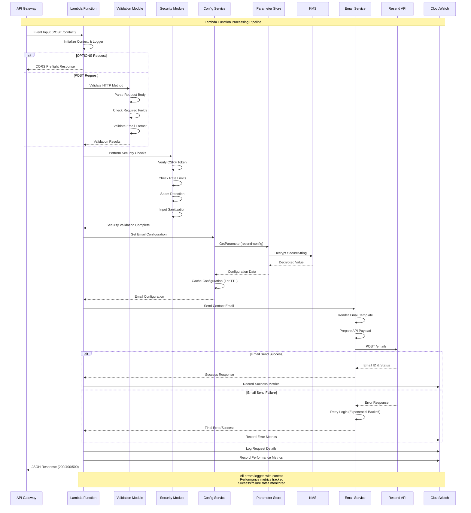

# Email Service Architecture - bjornmelin.io

## Overview

The email service architecture for bjornmelin.io implements a secure, scalable, and cost-effective solution for handling contact form submissions. This document provides detailed technical specifications, flow diagrams, and implementation details.

## High-Level Email Service Flow


## Detailed Component Architecture

### 1. Frontend Security Layer

```text
┌─────────────────────────────────────────────────────────────────┐
│                    Frontend Security                            │
├─────────────────────────────────────────────────────────────────┤
│                                                                 │
│  Contact Form                                                   │
│       │                                                         │
│       ├─── CSRF Protection                                      │
│       │    ├─ Token generation per session                      │
│       │    ├─ Server-side token validation                      │
│       │    └─ Rolling token refresh                             │
│       │                                                         │
│       ├─── Input Validation                                     │
│       │    ├─ Client-side validation (immediate feedback)       │
│       │    ├─ Server-side validation (security)                │
│       │    ├─ Email format validation                           │
│       │    ├─ Content length limits                             │
│       │    └─ XSS prevention                                    │
│       │                                                         │
│       ├─── Anti-Spam Protection                                 │
│       │    ├─ Honeypot fields                                   │
│       │    ├─ Rate limiting per IP                              │
│       │    ├─ GDPR consent requirement                          │
│       │    └─ Submission frequency limits                       │
│       │                                                         │
│       └─── HTTPS Enforcement                                    │
│            ├─ TLS 1.2+ requirement                             │
│            ├─ Security headers                                  │
│            └─ HSTS implementation                               │
│                                                                 │
└─────────────────────────────────────────────────────────────────┘
```

### 2. API Gateway Configuration

```text
┌─────────────────────────────────────────────────────────────────┐
│                      API Gateway Setup                          │
├─────────────────────────────────────────────────────────────────┤
│                                                                 │
│  Endpoint: https://api.bjornmelin.io/contact                   │
│                                                                 │
│  Configuration:                                                 │
│  ├─ Method: POST                                                │
│  ├─ Integration: Lambda Proxy                                   │
│  ├─ Authentication: None (handled in Lambda)                    │
│  ├─ Throttling: 1000 requests/second                           │
│  ├─ CORS: Configured for bjornmelin.io                         │
│  │                                                             │
│  └─ Request Validation:                                         │
│      ├─ Content-Type: application/json                         │
│      ├─ Max payload: 1MB                                       │
│      ├─ Required headers validation                             │
│      └─ Request body validation                                 │
│                                                                 │
│  Monitoring:                                                    │
│  ├─ Access logging enabled                                      │
│  ├─ X-Ray tracing enabled                                       │
│  ├─ CloudWatch metrics                                          │
│  └─ Error rate monitoring                                       │
│                                                                 │
└─────────────────────────────────────────────────────────────────┘
```

### 3. Lambda Function Architecture

#### Function Configuration

- **Runtime**: Node.js 20.x (ARM64)
- **Memory**: 256 MB
- **Timeout**: 30 seconds
- **Architecture**: ARM64 (cost optimized)

#### Processing Flow



### 4. Parameter Store & KMS Security

```text
┌─────────────────────────────────────────────────────────────────┐
│              Parameter Store & KMS Architecture                  │
├─────────────────────────────────────────────────────────────────┤
│                                                                 │
│  Parameter Store Configuration:                                 │
│  ┌─────────────────────────────────────────────────────────────┐ │
│  │ Parameter Name: /portfolio/prod/resend/api-key             │ │
│  │ Type: SecureString                                          │ │
│  │ Tier: Standard (cost optimized)                            │ │
│  │ Description: Resend API configuration for portfolio        │ │
│  │                                                             │ │
│  │ Value Structure (JSON):                                     │ │
│  │ {                                                           │ │
│  │   "apiKey": "re_xxxxxxxxxxxxxxxxxxxx",                     │ │
│  │   "domain": "bjornmelin.io",                               │ │
│  │   "fromEmail": "no-reply@bjornmelin.io",                   │ │
│  │   "version": 1,                                             │ │
│  │   "rotatedAt": "2024-12-23T10:00:00Z"                      │ │
│  │ }                                                           │ │
│  └─────────────────────────────────────────────────────────────┘ │
│                                                                 │
│  KMS Customer Managed Key:                                      │
│  ┌─────────────────────────────────────────────────────────────┐ │
│  │ Alias: alias/prod-portfolio-parameters                     │ │
│  │ Key Rotation: Enabled (automatic)                          │ │
│  │ Key Usage: Encrypt/Decrypt                                 │ │
│  │ Key Spec: SYMMETRIC_DEFAULT                                │ │
│  │                                                             │ │
│  │ Key Policy:                                                 │ │
│  │ ├─ Allow CloudTrail encryption                             │ │
│  │ ├─ Allow Lambda function decryption                        │ │
│  │ ├─ Allow Parameter Store service access                    │ │
│  │ ├─ Deny root user access                                   │ │
│  │ └─ Condition: StringEquals "kms:ViaService"                │ │
│  │                                                             │ │
│  │ Deletion Policy:                                            │ │
│  │ ├─ Pending window: 30 days                                 │ │
│  │ ├─ Removal policy: RETAIN                                  │ │
│  │ └─ Backup required before deletion                         │ │
│  └─────────────────────────────────────────────────────────────┘ │
│                                                                 │
│  Access Control:                                                │
│  ┌─────────────────────────────────────────────────────────────┐ │
│  │ IAM Policy for Lambda:                                      │ │
│  │ {                                                           │ │
│  │   "Effect": "Allow",                                        │ │
│  │   "Action": ["ssm:GetParameter"],                          │ │
│  │   "Resource": "arn:aws:ssm:region:account:parameter/..."    │ │
│  │   "Condition": {                                            │ │
│  │     "StringEquals": {"ssm:version": "$LATEST"}             │ │
│  │   }                                                         │ │
│  │ }                                                           │ │
│  │                                                             │ │
│  │ KMS Decrypt Policy:                                         │ │
│  │ {                                                           │ │
│  │   "Effect": "Allow",                                        │ │
│  │   "Action": ["kms:Decrypt"],                               │ │
│  │   "Resource": "arn:aws:kms:region:account:key/...",        │ │
│  │   "Condition": {                                            │ │
│  │     "StringEquals": {                                       │ │
│  │       "kms:ViaService": "ssm.region.amazonaws.com"         │ │
│  │     }                                                       │ │
│  │   }                                                         │ │
│  │ }                                                           │ │
│  └─────────────────────────────────────────────────────────────┘ │
│                                                                 │
└─────────────────────────────────────────────────────────────────┘
```

### 5. DNS Configuration for Email Authentication

```text
┌─────────────────────────────────────────────────────────────────┐
│                 DNS Email Authentication                        │
├─────────────────────────────────────────────────────────────────┤
│                                                                 │
│  SPF Record (Sender Policy Framework):                         │
│  ┌─────────────────────────────────────────────────────────────┐ │
│  │ Type: TXT                                                   │ │
│  │ Name: bjornmelin.io                                         │ │
│  │ Value: "v=spf1 include:_spf.resend.com ~all"               │ │
│  │ TTL: 300 seconds                                            │ │
│  │                                                             │ │
│  │ Explanation:                                                │ │
│  │ ├─ v=spf1: SPF version 1                                   │ │
│  │ ├─ include:_spf.resend.com: Include Resend's SPF record    │ │
│  │ └─ ~all: Soft fail for unauthorized senders               │ │
│  └─────────────────────────────────────────────────────────────┘ │
│                                                                 │
│  DKIM Records (DomainKeys Identified Mail):                    │
│  ┌─────────────────────────────────────────────────────────────┐ │
│  │ Record 1:                                                   │ │
│  │ ├─ Type: TXT                                               │ │
│  │ ├─ Name: resend._domainkey.bjornmelin.io                   │ │
│  │ ├─ Value: "k=rsa; p=DKIM_PUBLIC_KEY_FROM_RESEND"          │ │
│  │ └─ TTL: 300 seconds                                        │ │
│  │                                                             │ │
│  │ Record 2 (if provided):                                     │ │
│  │ ├─ Type: TXT                                               │ │
│  │ ├─ Name: resend2._domainkey.bjornmelin.io                  │ │
│  │ ├─ Value: "k=rsa; p=SECOND_DKIM_KEY_FROM_RESEND"          │ │
│  │ └─ TTL: 300 seconds                                        │ │
│  └─────────────────────────────────────────────────────────────┘ │
│                                                                 │
│  Domain Verification:                                           │
│  ┌─────────────────────────────────────────────────────────────┐ │
│  │ Type: TXT                                                   │ │
│  │ Name: _resend.bjornmelin.io                                 │ │
│  │ Value: "resend-verification-xxxxxxxxxxxx"                   │ │
│  │ TTL: 300 seconds                                            │ │
│  │                                                             │ │
│  │ Purpose: Proves domain ownership to Resend                 │ │
│  └─────────────────────────────────────────────────────────────┘ │
│                                                                 │
│  DMARC Policy (Optional but Recommended):                      │
│  ┌─────────────────────────────────────────────────────────────┐ │
│  │ Type: TXT                                                   │ │
│  │ Name: _dmarc.bjornmelin.io                                  │ │
│  │ Value: "v=DMARC1; p=none; rua=mailto:dmarc@bjornmelin.io"  │ │
│  │ TTL: 300 seconds                                            │ │
│  │                                                             │ │
│  │ Policy Options:                                             │ │
│  │ ├─ p=none: Monitor mode (recommended for initial setup)    │ │
│  │ ├─ p=quarantine: Quarantine suspicious emails             │ │
│  │ └─ p=reject: Reject emails that fail authentication        │ │
│  └─────────────────────────────────────────────────────────────┘ │
│                                                                 │
└─────────────────────────────────────────────────────────────────┘
```

### 6. Resend API Integration

```text
┌─────────────────────────────────────────────────────────────────┐
│                    Resend API Integration                       │
├─────────────────────────────────────────────────────────────────┤
│                                                                 │
│  API Configuration:                                             │
│  ┌─────────────────────────────────────────────────────────────┐ │
│  │ Base URL: https://api.resend.com                           │ │
│  │ Authentication: Bearer token (API key)                      │ │
│  │ Rate Limits: 100 emails/day (free tier)                   │ │
│  │ Monthly Limit: 3,000 emails/month (free tier)             │ │
│  │                                                             │ │
│  │ Email Endpoint: POST /emails                               │ │
│  │ Content-Type: application/json                             │ │
│  │                                                             │ │
│  │ Request Structure:                                          │ │
│  │ {                                                           │ │
│  │   "from": "no-reply@bjornmelin.io",                        │ │
│  │   "to": ["bjornmelin16@gmail.com"],                        │ │
│  │   "subject": "Contact Form: Message from [Name]",          │ │
│  │   "html": "<h2>New Contact Form Submission</h2>...",       │ │
│  │   "text": "Name: [Name]\nEmail: [Email]\n...",             │ │
│  │   "reply_to": "[sender_email]"                             │ │
│  │ }                                                           │ │
│  └─────────────────────────────────────────────────────────────┘ │
│                                                                 │
│  Error Handling & Retry Logic:                                 │
│  ┌─────────────────────────────────────────────────────────────┐ │
│  │ HTTP Status Codes:                                          │ │
│  │ ├─ 200: Success - email queued for delivery                │ │
│  │ ├─ 400: Bad Request - validation error                     │ │
│  │ ├─ 401: Unauthorized - invalid API key                     │ │
│  │ ├─ 429: Too Many Requests - rate limit exceeded            │ │
│  │ └─ 500: Server Error - Resend service issue                │ │
│  │                                                             │ │
│  │ Retry Strategy:                                             │ │
│  │ ├─ Initial delay: 1 second                                 │ │
│  │ ├─ Exponential backoff: 2x multiplier                      │ │
│  │ ├─ Maximum retries: 3 attempts                             │ │
│  │ ├─ Maximum delay: 16 seconds                               │ │
│  │ └─ Retry on: 429, 500, network timeouts                   │ │
│  │                                                             │ │
│  │ Circuit Breaker:                                            │ │
│  │ ├─ Failure threshold: 5 consecutive failures               │ │
│  │ ├─ Timeout: 60 seconds                                     │ │
│  │ ├─ Half-open retry: 1 request after timeout               │ │
│  │ └─ Success threshold: 3 consecutive successes              │ │
│  └─────────────────────────────────────────────────────────────┘ │
│                                                                 │
│  Response Processing:                                           │
│  ┌─────────────────────────────────────────────────────────────┐ │
│  │ Success Response:                                           │ │
│  │ {                                                           │ │
│  │   "id": "msg_xxxxxxxxxxxx",                                │ │
│  │   "from": "no-reply@bjornmelin.io",                        │ │
│  │   "to": ["bjornmelin16@gmail.com"],                        │ │
│  │   "created_at": "2024-12-23T10:30:00.000Z"                │ │
│  │ }                                                           │ │
│  │                                                             │ │
│  │ Error Response:                                             │ │
│  │ {                                                           │ │
│  │   "message": "Validation error",                           │ │
│  │   "name": "validation_error"                               │ │
│  │ }                                                           │ │
│  └─────────────────────────────────────────────────────────────┘ │
│                                                                 │
└─────────────────────────────────────────────────────────────────┘
```

### 7. Monitoring & Alerting

```text
┌─────────────────────────────────────────────────────────────────┐
│                  Monitoring & Alerting System                   │
├─────────────────────────────────────────────────────────────────┤
│                                                                 │
│  CloudWatch Metrics:                                           │
│  ┌─────────────────────────────────────────────────────────────┐ │
│  │ Namespace: Portfolio/EmailService                          │ │
│  │                                                             │ │
│  │ Custom Metrics:                                             │ │
│  │ ├─ EmailsSent: Count of successful email sends             │ │
│  │ ├─ EmailsFailed: Count of failed email sends               │ │
│  │ ├─ ParameterAccess: Parameter Store access frequency       │ │
│  │ ├─ ResponseTime: End-to-end response time                  │ │
│  │ ├─ ValidationErrors: Input validation failures             │ │
│  │ └─ SpamBlocked: Blocked spam attempts                      │ │
│  │                                                             │ │
│  │ AWS Native Metrics:                                         │ │
│  │ ├─ Lambda Duration                                          │ │
│  │ ├─ Lambda Errors                                            │ │
│  │ ├─ Lambda Invocations                                       │ │
│  │ ├─ API Gateway 4XXError                                     │ │
│  │ ├─ API Gateway 5XXError                                     │ │
│  │ ├─ API Gateway Latency                                      │ │
│  │ └─ API Gateway Count                                        │ │
│  └─────────────────────────────────────────────────────────────┘ │
│                                                                 │
│  CloudWatch Dashboard:                                         │
│  ┌─────────────────────────────────────────────────────────────┐ │
│  │ Dashboard Name: prod-portfolio-email-dashboard             │ │
│  │                                                             │ │
│  │ Widgets:                                                    │ │
│  │ ├─ Email Success Rate (24h)                                │ │
│  │ ├─ Response Time Trends                                     │ │
│  │ ├─ Error Rate by Type                                       │ │
│  │ ├─ Parameter Access Frequency                               │ │
│  │ ├─ API Gateway Request Volume                               │ │
│  │ ├─ Lambda Function Performance                              │ │
│  │ └─ Cost Tracking                                            │ │
│  └─────────────────────────────────────────────────────────────┘ │
│                                                                 │
│  SNS Alerting:                                                 │
│  ┌─────────────────────────────────────────────────────────────┐ │
│  │ Topic: prod-portfolio-email-alarms                         │ │
│  │ Subscribers: bjornmelin16@gmail.com                         │ │
│  │                                                             │ │
│  │ Alert Conditions:                                           │ │
│  │ ├─ Error Rate > 5% (5-minute window)                       │ │
│  │ ├─ Response Time > 5 seconds (95th percentile)             │ │
│  │ ├─ Failed Emails > 5 (5-minute window)                     │ │
│  │ ├─ Parameter Access Anomaly (hourly check)                 │ │
│  │ ├─ API Gateway 5XX Errors > 3 (5-minute window)            │ │
│  │ └─ Lambda Function Timeouts                                 │ │
│  └─────────────────────────────────────────────────────────────┘ │
│                                                                 │
│  Log Management:                                               │
│  ┌─────────────────────────────────────────────────────────────┐ │
│  │ Log Groups:                                                 │ │
│  │ ├─ /aws/lambda/contact-form-handler                        │ │
│  │ ├─ /aws/apigateway/prod-portfolio-api                      │ │
│  │ └─ /aws/email-service/prod                                 │ │
│  │                                                             │ │
│  │ Retention Policy: 7 days (cost optimized)                 │ │
│  │ Log Level: INFO (ERROR for sensitive operations)          │ │
│  │                                                             │ │
│  │ Structured Logging Format:                                 │ │
│  │ {                                                           │ │
│  │   "timestamp": "2024-12-23T10:30:00.000Z",                │ │
│  │   "level": "INFO",                                         │ │
│  │   "component": "email-service",                            │ │
│  │   "action": "send-email",                                  │ │
│  │   "success": true,                                         │ │
│  │   "duration_ms": 1250,                                     │ │
│  │   "message_id": "msg_xxxxxxxxxxxx"                        │ │
│  │ }                                                           │ │
│  └─────────────────────────────────────────────────────────────┘ │
│                                                                 │
└─────────────────────────────────────────────────────────────────┘
```

## Security Considerations

### 1. Data Protection

- **Encryption at Rest**: All sensitive data encrypted using customer-managed KMS keys
- **Encryption in Transit**: TLS 1.2+ for all API communications
- **Parameter Isolation**: Strict IAM policies for parameter access
- **Key Rotation**: Automatic KMS key rotation with quarterly API key rotation

### 2. Access Control

- **Least Privilege**: IAM policies grant minimum required permissions
- **Service-to-Service**: Secure authentication between AWS services
- **API Security**: CSRF protection, rate limiting, input validation
- **Audit Logging**: Comprehensive CloudTrail logging for all access

### 3. Input Validation

- **Client-Side**: Immediate feedback for user experience
- **Server-Side**: Security-focused validation and sanitization
- **Content Filtering**: XSS and injection attack prevention
- **Rate Limiting**: Per-IP and per-session limits

## Performance Optimization

### 1. Caching Strategy

- **Parameter Caching**: 1-hour cache for configuration data
- **Connection Reuse**: HTTP keep-alive for API calls
- **ARM64 Architecture**: Cost and performance optimized Lambda

### 2. Error Handling

- **Exponential Backoff**: Smart retry logic for transient failures
- **Circuit Breaker**: Prevent cascade failures
- **Graceful Degradation**: Fallback mechanisms for service issues

### 3. Monitoring

- **Real-time Metrics**: Sub-minute resolution for critical metrics
- **Performance Tracking**: 95th percentile response time monitoring
- **Cost Tracking**: Resource utilization and cost optimization

## Operational Procedures

### 1. Deployment Process

- **Infrastructure as Code**: CDK-based deployment
- **Blue/Green Deployment**: Zero-downtime deployments
- **Rollback Procedures**: Automated rollback on failure detection

### 2. Maintenance Windows

- **API Key Rotation**: Quarterly manual rotation
- **Security Updates**: Monthly security patch reviews
- **Performance Reviews**: Quarterly performance optimization

### 3. Incident Response

- **Automated Alerting**: Real-time incident detection
- **Escalation Procedures**: Clear escalation paths
- **Post-Incident Reviews**: Continuous improvement process

## Cost Analysis

### Email Service Costs (Monthly)

```text
Component                 | Cost    | Notes
--------------------------|---------|---------------------------
Parameter Store          | $0.00   | Standard tier (free)
KMS Customer Key         | $1.00   | Monthly key charge
KMS API Calls           | $0.03   | Minimal decrypt operations
Lambda Function         | $0.00   | Free tier coverage
API Gateway            | $0.00   | Free tier coverage
CloudWatch Logs        | $0.30   | 7-day retention
SNS Notifications     | $0.00   | Low volume
Resend API            | $0.00   | Free tier (3k emails/month)
--------------------------|---------|---------------------------
Total                   | $1.33   | Estimated monthly cost
```

### Scaling Considerations

- **Free Tier Limits**: 3,000 emails/month via Resend
- **API Gateway**: 1 million requests/month free tier
- **Lambda**: 1 million invocations/month free tier
- **Paid Tier Migration**: When exceeding free tier limits

## Related Documentation

This email service architecture document is part of a comprehensive documentation suite:

### Architecture Documentation Suite

- **[Architecture Overview](./architecture-overview.md)** - Comprehensive system architecture and design principles
- **[Security Architecture](./security-architecture.md)** - Defense-in-depth security layers and compliance
- **[API Gateway + Lambda Architecture](./api-lambda-architecture.md)** - Serverless API architecture and performance
- **[DNS Configuration Guide](./dns-configuration-guide.md)** - Complete DNS setup and email authentication

### Implementation Guides

- **[Email Infrastructure Guide](./email-infrastructure-guide.md)** - Complete email service implementation with AWS
- **[Application Integration Examples](./application-integration-examples.md)** - Code examples for Lambda and frontend integration
- **[Resend Complete Setup Guide](../deployment/resend-complete-setup-guide.md)** - Comprehensive deployment instructions

---

*This document provides the technical implementation details for the email service architecture. For deployment instructions, see the [Resend Complete Setup Guide](../deployment/resend-complete-setup-guide.md).*
