# Email Service Documentation

## Overview

This portfolio site uses **Resend API** as its email service provider for handling contact form submissions. The service was migrated from AWS SES to Resend in June 2025 to reduce complexity and improve developer experience.

## Email Service Architecture Overview

The following diagram shows the current email service implementation architecture:

```mermaid
graph TB
    %% Email Service Implementation Architecture
    subgraph EmailServiceArch ["Email Service Implementation Architecture"]
        
        %% Application Layer
        subgraph ApplicationLayer ["Application Layer"]
            NextJSApp["Next.js Application<br/>bjornmelin.io<br/>Contact Form"]
            ReactComponents["React Components<br/>Form Validation<br/>User Interface"]
            APIRoutes["API Routes<br/>/api/contact<br/>Server-Side Processing"]
        end
        
        %% Service Layer
        subgraph ServiceLayer ["Service Implementation Layer"]
            ResendService["ResendEmailService<br/>Singleton Pattern<br/>TypeScript Implementation"]
            
            subgraph ServiceFeatures ["Service Features"]
                ErrorHandling["Enhanced Error Handling<br/>Custom Error Types<br/>Retry Logic"]
                BatchSupport["Batch Email Support<br/>Concurrency Control<br/>Rate Management"]
                HealthCheck["Health Check<br/>Service Monitoring<br/>Status Validation"]
                WebhookSupport["Webhook Support<br/>Delivery Status<br/>Future Implementation"]
            end
            
            subgraph TemplateEngine ["Template Engine"]
                ReactEmail["React Email Templates<br/>Component-based<br/>TypeScript Support"]
                HTMLTemplates["HTML Templates<br/>Contact Form Layout<br/>Responsive Design"]
                TextFallback["Text Fallback<br/>Plain Text Version<br/>Accessibility"]
            end
        end
        
        %% External Integration Layer
        subgraph ExternalLayer ["External Integration Layer"]
            ResendAPI["Resend API<br/>resend.com<br/>3k emails/month free"]
            
            subgraph ResendFeatures ["Resend Features"]
                TypeScriptSDK["TypeScript SDK<br/>Native Support<br/>Type Safety"]
                Analytics["Real-time Analytics<br/>Delivery Tracking<br/>Dashboard UI"]
                DomainManagement["Domain Management<br/>DNS Configuration<br/>Authentication"]
            end
        end
        
        %% Configuration & Environment
        subgraph ConfigLayer ["Configuration Layer"]
            EnvironmentVars["Environment Variables<br/>API Keys<br/>Configuration"]
            LocalTesting["Local Development<br/>Easy Testing<br/>No Infrastructure"]
            ProductionConfig["Production Setup<br/>Domain Verification<br/>DNS Records"]
        end
        
        %% Monitoring & Testing
        subgraph MonitoringLayer ["Monitoring and Testing Layer"]
            TestSuite["Test Suite<br/>97.33% Coverage<br/>28 Comprehensive Tests"]
            StructuredLogging["Structured Logging<br/>Timestamp Logging<br/>Error Tracking"]
            ServiceHealth["Health Monitoring<br/>API Status Checks<br/>Service Validation"]
        end
    end
    
    %% Service Flow - Request Processing
    NextJSApp --> ReactComponents
    ReactComponents --> APIRoutes
    APIRoutes --> ResendService
    
    ResendService --> ServiceFeatures
    ServiceFeatures --> ErrorHandling
    ServiceFeatures --> BatchSupport
    ServiceFeatures --> HealthCheck
    ServiceFeatures --> WebhookSupport
    
    ResendService --> TemplateEngine
    TemplateEngine --> ReactEmail
    TemplateEngine --> HTMLTemplates
    TemplateEngine --> TextFallback
    
    ResendService --> ResendAPI
    ResendAPI --> ResendFeatures
    ResendFeatures --> TypeScriptSDK
    ResendFeatures --> Analytics
    ResendFeatures --> DomainManagement
    
    %% Configuration Flow
    ResendService --> ConfigLayer
    ConfigLayer --> EnvironmentVars
    ConfigLayer --> LocalTesting
    ConfigLayer --> ProductionConfig
    
    %% Monitoring Flow
    ResendService --> MonitoringLayer
    MonitoringLayer --> TestSuite
    MonitoringLayer --> StructuredLogging
    MonitoringLayer --> ServiceHealth
    
    %% External Dependencies
    DomainManagement -.->|DNS Configuration| ProductionConfig
    Analytics -.->|Delivery Metrics| ServiceHealth
    TypeScriptSDK -.->|SDK Integration| ResendService
    
    %% Feedback Loops
    ServiceHealth -.->|Health Status| HealthCheck
    StructuredLogging -.->|Error Events| ErrorHandling
    TestSuite -.->|Test Results| ServiceFeatures
    
    %% Styling
    classDef appLayer fill:#e8f5e8,stroke:#2e7d32,stroke-width:2px
    classDef serviceLayer fill:#e3f2fd,stroke:#1976d2,stroke-width:2px
    classDef featuresLayer fill:#f3e5f5,stroke:#7b1fa2,stroke-width:2px
    classDef templateLayer fill:#fff3e0,stroke:#ef6c00,stroke-width:2px
    classDef externalLayer fill:#fff8e1,stroke:#f57c00,stroke-width:2px
    classDef configLayer fill:#e0f2f1,stroke:#00695c,stroke-width:2px
    classDef monitoringLayer fill:#ffebee,stroke:#c62828,stroke-width:2px
    
    class NextJSApp,ReactComponents,APIRoutes appLayer
    class ResendService serviceLayer
    class ErrorHandling,BatchSupport,HealthCheck,WebhookSupport featuresLayer
    class ReactEmail,HTMLTemplates,TextFallback templateLayer
    class ResendAPI,TypeScriptSDK,Analytics,DomainManagement externalLayer
    class EnvironmentVars,LocalTesting,ProductionConfig configLayer
    class TestSuite,StructuredLogging,ServiceHealth monitoringLayer
```



## Current Implementation

### Service Provider: Resend API

- **Provider**: [Resend](https://resend.com)
- **Free Tier**: 3,000 emails/month
- **Implementation**: Native TypeScript SDK
- **Location**: `src/lib/services/resend-email.ts`

### Key Features

1. **Enhanced Error Handling**
   - Custom error types (`ResendEmailError`, `ResendConfigurationError`, `ResendRateLimitError`)
   - Intelligent retry logic with exponential backoff
   - Structured logging with timestamps

2. **Advanced Capabilities**
   - Batch email support with concurrency control
   - Health check functionality
   - Webhook support (placeholders for future implementation)
   - React Email template support

3. **Developer Experience**
   - TypeScript-native SDK
   - Simple local testing
   - Real-time email analytics dashboard
   - No infrastructure management required

## Configuration

### Environment Variables

```bash
# Required
RESEND_API_KEY=re_xxxxxxxxxxxx        # Your Resend API key
RESEND_FROM_EMAIL=no-reply@domain.com # Sender email address
CONTACT_EMAIL=your@email.com          # Recipient for contact form

# Optional (with defaults)
RESEND_DOMAIN=domain.com              # Email domain
```

### Setup Instructions

1. **Create Resend Account**
   - Sign up at [resend.com](https://resend.com)
   - Verify your domain
   - Generate an API key

2. **Configure Environment**

   ```bash
   # .env.local
   RESEND_API_KEY=re_your_api_key
   RESEND_FROM_EMAIL=no-reply@yourdomain.com
   CONTACT_EMAIL=you@example.com
   ```

3. **Test Configuration**

   ```bash
   pnpm run dev
   # Submit a test message via the contact form
   ```

## API Integration

### Contact Form Endpoint

**Route**: `/api/contact`  
**Method**: `POST`

**Request Body**:

```json
{
  "name": "string",
  "email": "string",
  "message": "string"
}
```

**Success Response**:

```json
{
  "success": true,
  "emailId": "string"
}
```

**Error Responses**:

- `400`: Validation error or missing fields
- `429`: Rate limit exceeded
- `500`: Server error

### Code Example

```typescript
import { ResendEmailService } from '@/lib/services/resend-email';

const emailService = ResendEmailService.getInstance();

// Send a single email
const result = await emailService.sendEmail({
  to: 'recipient@example.com',
  subject: 'New Contact Form Submission',
  html: '<p>Your HTML content</p>',
  text: 'Plain text version'
});

// Send batch emails
const results = await emailService.sendBatchEmails(
  [
    { to: 'user1@example.com', subject: 'Subject 1', html: '<p>Content 1</p>' },
    { to: 'user2@example.com', subject: 'Subject 2', html: '<p>Content 2</p>' }
  ],
  { maxConcurrent: 5 }
);

// Check service health
const health = await emailService.getHealthStatus();
```

## Testing

### Test Coverage

- **Line Coverage**: 97.33%
- **Function Coverage**: 100%
- **Branch Coverage**: 87.2%
- **Test Suite**: 28 comprehensive tests

### Running Tests

```bash
# Unit tests
pnpm test:unit src/lib/services/__tests__/resend-email.test.ts

# Integration tests
pnpm test:integration

# All tests
pnpm test
```

### Mocking in Tests

```typescript
import { vi } from 'vitest';

vi.mock('resend', () => ({
  Resend: vi.fn().mockImplementation(() => ({
    emails: {
      send: vi.fn().mockResolvedValue({ 
        data: { id: 'test-email-id' }, 
        error: null 
      })
    }
  }))
}));
```

## Migration History

### AWS SES to Resend Migration (June 2025)

**Reasons for Migration**:

- 88.5% weighted score for Resend vs 33.75% for fixing AWS SES
- 30 minutes implementation time vs 2-4 hours to fix SES
- Near-zero maintenance vs ongoing AWS infrastructure management
- Superior developer experience with TypeScript support

**Migration Timeline**:

1. **Analysis Phase**: Comprehensive comparison of AWS SES vs Resend
2. **Implementation**: Added ResendEmailService with enhanced features
3. **Testing**: Achieved 97.33% test coverage
4. **Cleanup**: Removed AWS SES code and dependencies
5. **Documentation**: Created comprehensive documentation

### Cost Analysis

**Low Volume (<3,000 emails/month)**:

- Resend: $0 (free tier)
- AWS SES: $0 (1,000 free) + Lambda costs

**Medium Volume (10,000 emails/month)**:

- Resend: $20/month
- AWS SES: $1.00 + ~$0.50 Lambda costs

**High Volume (100,000 emails/month)**:

- Resend: $65/month
- AWS SES: $10.00 + ~$5 Lambda costs

For this portfolio site's expected volume, Resend's free tier is more than sufficient.

## Monitoring and Analytics

### Resend Dashboard

Access the [Resend Dashboard](https://resend.com/dashboard) for:

- Real-time email delivery status
- Open and click tracking
- Bounce and complaint rates
- Domain reputation monitoring

### Application Logs

The ResendEmailService provides structured logging:

```typescript
{
  timestamp: '2025-06-23T10:00:00.000Z',
  level: 'info',
  operation: 'sendEmail',
  details: {
    to: 'recipient@example.com',
    subject: 'Contact Form Submission',
    success: true,
    emailId: 'abc123'
  }
}
```

### Health Checks

```bash
# Check service health via API
curl -X GET http://localhost:3000/api/health/email
```

## Troubleshooting

### Common Issues

1. **"Missing RESEND_API_KEY"**
   - Ensure `.env.local` contains valid API key
   - Restart development server after adding

2. **"Rate limit exceeded"**
   - Free tier limit: 100 emails/day
   - Implement client-side rate limiting
   - Consider upgrading plan if needed

3. **"Domain not verified"**
   - Complete domain verification in Resend dashboard
   - Add required DNS records

### Debug Mode

Enable debug logging:

```typescript
const emailService = ResendEmailService.getInstance();
// Service automatically logs all operations
```

## Future Enhancements

### Planned Features

1. **Webhook Implementation**
   - Real-time delivery notifications
   - Bounce and complaint handling
   - Analytics integration

2. **React Email Templates**
   - Component-based email templates
   - Consistent branding
   - A/B testing support

3. **Advanced Analytics**
   - Custom tracking pixels
   - Engagement metrics
   - Conversion tracking

### Scaling Considerations

If email volume exceeds 50,000/month:

1. Evaluate cost vs AWS SES
2. Consider custom pricing from Resend
3. Implement email queueing if needed
4. Add monitoring for delivery rates

## Security Best Practices

1. **API Key Management**
   - Never commit API keys to version control
   - Use environment variables
   - Rotate keys periodically

2. **Rate Limiting**
   - Implement client-side throttling
   - Use reCAPTCHA for contact forms
   - Monitor for abuse patterns

3. **Content Validation**
   - Sanitize all user inputs
   - Validate email addresses
   - Limit message length

## References

- [Resend Documentation](https://resend.com/docs)
- [React Email](https://react.email)
- [Next.js Email Integration](https://resend.com/docs/send-with-nextjs)
- [Migration Analysis Document](../archive/email/email-service-comparison-2025.md)
