# AWS Systems Manager Parameter Store Migration Guide

## Overview

This guide provides a comprehensive migration path from AWS Secrets Manager to AWS Systems Manager Parameter Store for the bjornmelin.io infrastructure. This migration reduces monthly costs by ~$0.40 (70% of secrets management costs) while maintaining security best practices.

## Why Migrate to Parameter Store?

### Cost Comparison

| Feature | Secrets Manager | Parameter Store |
|---------|----------------|-----------------|
| **Storage Cost** | $0.40/secret/month | FREE (standard parameters) |
| **API Calls** | $0.05/10k calls | FREE (standard throughput) |
| **Storage Limit** | 64KB | 4KB (standard), 8KB (advanced) |
| **Automatic Rotation** | ✅ Built-in | ❌ Manual process |
| **Cross-Account Access** | ✅ Native | ⚠️ Requires additional setup |
| **Multi-Region Replication** | ✅ Available | ❌ Not available |

### Best Use Cases for Parameter Store

- Static API keys that change infrequently
- Configuration values
- Environment-specific settings
- Non-rotating credentials

### When to Keep Secrets Manager

- Database credentials requiring automatic rotation
- Secrets that need cross-account access
- Multi-region active-active deployments
- Compliance requirements (PCI, HIPAA)

## Migration Prerequisites

1. **AWS CLI** configured with appropriate permissions
2. **Existing Secrets Manager** secret to migrate
3. **KMS Key** for encryption (can reuse existing)
4. **IAM Permissions** to create parameters and update Lambda functions

## Migration Process Flow

The following diagram illustrates the comprehensive migration process from AWS Secrets Manager to Parameter Store:

```mermaid
graph TB
    %% Parameter Store Migration Flow
    subgraph MigrationProcess [📋 Parameter Store Migration Process]
        
        %% Pre-Migration Phase
        subgraph PreMigration [🔍 Pre-Migration Assessment]
            CurrentState[📊 Current State Analysis<br/>Secrets Manager Assessment<br/>Cost & Usage Review]
            Prerequisites[✅ Prerequisites Check<br/>AWS CLI Configuration<br/>IAM Permissions Verification]
            BackupPlan[💾 Backup Strategy<br/>Secret Value Export<br/>Rollback Procedures]
        end
        
        %% Phase 1: Parameter Creation
        subgraph Phase1 [🏗️ Phase 1: Parameter Store Setup]
            ExportSecret[📤 Export Existing Secret<br/>SecretString Extraction<br/>Secure Local Storage]
            CreateParameter[🔧 Create Parameter<br/>SecureString Type<br/>KMS Encryption]
            VerifyParameter[✅ Verify Parameter<br/>Decryption Test<br/>Value Validation]
        end
        
        %% Phase 2: Infrastructure Updates
        subgraph Phase2 [🔄 Phase 2: Infrastructure Migration]
            UpdateCDK[📝 Update CDK Code<br/>Replace Secrets Manager<br/>Add Parameter References]
            UpdatePermissions[🔐 Update IAM Policies<br/>SSM GetParameter<br/>KMS Decrypt Permissions]
            DeployInfra[🚀 Deploy Infrastructure<br/>Stack Updates<br/>Resource Migration]
        end
        
        %% Phase 3: Application Updates
        subgraph Phase3 [💻 Phase 3: Application Migration]
            UpdateSDK[🔧 Update SDK Client<br/>Secrets Manager → SSM<br/>API Call Changes]
            UpdateEnvVars[⚙️ Update Environment<br/>Secret ARN → Parameter Name<br/>Configuration Changes]
            CodeTesting[🧪 Test Code Changes<br/>Local Testing<br/>Integration Verification]
        end
        
        %% Phase 4: Validation & Testing
        subgraph Phase4 [✅ Phase 4: Testing & Validation]
            DevDeployment[🔧 Development Deployment<br/>Test Environment<br/>Functionality Verification]
            IntegrationTests[🧪 Integration Testing<br/>End-to-End Tests<br/>Performance Validation]
            SecurityValidation[🔒 Security Validation<br/>Access Control Testing<br/>Encryption Verification]
        end
        
        %% Phase 5: Production Deployment
        subgraph Phase5 [🚀 Phase 5: Production Migration]
            ProdDeployment[🚀 Production Deployment<br/>Blue-Green Strategy<br/>Monitoring Setup]
            FunctionalTest[✅ Functional Testing<br/>Live System Verification<br/>User Experience Testing]
            MonitoringSetup[📊 Monitoring & Alerts<br/>CloudWatch Configuration<br/>Audit Trail Setup]
        end
        
        %% Phase 6: Cleanup & Documentation
        subgraph Phase6 [🧹 Phase 6: Cleanup & Finalization]
            SecretsCleanup[🗑️ Secrets Manager Cleanup<br/>Scheduled Deletion<br/>Resource Decommission]
            DocumentUpdate[📚 Documentation Updates<br/>Process Documentation<br/>Team Training Materials]
            CostValidation[💰 Cost Validation<br/>Billing Verification<br/>Savings Confirmation]
        end
    end
    
    %% Migration Flow Progression
    CurrentState --> Prerequisites
    Prerequisites --> BackupPlan
    
    BackupPlan --> ExportSecret
    ExportSecret --> CreateParameter
    CreateParameter --> VerifyParameter
    
    VerifyParameter --> UpdateCDK
    UpdateCDK --> UpdatePermissions
    UpdatePermissions --> DeployInfra
    
    DeployInfra --> UpdateSDK
    UpdateSDK --> UpdateEnvVars
    UpdateEnvVars --> CodeTesting
    
    CodeTesting --> DevDeployment
    DevDeployment --> IntegrationTests
    IntegrationTests --> SecurityValidation
    
    SecurityValidation --> ProdDeployment
    ProdDeployment --> FunctionalTest
    FunctionalTest --> MonitoringSetup
    
    MonitoringSetup --> SecretsCleanup
    SecretsCleanup --> DocumentUpdate
    DocumentUpdate --> CostValidation
    
    %% Rollback Paths (Emergency Procedures)
    ProdDeployment -.->|Issues Detected| BackupPlan
    FunctionalTest -.->|Failures| DevDeployment
    SecurityValidation -.->|Security Issues| Phase2
    
    %% Validation Loops
    VerifyParameter -.->|Validation Failed| CreateParameter
    IntegrationTests -.->|Tests Failed| CodeTesting
    CostValidation -.->|Cost Issues| DocumentUpdate
    
    %% Styling
    classDef preMigration fill:#fff3e0,stroke:#ef6c00,stroke-width:2px
    classDef phase1 fill:#e8f5e8,stroke:#2e7d32,stroke-width:2px
    classDef phase2 fill:#e3f2fd,stroke:#1976d2,stroke-width:2px
    classDef phase3 fill:#f3e5f5,stroke:#7b1fa2,stroke-width:2px
    classDef phase4 fill:#fff8e1,stroke:#f57c00,stroke-width:2px
    classDef phase5 fill:#ffebee,stroke:#c62828,stroke-width:2px
    classDef phase6 fill:#e0f2f1,stroke:#00695c,stroke-width:2px
    
    class CurrentState,Prerequisites,BackupPlan preMigration
    class ExportSecret,CreateParameter,VerifyParameter phase1
    class UpdateCDK,UpdatePermissions,DeployInfra phase2
    class UpdateSDK,UpdateEnvVars,CodeTesting phase3
    class DevDeployment,IntegrationTests,SecurityValidation phase4
    class ProdDeployment,FunctionalTest,MonitoringSetup phase5
    class SecretsCleanup,DocumentUpdate,CostValidation phase6
```



### Cost Comparison Architecture

```mermaid
graph LR
    %% Cost Comparison: Secrets Manager vs Parameter Store
    subgraph CostComparison [💰 Cost Comparison Analysis]
        
        %% Current State (Secrets Manager)
        subgraph CurrentCosts [🔴 Current: AWS Secrets Manager]
            SMStorage[💾 Storage Cost<br/>$0.40/secret/month<br/>Per Secret Billing]
            SMAPICalls[🔄 API Calls<br/>$0.05/10k calls<br/>Per Request Billing]
            SMFeatures[⚡ Premium Features<br/>Auto Rotation<br/>Cross-Account Access]
            SMTotal[💸 Total Cost<br/>$0.40+/month<br/>Ongoing Charges]
        end
        
        %% Target State (Parameter Store)
        subgraph TargetCosts [🟢 Target: Parameter Store]
            PSStorage[💾 Storage Cost<br/>FREE (Standard)<br/>No Monthly Charges]
            PSAPICalls[🔄 API Calls<br/>FREE (Standard)<br/>40 req/sec Limit]
            PSFeatures[⚙️ Basic Features<br/>Manual Rotation<br/>Same-Account Access]
            PSTotal[💰 Total Cost<br/>$0.00/month<br/>Zero Charges]
        end
        
        %% Migration Benefits
        subgraph Benefits [✅ Migration Benefits]
            CostSavings[💰 Cost Savings<br/>$0.40/month<br/>$4.80/year]
            Simplicity[🎯 Simplicity<br/>Fewer Components<br/>Reduced Complexity]
            Reliability[🛡️ Same Security<br/>KMS Encryption<br/>CloudTrail Auditing]
            FreeTier[🆓 Free Tier<br/>Always Free<br/>No Time Limits]
        end
    end
    
    %% Cost Flow Connections
    SMStorage --> CostSavings
    SMAPICalls --> CostSavings
    PSStorage --> Simplicity
    PSAPICalls --> Reliability
    
    %% Feature Comparison
    SMFeatures -.->|Advanced Features| PSFeatures
    PSFeatures -.->|Simplified Approach| Benefits
    
    %% Total Cost Impact
    SMTotal --> CostSavings
    PSTotal --> FreeTier
    
    %% Styling
    classDef currentState fill:#ffebee,stroke:#c62828,stroke-width:2px
    classDef targetState fill:#e8f5e8,stroke:#2e7d32,stroke-width:2px
    classDef benefits fill:#e3f2fd,stroke:#1976d2,stroke-width:2px
    
    class SMStorage,SMAPICalls,SMFeatures,SMTotal currentState
    class PSStorage,PSAPICalls,PSFeatures,PSTotal targetState
    class CostSavings,Simplicity,Reliability,FreeTier benefits
```

## Step-by-Step Migration

### Phase 1: Create Parameter Store Entry

#### 1.1 Export Existing Secret

```bash
# Get current secret value
aws secretsmanager get-secret-value \
  --secret-id "prod/portfolio/resend-api-key" \
  --query SecretString \
  --output text > secret-backup.json
```

#### 1.2 Create Parameter Store Entry

```bash
# Create new parameter with same value
aws ssm put-parameter \
  --name "/prod/portfolio/resend-api-key" \
  --value file://secret-backup.json \
  --type SecureString \
  --key-id "alias/portfolio-kms-key" \
  --description "Resend API configuration for bjornmelin.io" \
  --tier Standard \
  --tags "Key=Environment,Value=Production" "Key=Service,Value=Email"
```

#### 1.3 Verify Parameter Creation

```bash
# Verify parameter exists and can be decrypted
aws ssm get-parameter \
  --name "/prod/portfolio/resend-api-key" \
  --with-decryption \
  --query Parameter.Value \
  --output text | jq .
```

### Phase 2: Update Infrastructure Code

#### 2.1 Update CDK Stack

Replace Secrets Manager references in your CDK code:

**Before (Secrets Manager):**

```typescript
import * as secretsmanager from 'aws-cdk-lib/aws-secretsmanager';

// In stack constructor
const resendApiKeySecret = new secretsmanager.Secret(this, 'ResendApiKey', {
  description: 'Resend API key for email service',
  encryptionKey: props.kmsKey,
});
```

**After (Parameter Store):**

```typescript
import * as ssm from 'aws-cdk-lib/aws-ssm';

// In stack constructor
const resendApiKeyParameter = new ssm.StringParameter(this, 'ResendApiKey', {
  parameterName: '/prod/portfolio/resend-api-key',
  stringValue: 'placeholder-will-be-updated-manually',
  type: ssm.ParameterType.SECURE_STRING,
  description: 'Resend API key for email service',
});
```

#### 2.2 Update Lambda Permissions

**Before:**

```typescript
resendApiKeySecret.grantRead(lambdaFunction);
```

**After:**

```typescript
lambdaFunction.addToRolePolicy(new iam.PolicyStatement({
  actions: ['ssm:GetParameter'],
  resources: [`arn:aws:ssm:${this.region}:${this.account}:parameter/prod/portfolio/resend-api-key`],
}));

// Also grant KMS decrypt permissions
lambdaFunction.addToRolePolicy(new iam.PolicyStatement({
  actions: ['kms:Decrypt'],
  resources: [kmsKey.keyArn],
  conditions: {
    StringEquals: {
      'kms:ViaService': `ssm.${this.region}.amazonaws.com`
    }
  }
}));
```

### Phase 3: Update Application Code

#### 3.1 Update SDK Client

**Before (Secrets Manager):**

```typescript
import { SecretsManagerClient, GetSecretValueCommand } from "@aws-sdk/client-secrets-manager";

const client = new SecretsManagerClient({});
const command = new GetSecretValueCommand({
  SecretId: process.env.RESEND_SECRET_ARN,
});
const response = await client.send(command);
const config = JSON.parse(response.SecretString!);
```

**After (Parameter Store):**

```typescript
import { SSMClient, GetParameterCommand } from "@aws-sdk/client-ssm";

const client = new SSMClient({});
const command = new GetParameterCommand({
  Name: process.env.RESEND_PARAMETER_NAME,
  WithDecryption: true
});
const response = await client.send(command);
const config = JSON.parse(response.Parameter!.Value!);
```

#### 3.2 Update Environment Variables

**Before:**

```typescript
environment: {
  RESEND_SECRET_ARN: "arn:aws:secretsmanager:region:account:secret:name"
}
```

**After:**

```typescript
environment: {
  RESEND_PARAMETER_NAME: "/prod/portfolio/resend-api-key"
}
```

### Phase 4: Testing & Validation

#### 4.1 Local Testing

```bash
# Set environment variable
export RESEND_PARAMETER_NAME="/prod/portfolio/resend-api-key"

# Test your Lambda function locally
npm test
```

#### 4.2 Integration Testing

1. Deploy to development environment first
2. Test all email functionality
3. Monitor CloudWatch logs for errors
4. Verify parameter access in CloudTrail

#### 4.3 Performance Testing

```bash
# Compare latency between Secrets Manager and Parameter Store
aws cloudwatch get-metric-statistics \
  --namespace AWS/Lambda \
  --metric-name Duration \
  --dimensions Name=FunctionName,Value=ContactFormHandler \
  --start-time 2025-01-01T00:00:00Z \
  --end-time 2025-01-02T00:00:00Z \
  --period 3600 \
  --statistics Average
```

### Phase 5: Production Deployment

#### 5.1 Pre-Deployment Checklist

- [ ] Parameter created in production
- [ ] CDK code updated and tested
- [ ] Lambda code updated and tested
- [ ] IAM permissions verified
- [ ] Rollback plan documented

#### 5.2 Deployment Steps

```bash
# 1. Deploy infrastructure changes
cd infrastructure
pnpm run build
pnpm run deploy:prod

# 2. Monitor deployment
aws cloudformation describe-stack-events \
  --stack-name prod-portfolio-api \
  --max-items 10

# 3. Test email functionality
curl -X POST https://api.bjornmelin.io/contact \
  -H "Content-Type: application/json" \
  -d '{"name":"Test","email":"test@example.com","message":"Migration test"}'
```

#### 5.3 Post-Deployment Validation

```bash
# Check Lambda logs
aws logs tail /aws/lambda/ContactFormHandler --follow

# Verify parameter access in CloudTrail
aws cloudtrail lookup-events \
  --lookup-attributes AttributeKey=EventName,AttributeValue=GetParameter \
  --max-items 10
```

### Phase 6: Cleanup

#### 6.1 Remove Secrets Manager (After Validation Period)

```bash
# Schedule deletion (7-day waiting period)
aws secretsmanager delete-secret \
  --secret-id "prod/portfolio/resend-api-key" \
  --recovery-window-in-days 7

# Or immediate deletion (not recommended)
aws secretsmanager delete-secret \
  --secret-id "prod/portfolio/resend-api-key" \
  --force-delete-without-recovery
```

#### 6.2 Update Documentation

- Update all references from Secrets Manager to Parameter Store
- Document the manual rotation process
- Update cost analysis documentation

## Manual Rotation Process

Since Parameter Store doesn't support automatic rotation, implement a quarterly manual process:

### Rotation Steps

1. **Generate New API Key** in Resend dashboard
2. **Update Parameter Store**:

   ```bash
   aws ssm put-parameter \
     --name "/prod/portfolio/resend-api-key" \
     --value '{"apiKey":"re_NEW_KEY","domain":"bjornmelin.io","fromEmail":"noreply@bjornmelin.io"}' \
     --type SecureString \
     --key-id "alias/portfolio-kms-key" \
     --overwrite
   ```

3. **Verify New Key Works**:

   ```bash
   # Test email sending with new key
   ```

4. **Revoke Old Key** in Resend dashboard
5. **Document Rotation** in security log

### Rotation Schedule

- Set quarterly calendar reminders
- Use CloudWatch Events for automated reminders:

  ```bash
  aws events put-rule \
    --name quarterly-rotation-reminder \
    --schedule-expression "rate(90 days)"
  ```

## Rollback Plan

If issues arise during migration:

### Immediate Rollback

1. **Revert Lambda Environment Variables**:

   ```bash
   # Update Lambda to use Secrets Manager again
   aws lambda update-function-configuration \
     --function-name ContactFormHandler \
     --environment Variables="{RESEND_SECRET_ARN=arn:aws:secretsmanager:...}"
   ```

2. **Restore IAM Permissions**:

   ```bash
   # Re-grant Secrets Manager permissions
   ```

3. **Verify Functionality**:

   ```bash
   # Test email sending
   ```

### Parameter History

Parameter Store maintains history, allowing easy recovery:

```bash
# View parameter history
aws ssm get-parameter-history \
  --name "/prod/portfolio/resend-api-key" \
  --with-decryption

# Restore previous version if needed
aws ssm put-parameter \
  --name "/prod/portfolio/resend-api-key" \
  --value "PREVIOUS_VALUE" \
  --type SecureString \
  --overwrite
```

## Best Practices

### Security

1. **Use SecureString Type** - Always encrypt sensitive data
2. **Restrict IAM Permissions** - Grant minimal required access
3. **Enable CloudTrail** - Audit all parameter access
4. **Use KMS ViaService** - Restrict decryption to specific services

### Performance

1. **Cache Parameters** - Reduce API calls and latency
2. **Use GetParameters** - Batch retrieve multiple parameters
3. **Set Appropriate TTL** - Balance freshness vs performance

### Organization

1. **Use Hierarchical Names** - `/environment/application/component/parameter`
2. **Tag Parameters** - Enable cost allocation and organization
3. **Document Parameters** - Use descriptions for clarity
4. **Version Control** - Track parameter changes in git

## Monitoring & Alerts

### CloudWatch Metrics

```bash
# Create alarm for failed parameter retrievals
aws cloudwatch put-metric-alarm \
  --alarm-name "parameter-store-failures" \
  --alarm-description "Alert on Parameter Store access failures" \
  --metric-name Errors \
  --namespace AWS/Lambda \
  --statistic Sum \
  --period 300 \
  --threshold 5 \
  --comparison-operator GreaterThanThreshold \
  --evaluation-periods 1
```

### Cost Tracking

```bash
# Track API usage to ensure within free tier
aws cloudwatch get-metric-statistics \
  --namespace AWS/SSM \
  --metric-name GetParameterInvocations \
  --start-time 2025-01-01T00:00:00Z \
  --end-time 2025-01-31T23:59:59Z \
  --period 2592000 \
  --statistics Sum
```

## Troubleshooting

### Common Issues

1. **Access Denied Errors**
   - Verify IAM role has `ssm:GetParameter` permission
   - Check KMS key permissions
   - Ensure correct parameter name format

2. **Parameter Not Found**
   - Verify parameter exists: `aws ssm describe-parameters`
   - Check region consistency
   - Ensure correct parameter path

3. **Decryption Failures**
   - Verify KMS key access
   - Check `kms:ViaService` condition
   - Ensure KMS key is in same region

4. **Performance Issues**
   - Implement caching strategy
   - Use connection pooling
   - Consider batch operations

## Migration Timeline

### Week 1

- Day 1-2: Create parameters in development
- Day 3-4: Update and test code
- Day 5: Deploy to development

### Week 2

- Day 1-2: Performance testing
- Day 3-4: Update documentation
- Day 5: Production deployment

### Week 3

- Monitor for issues
- Gather metrics
- Schedule Secrets Manager deletion

### Week 4

- Complete Secrets Manager removal
- Final documentation updates
- Team training on rotation process

## Summary

Migrating from Secrets Manager to Parameter Store provides:

- **Cost Savings**: $0.40/month ($4.80/year)
- **Simplicity**: Fewer moving parts
- **Reliability**: Same encryption, simpler architecture
- **Free Tier**: Stays within AWS free tier limits

The tradeoff is manual rotation, which is acceptable for API keys that change infrequently. For frequently rotating secrets or compliance requirements, Secrets Manager remains the better choice.
