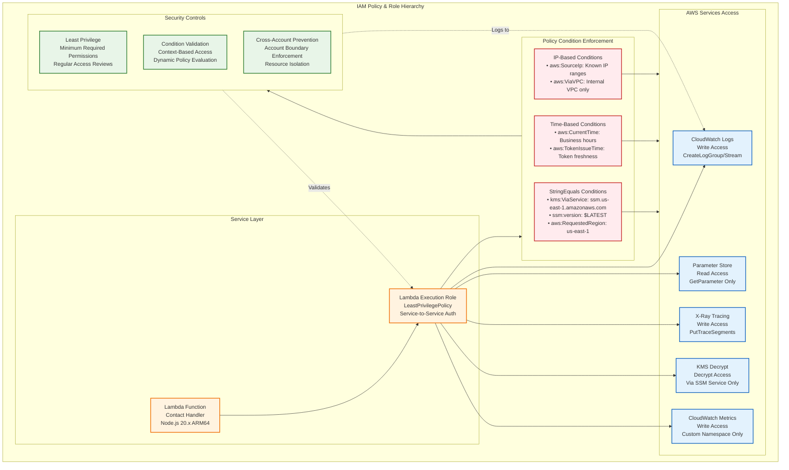

# Security Architecture - bjornmelin.io

## Overview

The security architecture for bjornmelin.io implements a comprehensive defense-in-depth strategy following AWS Well-Architected Security Pillar principles. This document outlines security controls, threat mitigation, and compliance measures implemented across the entire infrastructure.

## Security Architecture Layers

```mermaid
graph TB
    %% Defense-in-Depth Security Layers
    subgraph DefenseInDepth ["Defense-in-Depth Security Architecture"]
        
        %% Layer 7: Application Security
        subgraph Layer7 ["Layer 7: Application Security"]
            InputValidation["Input Validation & Sanitization<br/>XSS & Injection Prevention"]
            CSRFProtection["CSRF Protection<br/>Rolling Tokens & Validation"]
            RateLimit["Rate Limiting<br/>Per IP/Session Controls"]
            AntiSpam["Anti-Spam Protection<br/>Honeypot Fields & Detection"]
            GDPRCompliance["GDPR Compliance<br/>Data Protection Controls"]
        end
        
        %% Layer 6: API Security
        subgraph Layer6 ["Layer 6: API Security"]
            APIThrottling["API Gateway Throttling<br/>1000 req/sec limit"]
            RequestValidation["Request Size Limiting<br/>1MB max payload"]
            ContentTypeValidation["Content-Type Validation<br/>JSON schema enforcement"]
            CORSPolicy["CORS Policy<br/>Origin enforcement"]
            APILogging["Request/Response Logging<br/>X-Ray distributed tracing"]
            LambdaAuth["Lambda Authorizer<br/>Future authentication"]
        end
        
        %% Layer 5: Transport Security
        subgraph Layer5 ["Layer 5: Transport Security"]
            TLSEnforcement["TLS 1.2+ Enforcement<br/>Strong cipher suites only"]
            HSTSHeaders["HSTS Headers<br/>Strict transport security"]
            PerfectForwardSecrecy["Perfect Forward Secrecy<br/>ECDHE key exchange"]
            CertificatePinning["Certificate Pinning<br/>CloudFront validation"]
            HTTPSRedirects["HTTP to HTTPS<br/>Automatic redirects"]
        end
        
        %% Layer 4: Network Security
        subgraph Layer4 ["Layer 4: Network Security"]
            WAF["CloudFront WAF<br/>Web application firewall"]
            DDoSProtection["DDoS Protection<br/>CloudFront + Shield"]
            GeoRestrictions["Geographic Restrictions<br/>Country-based controls"]
            IPControl["IP Whitelisting/Blacklisting<br/>Access control lists"]
            VPCEndpoints["VPC Endpoints<br/>Internal traffic security"]
            SecurityGroups["Security Groups & NACLs<br/>Network access control"]
        end
        
        %% Layer 3: Identity & Access Management
        subgraph Layer3 ["Layer 3: Identity & Access Management"]
            IAMPolicies["IAM Least Privilege<br/>Minimal required permissions"]
            ServiceAuth["Service-to-Service Auth<br/>Role-based access control"]
            RBAC["Role-Based Access<br/>Resource-based policies"]
            MFA["MFA Administrative<br/>Multi-factor authentication"]
            CrossAccountRoles["Cross-Account Roles<br/>Secure role assumptions"]
            AccessReviews["Regular Access Reviews<br/>Quarterly audits"]
        end
        
        %% Layer 2: Data Security
        subgraph Layer2 ["Layer 2: Data Security"]
            KMSKeys["KMS Customer Keys<br/>Customer-managed encryption"]
            KeyRotation["Automatic Rotation<br/>Annual key rotation"]
            SecureParameters["Parameter Store<br/>SecureString encryption"]
            EncryptionAtRest["Encryption at Rest<br/>All data encrypted"]
            EncryptionInTransit["Encryption in Transit<br/>TLS for all communications"]
            DataClassification["Data Classification<br/>Retention & purging policies"]
        end
        
        %% Layer 1: Infrastructure Security
        subgraph Layer1 ["Layer 1: Infrastructure Security"]
            SharedResponsibility["Shared Responsibility<br/>AWS security model"]
            SecurityPatching["Security Patching<br/>Regular updates"]
            InfraAsCode["Infrastructure as Code<br/>CDK managed resources"]
            ImmutableInfra["Immutable Infrastructure<br/>Deployment consistency"]
            ResourceTagging["Resource Tagging<br/>Governance & compliance"]
            ComplianceFrameworks["Compliance Adherence<br/>Industry standards"]
        end
    end
    
    %% Security Flow - Attacks must penetrate all layers
    Users["Internet Users"] --> Layer7
    Layer7 --> Layer6
    Layer6 --> Layer5
    Layer5 --> Layer4
    Layer4 --> Layer3
    Layer3 --> Layer2
    Layer2 --> Layer1
    
    %% Feedback Loop - Each layer informs others
    Layer1 -.->|Security Events| Layer4
    Layer4 -.->|Threat Intelligence| Layer6
    Layer6 -.->|Attack Patterns| Layer7
    Layer7 -.->|User Behavior| Layer3
    
    %% Styling
    classDef layer7 fill:#e8f5e8,stroke:#2e7d32,stroke-width:2px
    classDef layer6 fill:#fff3e0,stroke:#ef6c00,stroke-width:2px
    classDef layer5 fill:#e3f2fd,stroke:#1565c0,stroke-width:2px
    classDef layer4 fill:#f3e5f5,stroke:#6a1b9a,stroke-width:2px
    classDef layer3 fill:#ffebee,stroke:#c62828,stroke-width:2px
    classDef layer2 fill:#fff8e1,stroke:#f57c00,stroke-width:2px
    classDef layer1 fill:#fce4ec,stroke:#c2185b,stroke-width:2px
    classDef external fill:#f5f5f5,stroke:#424242,stroke-width:2px
    
    class InputValidation,CSRFProtection,RateLimit,AntiSpam,GDPRCompliance layer7
    class APIThrottling,RequestValidation,ContentTypeValidation,CORSPolicy,APILogging,LambdaAuth layer6
    class TLSEnforcement,HSTSHeaders,PerfectForwardSecrecy,CertificatePinning,HTTPSRedirects layer5
    class WAF,DDoSProtection,GeoRestrictions,IPControl,VPCEndpoints,SecurityGroups layer4
    class IAMPolicies,ServiceAuth,RBAC,MFA,CrossAccountRoles,AccessReviews layer3
    class KMSKeys,KeyRotation,SecureParameters,EncryptionAtRest,EncryptionInTransit,DataClassification layer2
    class SharedResponsibility,SecurityPatching,InfraAsCode,ImmutableInfra,ResourceTagging,ComplianceFrameworks layer1
    class Users external
```



## Identity & Access Management (IAM) Architecture

### 1. IAM Policy Structure



### 2. Detailed IAM Policies

#### Lambda Execution Role Policy

```json
{
  "Version": "2012-10-17",
  "Statement": [
    {
      "Sid": "CloudWatchLogsAccess",
      "Effect": "Allow",
      "Action": [
        "logs:CreateLogGroup",
        "logs:CreateLogStream",
        "logs:PutLogEvents"
      ],
      "Resource": "arn:aws:logs:us-east-1:*:log-group:/aws/lambda/contact-form-handler:*"
    },
    {
      "Sid": "ParameterStoreReadAccess",
      "Effect": "Allow",
      "Action": [
        "ssm:GetParameter"
      ],
      "Resource": "arn:aws:ssm:us-east-1:*:parameter/portfolio/prod/resend/api-key",
      "Condition": {
        "StringEquals": {
          "ssm:version": "$LATEST"
        }
      }
    },
    {
      "Sid": "KMSDecryptAccess",
      "Effect": "Allow",
      "Action": [
        "kms:Decrypt"
      ],
      "Resource": "arn:aws:kms:us-east-1:*:key/*",
      "Condition": {
        "StringEquals": {
          "kms:ViaService": "ssm.us-east-1.amazonaws.com"
        }
      }
    },
    {
      "Sid": "XRayTracingAccess",
      "Effect": "Allow",
      "Action": [
        "xray:PutTraceSegments",
        "xray:PutTelemetryRecords"
      ],
      "Resource": "*"
    },
    {
      "Sid": "CloudWatchMetricsAccess",
      "Effect": "Allow",
      "Action": [
        "cloudwatch:PutMetricData"
      ],
      "Resource": "*",
      "Condition": {
        "StringEquals": {
          "cloudwatch:namespace": "Portfolio/EmailService"
        }
      }
    }
  ]
}
```

## Encryption & Key Management

### 1. KMS Key Architecture

```mermaid
graph TB
    %% KMS Key Management Architecture
    subgraph KMSArchitecture ["🔑 KMS Customer Managed Key Architecture"]
        
        %% Key Specifications
        subgraph KeySpecs ["📊 Key Specifications"]
            CustomerKey[🔑 Customer Managed Key<br/>alias/prod-portfolio-parameters<br/>ENCRYPT_DECRYPT Usage]
            KeyDetails[📋 Key Details<br/>• Spec: SYMMETRIC_DEFAULT<br/>• Origin: AWS_KMS<br/>• Multi-Region: No (Cost optimized)<br/>• Auto Rotation: Annual<br/>• Deletion Window: 30 days]
        end
        
        %% Key Policy Statements
        subgraph KeyPolicies ["📋 Key Policy Statements"]
            AdminAccess[👑 Admin Access<br/>Principal: Account Root<br/>Action: kms:*<br/>Full administrative control]
            
            ParameterStoreAccess[🔒 Parameter Store Access<br/>Principal: ssm.amazonaws.com<br/>Actions: Encrypt, Decrypt, ReEncrypt<br/>GenerateDataKey, DescribeKey]
            
            LambdaAccess[⚡ Lambda Decrypt Access<br/>Principal: Lambda Execution Role<br/>Actions: Decrypt, DescribeKey<br/>Condition: Via SSM Service Only]
            
            CloudTrailAccess[📋 CloudTrail Access<br/>Principal: cloudtrail.amazonaws.com<br/>Actions: Encrypt, GenerateDataKey<br/>DescribeKey for log encryption]
        end
        
        %% Access Controls
        subgraph AccessControls ["🛡️ Access Controls & Conditions"]
            ViaServiceCondition[🔗 Via Service Condition<br/>kms:ViaService: ssm.us-east-1.amazonaws.com<br/>Restricts access through specific service]
            
            RegionRestriction[🌍 Region Restriction<br/>aws:RequestedRegion: us-east-1<br/>Prevents cross-region access]
            
            TimeRestriction[⏰ Time-based Access<br/>aws:CurrentTime conditions<br/>Business hours enforcement]
        end
        
        %% Encryption Operations
        subgraph EncryptionOps ["🔐 Encryption Operations"]
            EncryptOperation[🔒 Encrypt Operation<br/>Data → Encrypted Data<br/>Parameter Store Storage]
            
            DecryptOperation[🔓 Decrypt Operation<br/>Encrypted Data → Plain Text<br/>Lambda Function Access]
            
            KeyRotation[🔄 Key Rotation<br/>Annual Automatic Rotation<br/>Backward Compatibility Maintained]
        end
        
        %% Security Features
        subgraph SecurityFeatures ["🛡️ Security Features"]
            AuditLogging[📊 Audit Logging<br/>CloudTrail Integration<br/>All key operations logged]
            
            KeyDeletion[🗑️ Secure Deletion<br/>30-day deletion window<br/>Recovery possible during window]
            
            CrossAccountProtection[🚫 Cross-Account Protection<br/>Account boundary enforcement<br/>Resource isolation]
        end
    end
    
    %% Key Usage Flow
    CustomerKey --> KeyPolicies
    AdminAccess --> AccessControls
    ParameterStoreAccess --> EncryptOperation
    LambdaAccess --> DecryptOperation
    CloudTrailAccess --> AuditLogging
    
    %% Condition Application
    ViaServiceCondition --> LambdaAccess
    RegionRestriction --> KeyPolicies
    TimeRestriction --> AccessControls
    
    %% Operational Flow
    EncryptOperation --> KeyRotation
    DecryptOperation --> AuditLogging
    KeyRotation --> SecurityFeatures
    
    %% Security Enforcement
    SecurityFeatures -.->|Monitors| KeyPolicies
    AuditLogging -.->|Tracks| EncryptionOps
    
    %% Styling
    classDef key fill:#fff3e0,stroke:#ef6c00,stroke-width:2px
    classDef policy fill:#e3f2fd,stroke:#1565c0,stroke-width:2px
    classDef condition fill:#ffebee,stroke:#c62828,stroke-width:2px
    classDef operation fill:#f3e5f5,stroke:#6a1b9a,stroke-width:2px
    classDef security fill:#e8f5e8,stroke:#2e7d32,stroke-width:2px
    
    class CustomerKey,KeyDetails key
    class AdminAccess,ParameterStoreAccess,LambdaAccess,CloudTrailAccess policy
    class ViaServiceCondition,RegionRestriction,TimeRestriction condition
    class EncryptOperation,DecryptOperation,KeyRotation operation
    class AuditLogging,KeyDeletion,CrossAccountProtection security
```

### 2. Data Encryption Flow

```mermaid
flowchart TD
    %% Data Encryption Flow Architecture
    subgraph EncryptionFlow ["🔐 Comprehensive Data Encryption Flow"]
        
        %% Parameter Storage Encryption
        subgraph StorageEncryption ["💾 Parameter Storage Encryption"]
            PlainTextAPI[📝 Plain Text API Key<br/>Resend Configuration<br/>JSON Format]
            KMSCustomerKey[🔑 KMS Customer Key<br/>alias/prod-portfolio-parameters<br/>SYMMETRIC_DEFAULT]
            ParameterStore[🔒 Parameter Store<br/>SecureString Type<br/>Standard Tier]
            EncryptedDataKey[🔐 Encrypted Data Key<br/>Generated per Parameter<br/>Stored with Data]
        end
        
        %% Parameter Retrieval & Decryption
        subgraph RetrievalDecryption ["🔓 Parameter Retrieval & Decryption"]
            LambdaRequest[⚡ Lambda Function<br/>GetParameter Request<br/>WithDecryption: true]
            ParameterFetch[📦 Parameter Store Fetch<br/>Retrieve Encrypted Value<br/>Parameter Metadata]
            KMSDecrypt[🔑 KMS Decrypt Operation<br/>Decrypt Data Key<br/>Via Service Condition]
            DecryptedValue[📄 Decrypted Plain Text<br/>Available to Lambda<br/>Memory-resident Only]
        end
        
        %% Transport Layer Security
        subgraph TransportSecurity ["🌐 Transport Layer Security (TLS)"]
            ClientBrowser[🖥️ Client Browser<br/>User Agent<br/>TLS 1.2+ Support]
            TLSEncryption[🔒 TLS 1.2+ Encryption<br/>End-to-End Security<br/>Certificate Validation]
            ServerEndpoint[🖥️ Server Endpoint<br/>CloudFront/API Gateway<br/>ACM Certificate]
        end
        
        %% Certificate Hierarchy
        subgraph CertificateHierarchy ["📜 Certificate Hierarchy & Cryptography"]
            RootCA[🏛️ Root CA<br/>Amazon Root CA 1<br/>Trust Anchor]
            IntermediateCA[🔗 Intermediate CA<br/>Amazon Intermediate<br/>Certificate Chain]
            DomainCert[📋 Domain Certificate<br/>*.bjornmelin.io<br/>SAN: www, api subdomains]
            KeyExchange[🔄 Key Exchange<br/>ECDHE (Perfect Forward Secrecy)<br/>Ephemeral Keys]
            CipherSuite[🔐 Cipher Suite<br/>AES-256-GCM<br/>Authenticated Encryption]
        end
        
        %% Encryption in Transit Details
        subgraph TransitDetails ["🔄 Encryption in Transit Details"]
            HTTPSEnforcement[🔒 HTTPS Enforcement<br/>301/302 Redirects<br/>HSTS Headers]
            SessionSecurity[🎫 Session Security<br/>Session Tokens<br/>Secure Cookies]
            APIEncryption[🚪 API Gateway Encryption<br/>TLS Termination<br/>Backend Security]
        end
        
        %% Security Controls
        subgraph SecurityControls ["🛡️ Security Controls"]
            EncryptionAtRest[💽 Encryption at Rest<br/>All stored data encrypted<br/>KMS integration]
            EncryptionInTransit[🔐 Encryption in Transit<br/>TLS for all communications<br/>Certificate validation]
            KeyRotation[🔄 Key Rotation<br/>Automatic KMS rotation<br/>Manual API key rotation]
            AuditTrail[📊 Audit Trail<br/>CloudTrail logging<br/>All encryption operations]
        end
    end
    
    %% Storage Flow
    PlainTextAPI --> KMSCustomerKey
    KMSCustomerKey --> ParameterStore
    ParameterStore --> EncryptedDataKey
    
    %% Retrieval Flow
    LambdaRequest --> ParameterFetch
    ParameterFetch --> KMSDecrypt
    KMSDecrypt --> DecryptedValue
    
    %% Transport Flow
    ClientBrowser --> TLSEncryption
    TLSEncryption --> ServerEndpoint
    
    %% Certificate Chain
    RootCA --> IntermediateCA
    IntermediateCA --> DomainCert
    DomainCert --> KeyExchange
    KeyExchange --> CipherSuite
    
    %% Security Integration
    TLSEncryption --> TransitDetails
    HTTPSEnforcement --> SessionSecurity
    SessionSecurity --> APIEncryption
    
    %% Security Controls Integration
    ParameterStore --> SecurityControls
    DecryptedValue --> SecurityControls
    ServerEndpoint --> SecurityControls
    
    %% Monitoring and Auditing
    SecurityControls -.->|Logs All Operations| AuditTrail
    KMSDecrypt -.->|Audit Trail| AuditTrail
    TLSEncryption -.->|Connection Logs| AuditTrail
    
    %% Styling
    classDef storage fill:#fff3e0,stroke:#ef6c00,stroke-width:2px
    classDef retrieval fill:#e3f2fd,stroke:#1565c0,stroke-width:2px
    classDef transport fill:#f3e5f5,stroke:#6a1b9a,stroke-width:2px
    classDef certificate fill:#ffebee,stroke:#c62828,stroke-width:2px
    classDef transit fill:#e8f5e8,stroke:#2e7d32,stroke-width:2px
    classDef security fill:#fff8e1,stroke:#f57c00,stroke-width:2px
    
    class PlainTextAPI,KMSCustomerKey,ParameterStore,EncryptedDataKey storage
    class LambdaRequest,ParameterFetch,KMSDecrypt,DecryptedValue retrieval
    class ClientBrowser,TLSEncryption,ServerEndpoint transport
    class RootCA,IntermediateCA,DomainCert,KeyExchange,CipherSuite certificate
    class HTTPSEnforcement,SessionSecurity,APIEncryption transit
    class EncryptionAtRest,EncryptionInTransit,KeyRotation,AuditTrail security
```

## Application Security Controls

### 1. Input Validation & Sanitization

```text
┌─────────────────────────────────────────────────────────────────┐
│                  Input Validation Framework                     │
├─────────────────────────────────────────────────────────────────┤
│                                                                 │
│  Contact Form Validation Pipeline:                             │
│                                                                 │
│  ┌─────────────┐                                               │
│  │   Client    │                                               │
│  │ JavaScript  │                                               │
│  │ Validation  │                                               │
│  └─────────────┘                                               │
│         │                                                       │
│         ▼                                                       │
│  ┌─────────────────────────────────────────────────────────────┐ │
│  │ Client-Side Validation Rules:                              │ │
│  │ ├─ Name: Required, 2-100 characters, no HTML tags          │ │
│  │ ├─ Email: RFC 5322 compliant format validation             │ │
│  │ ├─ Message: Required, 10-5000 characters                   │ │
│  │ ├─ Honeypot: Must be empty (hidden field)                  │ │
│  │ ├─ GDPR Consent: Must be checked                           │ │
│  │ └─ CSRF Token: Present and format validated                │ │
│  └─────────────────────────────────────────────────────────────┘ │
│         │                                                       │
│         ▼                                                       │
│  ┌─────────────┐                                               │
│  │   Server    │                                               │
│  │  Lambda     │                                               │
│  │ Validation  │                                               │
│  └─────────────┘                                               │
│         │                                                       │
│         ▼                                                       │
│  ┌─────────────────────────────────────────────────────────────┐ │
│  │ Server-Side Validation Rules:                              │ │
│  │ ├─ Request Method: POST only                               │ │
│  │ ├─ Content-Type: application/json                          │ │
│  │ ├─ Content-Length: 1KB-1MB                                 │ │
│  │ ├─ JSON Structure: Valid JSON syntax                       │ │
│  │ ├─ Required Fields: All mandatory fields present           │ │
│  │ ├─ Data Types: Correct type for each field                 │ │
│  │ ├─ String Lengths: Within allowed ranges                   │ │
│  │ ├─ Character Sets: Allowed characters only                 │ │
│  │ ├─ Email Validation: Deep email format validation          │ │
│  │ ├─ HTML/Script Detection: XSS prevention                   │ │
│  │ ├─ SQL Keywords: SQL injection prevention                  │ │
│  │ └─ Rate Limiting: Per-IP submission limits                 │ │
│  └─────────────────────────────────────────────────────────────┘ │
│         │                                                       │
│         ▼                                                       │
│  ┌─────────────────────────────────────────────────────────────┐ │
│  │ Sanitization Process:                                       │ │
│  │ ├─ HTML Entity Encoding: < > & " ' characters              │ │
│  │ ├─ Whitespace Normalization: Trim and normalize spaces     │ │
│  │ ├─ Unicode Normalization: Prevent Unicode attacks          │ │
│  │ ├─ Control Character Removal: Remove non-printable chars   │ │
│  │ ├─ URL Encoding: Encode special characters                 │ │
│  │ └─ Case Normalization: Consistent case handling            │ │
│  └─────────────────────────────────────────────────────────────┘ │
│                                                                 │
└─────────────────────────────────────────────────────────────────┘
```

### 2. CSRF Protection

```text
┌─────────────────────────────────────────────────────────────────┐
│                     CSRF Protection System                      │
├─────────────────────────────────────────────────────────────────┤
│                                                                 │
│  Token Generation & Validation Flow:                           │
│                                                                 │
│  ┌─────────────┐    ┌─────────────┐    ┌─────────────┐         │
│  │   Session   │────│    Token    │────│   Client    │         │
│  │    Start    │    │ Generation  │    │ Form Render │         │
│  └─────────────┘    └─────────────┘    └─────────────┘         │
│         │                   │                   │               │
│         ▼                   ▼                   ▼               │
│  ┌─────────────────────────────────────────────────────────────┐ │
│  │ Token Characteristics:                                      │ │
│  │ ├─ Algorithm: HMAC-SHA256                                   │ │
│  │ ├─ Length: 32 bytes (256 bits)                             │ │
│  │ ├─ Encoding: Base64URL                                      │ │
│  │ ├─ Expiry: 1 hour                                           │ │
│  │ ├─ Binding: Session ID + User Agent                        │ │
│  │ ├─ Secret Key: Rotated daily                               │ │
│  │ └─ Timestamp: Unix timestamp inclusion                      │ │
│  └─────────────────────────────────────────────────────────────┘ │
│                                                                 │
│  ┌─────────────┐    ┌─────────────┐    ┌─────────────┐         │
│  │    Form     │────│   Token     │────│  Validation │         │
│  │ Submission  │    │Verification │    │   Result    │         │
│  └─────────────┘    └─────────────┘    └─────────────┘         │
│         │                   │                   │               │
│         ▼                   ▼                   ▼               │
│  ┌─────────────────────────────────────────────────────────────┐ │
│  │ Validation Process:                                         │ │
│  │ ├─ Token Presence: Verify token exists in request          │ │
│  │ ├─ Token Format: Valid Base64URL encoding                  │ │
│  │ ├─ Token Expiry: Check timestamp validity                  │ │
│  │ ├─ Session Binding: Verify session ID match                │ │
│  │ ├─ User Agent: Validate user agent consistency             │ │
│  │ ├─ Signature: Verify HMAC signature                        │ │
│  │ ├─ Replay Prevention: One-time use validation              │ │
│  │ └─ Error Handling: Secure failure modes                    │ │
│  └─────────────────────────────────────────────────────────────┘ │
│                                                                 │
│  Security Features:                                             │
│  ┌─────────────────────────────────────────────────────────────┐ │
│  │ ├─ Double Submit Cookie: Additional CSRF protection        │ │
│  │ ├─ SameSite Cookies: Browser-level CSRF protection         │ │
│  │ ├─ Referrer Validation: Origin header verification         │ │
│  │ ├─ Content-Type Validation: JSON content type required     │ │
│  │ └─ Token Rotation: Rolling tokens for enhanced security    │ │
│  └─────────────────────────────────────────────────────────────┘ │
│                                                                 │
└─────────────────────────────────────────────────────────────────┘
```

### 3. Rate Limiting & Anti-Spam

```text
┌─────────────────────────────────────────────────────────────────┐
│                   Rate Limiting System                          │
├─────────────────────────────────────────────────────────────────┤
│                                                                 │
│  Multi-Layer Rate Limiting:                                    │
│                                                                 │
│  Layer 1: CloudFront Rate Limiting                             │
│  ┌─────────────────────────────────────────────────────────────┐ │
│  │ ├─ Geographic Restrictions: Country-based blocking          │ │
│  │ ├─ IP-based Throttling: Requests per IP per minute          │ │
│  │ ├─ Request Frequency: Maximum burst size                    │ │
│  │ └─ WAF Integration: Custom rules for attack patterns        │ │
│  └─────────────────────────────────────────────────────────────┘ │
│                                                                 │
│  Layer 2: API Gateway Throttling                               │
│  ┌─────────────────────────────────────────────────────────────┐ │
│  │ ├─ Account Level: 10,000 requests/second                    │ │
│  │ ├─ API Level: 1,000 requests/second                         │ │
│  │ ├─ Method Level: 100 requests/second                        │ │
│  │ ├─ Client Level: 10 requests/second per client              │ │
│  │ └─ Burst Capacity: 2x steady state for bursts              │ │
│  └─────────────────────────────────────────────────────────────┘ │
│                                                                 │
│  Layer 3: Application-Level Rate Limiting                      │
│  ┌─────────────────────────────────────────────────────────────┐ │
│  │ Contact Form Specific Limits:                              │ │
│  │ ├─ Per IP: 5 submissions per hour                          │ │
│  │ ├─ Per Session: 2 submissions per session                  │ │
│  │ ├─ Per Email: 1 submission per email per day               │ │
│  │ ├─ Global: 100 submissions per hour (abuse protection)     │ │
│  │ └─ Sliding Window: 15-minute rolling windows               │ │
│  │                                                             │ │
│  │ Rate Limiting Storage:                                      │ │
│  │ ├─ Backend: DynamoDB (future) or in-memory cache           │ │
│  │ ├─ TTL: Automatic expiration of rate limit counters        │ │
│  │ ├─ Persistence: Survives Lambda cold starts                │ │
│  │ └─ Cleanup: Automatic cleanup of expired entries           │ │
│  └─────────────────────────────────────────────────────────────┘ │
│                                                                 │
│  Anti-Spam Protection:                                         │
│  ┌─────────────────────────────────────────────────────────────┐ │
│  │ Honeypot Fields:                                            │ │
│  │ ├─ Hidden Input: Invisible to humans, detected by bots     │ │
│  │ ├─ CSS Styling: display:none, visibility:hidden            │ │
│  │ ├─ Validation: Must be empty for valid submission          │ │
│  │ └─ Multiple Honeypots: Different types for robust detection │ │
│  │                                                             │ │
│  │ Behavioral Analysis:                                        │ │
│  │ ├─ Submission Speed: Too fast indicates automation         │ │
│  │ ├─ Mouse Movement: Track human-like interaction patterns   │ │
│  │ ├─ Keyboard Timing: Natural typing patterns                │ │
│  │ └─ Focus Events: Field focus/blur event analysis           │ │
│  │                                                             │ │
│  │ Content Analysis:                                           │ │
│  │ ├─ Spam Keywords: Common spam terms detection              │ │
│  │ ├─ Link Counting: Maximum allowed links in message         │ │
│  │ ├─ Language Detection: Primary language validation         │ │
│  │ ├─ Duplicate Detection: Previous submission matching       │ │
│  │ └─ Sentiment Analysis: Obvious spam sentiment detection    │ │
│  └─────────────────────────────────────────────────────────────┘ │
│                                                                 │
└─────────────────────────────────────────────────────────────────┘
```

## Security Headers & Transport Security

### 1. HTTP Security Headers

```text
┌─────────────────────────────────────────────────────────────────┐
│                    Security Headers Configuration               │
├─────────────────────────────────────────────────────────────────┤
│                                                                 │
│  CloudFront Security Headers:                                  │
│  ┌─────────────────────────────────────────────────────────────┐ │
│  │ Strict-Transport-Security:                                  │ │
│  │ ├─ Value: max-age=63072000; includeSubDomains; preload     │ │
│  │ ├─ Purpose: Force HTTPS connections                        │ │
│  │ └─ Scope: 2 years, subdomains, HSTS preload list          │ │
│  │                                                             │ │
│  │ Content-Security-Policy:                                    │ │
│  │ ├─ default-src 'self'                                       │ │
│  │ ├─ script-src 'self' 'unsafe-inline' cdn.jsdelivr.net      │ │
│  │ ├─ style-src 'self' 'unsafe-inline' fonts.googleapis.com   │ │
│  │ ├─ img-src 'self' data: https:                             │ │
│  │ ├─ font-src 'self' fonts.gstatic.com                       │ │
│  │ ├─ connect-src 'self' api.bjornmelin.io                    │ │
│  │ ├─ object-src 'none'                                        │ │
│  │ ├─ base-uri 'self'                                          │ │
│  │ ├─ form-action 'self'                                       │ │
│  │ └─ frame-ancestors 'none'                                   │ │
│  │                                                             │ │
│  │ X-Frame-Options:                                            │ │
│  │ ├─ Value: DENY                                             │ │
│  │ └─ Purpose: Prevent clickjacking attacks                   │ │
│  │                                                             │ │
│  │ X-Content-Type-Options:                                     │ │
│  │ ├─ Value: nosniff                                          │ │
│  │ └─ Purpose: Prevent MIME type sniffing                     │ │
│  │                                                             │ │
│  │ Referrer-Policy:                                            │ │
│  │ ├─ Value: strict-origin-when-cross-origin                  │ │
│  │ └─ Purpose: Control referrer information                   │ │
│  │                                                             │ │
│  │ Permissions-Policy:                                         │ │
│  │ ├─ geolocation=(), microphone=(), camera=()                │ │
│  │ └─ Purpose: Disable unnecessary browser features           │ │
│  │                                                             │ │
│  │ X-XSS-Protection:                                           │ │
│  │ ├─ Value: 1; mode=block                                    │ │
│  │ └─ Purpose: Enable XSS filtering (legacy support)          │ │
│  └─────────────────────────────────────────────────────────────┘ │
│                                                                 │
│  API Gateway Security Headers:                                 │
│  ┌─────────────────────────────────────────────────────────────┐ │
│  │ CORS Headers:                                               │ │
│  │ ├─ Access-Control-Allow-Origin: https://bjornmelin.io      │ │
│  │ ├─ Access-Control-Allow-Methods: POST, OPTIONS             │ │
│  │ ├─ Access-Control-Allow-Headers: Content-Type              │ │
│  │ ├─ Access-Control-Max-Age: 3600                            │ │
│  │ └─ Access-Control-Allow-Credentials: false                 │ │
│  │                                                             │ │
│  │ API-Specific Headers:                                       │ │
│  │ ├─ X-Content-Type-Options: nosniff                         │ │
│  │ ├─ X-Frame-Options: DENY                                   │ │
│  │ ├─ Cache-Control: no-cache, no-store, must-revalidate      │ │
│  │ └─ X-RateLimit-*: Rate limiting information headers        │ │
│  └─────────────────────────────────────────────────────────────┘ │
│                                                                 │
└─────────────────────────────────────────────────────────────────┘
```

### 2. TLS/SSL Configuration

```text
┌─────────────────────────────────────────────────────────────────┐
│                    TLS/SSL Configuration                        │
├─────────────────────────────────────────────────────────────────┤
│                                                                 │
│  Certificate Configuration:                                     │
│  ┌─────────────────────────────────────────────────────────────┐ │
│  │ Certificate Details:                                        │ │
│  │ ├─ Provider: AWS Certificate Manager (ACM)                  │ │
│  │ ├─ Domain: bjornmelin.io                                    │ │
│  │ ├─ Subject Alternative Names:                               │ │
│  │ │   ├─ www.bjornmelin.io                                    │ │
│  │ │   └─ api.bjornmelin.io                                    │ │
│  │ ├─ Validation: DNS validation                               │ │
│  │ ├─ Renewal: Automatic (ACM managed)                         │ │
│  │ ├─ Key Algorithm: RSA-2048 or ECDSA P-256                   │ │
│  │ └─ CA: Amazon CA                                            │ │
│  └─────────────────────────────────────────────────────────────┘ │
│                                                                 │
│  CloudFront TLS Settings:                                      │
│  ┌─────────────────────────────────────────────────────────────┐ │
│  │ Minimum TLS Version: TLSv1.2                                │ │
│  │ Security Policy: TLSv1.2_2021                               │ │
│  │                                                             │ │
│  │ Supported Cipher Suites:                                    │ │
│  │ ├─ ECDHE-RSA-AES128-GCM-SHA256                              │ │
│  │ ├─ ECDHE-RSA-AES256-GCM-SHA384                              │ │
│  │ ├─ ECDHE-RSA-AES128-SHA256                                  │ │
│  │ ├─ ECDHE-RSA-AES256-SHA384                                  │ │
│  │ ├─ AES128-GCM-SHA256                                        │ │
│  │ ├─ AES256-GCM-SHA384                                        │ │
│  │ └─ AES128-SHA256                                            │ │
│  │                                                             │ │
│  │ Features:                                                   │ │
│  │ ├─ Perfect Forward Secrecy: Enabled                         │ │
│  │ ├─ Session Resumption: Enabled                              │ │
│  │ ├─ OCSP Stapling: Enabled                                   │ │
│  │ └─ HTTP/2: Enabled                                          │ │
│  └─────────────────────────────────────────────────────────────┘ │
│                                                                 │
│  API Gateway TLS Settings:                                     │
│  ┌─────────────────────────────────────────────────────────────┐ │
│  │ Minimum TLS Version: TLSv1.2                                │ │
│  │ Custom Domain Configuration:                                │ │
│  │ ├─ Domain: api.bjornmelin.io                                │ │
│  │ ├─ Certificate: ACM certificate (same as CloudFront)        │ │
│  │ ├─ Security Policy: TLS_1_2                                 │ │
│  │ └─ Endpoint Type: Edge-optimized                            │ │
│  └─────────────────────────────────────────────────────────────┘ │
│                                                                 │
└─────────────────────────────────────────────────────────────────┘
```

## Monitoring & Threat Detection

### 1. Security Monitoring

```text
┌─────────────────────────────────────────────────────────────────┐
│                    Security Monitoring System                   │
├─────────────────────────────────────────────────────────────────┤
│                                                                 │
│  CloudTrail Audit Logging:                                     │
│  ┌─────────────────────────────────────────────────────────────┐ │
│  │ Event Categories:                                           │ │
│  │ ├─ Management Events: All API calls                         │ │
│  │ ├─ Data Events: Parameter Store access                      │ │
│  │ ├─ Insight Events: Unusual activity patterns               │ │
│  │ └─ Global Service Events: IAM, CloudFront changes           │ │
│  │                                                             │ │
│  │ Critical Events to Monitor:                                 │ │
│  │ ├─ IAM Policy Changes                                       │ │
│  │ ├─ KMS Key Operations                                       │ │
│  │ ├─ Parameter Store Access                                   │ │
│  │ ├─ Lambda Function Modifications                            │ │
│  │ ├─ API Gateway Configuration Changes                        │ │
│  │ ├─ Root Account Usage                                       │ │
│  │ └─ Failed Authentication Attempts                           │ │
│  │                                                             │ │
│  │ Log Integrity:                                              │ │
│  │ ├─ Log File Validation: Enabled                             │ │
│  │ ├─ Log Encryption: KMS encrypted                            │ │
│  │ ├─ Log Retention: 90 days                                   │ │
│  │ └─ Cross-Region Replication: Optional                       │ │
│  └─────────────────────────────────────────────────────────────┘ │
│                                                                 │
│  CloudWatch Security Metrics:                                  │
│  ┌─────────────────────────────────────────────────────────────┐ │
│  │ Application Security Metrics:                               │ │
│  │ ├─ Failed Authentication Attempts                           │ │
│  │ ├─ CSRF Token Validation Failures                           │ │
│  │ ├─ Rate Limiting Violations                                 │ │
│  │ ├─ Input Validation Failures                                │ │
│  │ ├─ Spam Detection Triggers                                  │ │
│  │ ├─ Unusual Traffic Patterns                                 │ │
│  │ └─ Error Rate Spikes                                        │ │
│  │                                                             │ │
│  │ Infrastructure Security Metrics:                            │ │
│  │ ├─ API Gateway 4XX/5XX Error Rates                          │ │
│  │ ├─ Lambda Function Errors                                   │ │
│  │ ├─ Parameter Store Access Frequency                         │ │
│  │ ├─ KMS Decrypt Operation Failures                           │ │
│  │ ├─ CloudFront WAF Blocks                                    │ │
│  │ └─ Unusual Geographic Access Patterns                       │ │
│  └─────────────────────────────────────────────────────────────┘ │
│                                                                 │
│  Automated Threat Detection:                                   │
│  ┌─────────────────────────────────────────────────────────────┐ │
│  │ CloudWatch Anomaly Detection:                               │ │
│  │ ├─ Baseline Learning: 14-day training period                │ │
│  │ ├─ Anomaly Threshold: 2 standard deviations                 │ │
│  │ ├─ Metrics Monitored:                                       │ │
│  │ │   ├─ Request volume                                       │ │
│  │ │   ├─ Error rates                                          │ │
│  │ │   ├─ Response times                                       │ │
│  │ │   └─ Geographic distribution                              │ │
│  │ └─ Alert Actions: SNS notifications                         │ │
│  │                                                             │ │
│  │ Custom Security Rules:                                      │ │
│  │ ├─ Brute Force Detection: >10 failed attempts/minute       │ │
│  │ ├─ Unusual Source IPs: Geographic anomalies                │ │
│  │ ├─ Parameter Access Spikes: >100 accesses/hour             │ │
│  │ ├─ Error Rate Threshold: >5% error rate                    │ │
│  │ └─ Response Time Anomalies: >5 second 95th percentile      │ │
│  └─────────────────────────────────────────────────────────────┘ │
│                                                                 │
└─────────────────────────────────────────────────────────────────┘
```

### 2. Incident Response

```text
┌─────────────────────────────────────────────────────────────────┐
│                     Incident Response Plan                      │
├─────────────────────────────────────────────────────────────────┤
│                                                                 │
│  Incident Classification:                                       │
│  ┌─────────────────────────────────────────────────────────────┐ │
│  │ Severity Levels:                                            │ │
│  │ ├─ Critical (P1): Active security breach                    │ │
│  │ ├─ High (P2): Potential security vulnerability              │ │
│  │ ├─ Medium (P3): Security configuration issue                │ │
│  │ └─ Low (P4): Security monitoring alert                      │ │
│  │                                                             │ │
│  │ Response Times:                                             │ │
│  │ ├─ P1: Immediate (< 15 minutes)                            │ │
│  │ ├─ P2: Urgent (< 1 hour)                                   │ │
│  │ ├─ P3: Standard (< 4 hours)                                │ │
│  │ └─ P4: Planned (< 24 hours)                                │ │
│  └─────────────────────────────────────────────────────────────┘ │
│                                                                 │
│  Incident Response Workflow:                                   │
│  ┌─────────────────────────────────────────────────────────────┐ │
│  │ Detection:                                                  │ │
│  │ ├─ Automated Alerting: CloudWatch Alarms                    │ │
│  │ ├─ Manual Reporting: User reports or observations           │ │
│  │ └─ Proactive Monitoring: Regular security reviews           │ │
│  │                                                             │ │
│  │ Assessment:                                                 │ │
│  │ ├─ Impact Analysis: Affected systems and data               │ │
│  │ ├─ Scope Determination: Extent of the incident              │ │
│  │ ├─ Evidence Collection: Logs, metrics, traces               │ │
│  │ └─ Initial Classification: Severity and type                │ │
│  │                                                             │ │
│  │ Containment:                                                │ │
│  │ ├─ Immediate Actions: Stop ongoing damage                   │ │
│  │ ├─ Isolation: Isolate affected components                   │ │
│  │ ├─ Traffic Blocking: WAF rules or IP blocking               │ │
│  │ └─ Service Degradation: Graceful service reduction          │ │
│  │                                                             │ │
│  │ Eradication:                                                │ │
│  │ ├─ Root Cause Analysis: Identify vulnerability source       │ │
│  │ ├─ Security Patches: Apply necessary fixes                  │ │
│  │ ├─ Configuration Updates: Harden affected systems           │ │
│  │ └─ Key Rotation: Rotate compromised credentials             │ │
│  │                                                             │ │
│  │ Recovery:                                                   │ │
│  │ ├─ Service Restoration: Bring systems back online          │ │
│  │ ├─ Monitoring Enhancement: Additional monitoring             │ │
│  │ ├─ Testing: Verify security fixes                           │ │
│  │ └─ Communication: Stakeholder notifications                 │ │
│  │                                                             │ │
│  │ Lessons Learned:                                            │ │
│  │ ├─ Post-Incident Review: What went well/poorly              │ │
│  │ ├─ Process Improvements: Update procedures                  │ │
│  │ ├─ Training Updates: Security awareness training            │ │
│  │ └─ Documentation: Update security documentation             │ │
│  └─────────────────────────────────────────────────────────────┘ │
│                                                                 │
└─────────────────────────────────────────────────────────────────┘
```

## Security Compliance & Governance

### 1. Compliance Framework

```text
┌─────────────────────────────────────────────────────────────────┐
│                    Compliance Framework                         │
├─────────────────────────────────────────────────────────────────┤
│                                                                 │
│  GDPR Compliance:                                               │
│  ┌─────────────────────────────────────────────────────────────┐ │
│  │ Data Processing Principles:                                 │ │
│  │ ├─ Lawfulness: Explicit consent for data processing         │ │
│  │ ├─ Purpose Limitation: Contact form processing only         │ │
│  │ ├─ Data Minimization: Only collect necessary data           │ │
│  │ ├─ Accuracy: Validate and correct data inputs               │ │
│  │ ├─ Storage Limitation: Delete after processing              │ │
│  │ └─ Security: Implement appropriate technical measures       │ │
│  │                                                             │ │
│  │ Individual Rights:                                          │ │
│  │ ├─ Right to Information: Privacy policy provided            │ │
│  │ ├─ Right of Access: Data access upon request                │ │
│  │ ├─ Right to Rectification: Data correction procedures       │ │
│  │ ├─ Right to Erasure: Data deletion procedures               │ │
│  │ ├─ Right to Portability: Data export capabilities           │ │
│  │ └─ Right to Object: Opt-out mechanisms                      │ │
│  └─────────────────────────────────────────────────────────────┘ │
│                                                                 │
│  SOC 2 Type II (Future):                                       │
│  ┌─────────────────────────────────────────────────────────────┐ │
│  │ Trust Service Criteria:                                     │ │
│  │ ├─ Security: Logical and physical access controls           │ │
│  │ ├─ Availability: System operational availability            │ │
│  │ ├─ Processing Integrity: Complete and accurate processing   │ │
│  │ ├─ Confidentiality: Information designated as confidential  │ │
│  │ └─ Privacy: Personal information collection and disposal    │ │
│  └─────────────────────────────────────────────────────────────┘ │
│                                                                 │
│  ISO 27001 Alignment:                                          │
│  ┌─────────────────────────────────────────────────────────────┐ │
│  │ Information Security Controls:                              │ │
│  │ ├─ A.5: Information Security Policies                       │ │
│  │ ├─ A.6: Organization of Information Security                │ │
│  │ ├─ A.8: Asset Management                                    │ │
│  │ ├─ A.9: Access Control                                      │ │
│  │ ├─ A.10: Cryptography                                       │ │
│  │ ├─ A.12: Operations Security                                │ │
│  │ ├─ A.13: Communications Security                            │ │
│  │ ├─ A.14: System Acquisition, Development and Maintenance    │ │
│  │ ├─ A.16: Information Security Incident Management           │ │
│  │ └─ A.18: Compliance                                         │ │
│  └─────────────────────────────────────────────────────────────┘ │
│                                                                 │
└─────────────────────────────────────────────────────────────────┘
```

### 2. Security Governance

```text
┌─────────────────────────────────────────────────────────────────┐
│                    Security Governance Process                  │
├─────────────────────────────────────────────────────────────────┤
│                                                                 │
│  Security Review Schedule:                                      │
│  ┌─────────────────────────────────────────────────────────────┐ │
│  │ Monthly Reviews:                                            │ │
│  │ ├─ Access log analysis                                      │ │
│  │ ├─ Security metric review                                   │ │
│  │ ├─ Incident report analysis                                 │ │
│  │ └─ Vulnerability assessment                                 │ │
│  │                                                             │ │
│  │ Quarterly Reviews:                                          │ │
│  │ ├─ API key rotation                                         │ │
│  │ ├─ Security control effectiveness                           │ │
│  │ ├─ Risk assessment update                                   │ │
│  │ └─ Security training review                                 │ │
│  │                                                             │ │
│  │ Annual Reviews:                                             │ │
│  │ ├─ Security architecture review                             │ │
│  │ ├─ Penetration testing                                      │ │
│  │ ├─ Compliance audit                                         │ │
│  │ └─ Business continuity testing                              │ │
│  └─────────────────────────────────────────────────────────────┘ │
│                                                                 │
│  Change Management:                                             │
│  ┌─────────────────────────────────────────────────────────────┐ │
│  │ Security Change Process:                                    │ │
│  │ ├─ Change Request: Formal change documentation              │ │
│  │ ├─ Security Impact Assessment: Risk evaluation              │ │
│  │ ├─ Approval Process: Security team approval                 │ │
│  │ ├─ Implementation: Controlled deployment                    │ │
│  │ ├─ Testing: Security validation testing                     │ │
│  │ ├─ Monitoring: Post-change monitoring                       │ │
│  │ └─ Documentation: Update security documentation             │ │
│  └─────────────────────────────────────────────────────────────┘ │
│                                                                 │
│  Risk Management:                                              │
│  ┌─────────────────────────────────────────────────────────────┐ │
│  │ Risk Assessment Matrix:                                     │ │
│  │                                                             │ │
│  │           | Low    | Medium | High   | Critical            │ │
│  │ Likelihood| Impact | Impact | Impact | Impact              │ │
│  │ ----------|--------|--------|--------|----------            │ │
│  │ High      | Medium | High   | High   | Critical            │ │
│  │ Medium    | Low    | Medium | High   | High                │ │
│  │ Low       | Low    | Low    | Medium | Medium              │ │
│  │                                                             │ │
│  │ Risk Treatment Options:                                     │ │
│  │ ├─ Accept: Low impact, low likelihood risks                 │ │
│  │ ├─ Mitigate: Implement controls to reduce risk              │ │
│  │ ├─ Transfer: Insurance or third-party responsibility        │ │
│  │ └─ Avoid: Eliminate the risk source                         │ │
│  └─────────────────────────────────────────────────────────────┘ │
│                                                                 │
└─────────────────────────────────────────────────────────────────┘
```

## Security Cost Analysis

### Monthly Security Costs

```text
Security Component           | Cost    | Justification
----------------------------|---------|---------------------------
KMS Customer Managed Key    | $1.00   | Data encryption at rest
KMS API Calls              | $0.03   | Minimal decrypt operations
CloudTrail Logging         | $0.50   | Audit and compliance
CloudWatch Security Logs   | $0.20   | Security monitoring
Parameter Store            | $0.00   | Standard tier (free)
WAF (Future)              | $5.00   | Advanced threat protection
GuardDuty (Future)        | $3.00   | Threat detection
Security Hub (Future)     | $0.30   | Centralized security
----------------------------|---------|---------------------------
Current Total             | $1.73   | Core security controls
Future Enhanced Total     | $9.03   | With advanced security
```

### Security ROI Analysis

- **Data Breach Prevention**: Estimated savings of $50,000+ per incident
- **Compliance Adherence**: Avoid regulatory fines ($10,000+ potential)
- **Reputation Protection**: Maintain customer trust and business continuity
- **Operational Efficiency**: Automated security reduces manual overhead
- **Cost of Security**: <0.1% of potential breach costs

## Related Documentation

This security architecture document is part of a comprehensive documentation suite:

### Architecture Documentation Suite

- **[Architecture Overview](./architecture-overview.md)** - Comprehensive system architecture and design principles
- **[Email Service Architecture](./email-service-architecture.md)** - Detailed email service flow and technical specifications
- **[API Gateway + Lambda Architecture](./api-lambda-architecture.md)** - Serverless API architecture and performance
- **[DNS Configuration Guide](./dns-configuration-guide.md)** - Complete DNS setup and email authentication

### Security Implementation Guides

- **[Security Implementation Guide](./security-implementation.md)** - Technical guide for implementing security features
- **[Security Audit Checklist](./security-audit-checklist.md)** - Security review and compliance checklist
- **[Parameter Store Migration Guide](./parameter-store-migration-guide.md)** - Secure migration from Secrets Manager

### Operational Documentation

- **[Email Infrastructure Guide](./email-infrastructure-guide.md)** - Complete email service implementation with AWS
- **[Application Integration Examples](./application-integration-examples.md)** - Secure code examples for Lambda and frontend integration

---

*This security architecture documentation provides comprehensive coverage of all security controls, monitoring, and governance processes implemented for the bjornmelin.io infrastructure. For implementation details, refer to the deployment guides and operational procedures.*
