# Security Implementation Guide

**Last Updated**: June 23, 2025  
**Purpose**: Technical guide for implementing security features  
**Scope**: Contact form and API security enhancements

---

## Overview

This guide provides detailed implementation instructions for security enhancements to the portfolio platform, focusing on pragmatic solutions appropriate for the application's scale.

---

## Security Features Implementation

### Security Implementation Flow Overview

The following diagram shows the comprehensive security implementation flow for contact form processing:

```mermaid
graph TB
    %% Contact Form Security Implementation Flow
    subgraph SecurityFlow [Security Implementation Pipeline]
        
        %% Client Side Security
        subgraph ClientSide [📱 Client-Side Security Layer]
            UserForm[📝 Contact Form<br/>Input Collection<br/>Basic Validation]
            JSValidation[✅ JavaScript Validation<br/>Format Checks<br/>Required Fields]
            CSRFToken[🎫 CSRF Token Generation<br/>Secure Token Creation<br/>DOM Injection]
            RateLimitClient[⏱️ Client Rate Limiting<br/>Button Disable State<br/>Submission Tracking]
            FormEncryption[🔐 Form Data Encryption<br/>HTTPS Transport<br/>Content Encoding]
        end
        
        %% Transport Security
        subgraph TransportSec [🔒 Transport Security Layer]
            TLSValidation[🔐 TLS/HTTPS Validation<br/>Certificate Verification<br/>Secure Headers]
            ContentType[📋 Content-Type Validation<br/>JSON Schema Check<br/>MIME Type Verification]
            PayloadSize[📏 Payload Size Validation<br/>1MB Maximum<br/>Buffer Overflow Prevention]
        end
        
        %% Server Side Security
        subgraph ServerSide [🛡️ Server-Side Security Layer]
            CSRFValidation[🎫 CSRF Token Validation<br/>Token Verification<br/>Session Binding]
            InputSanitization[🧹 Input Sanitization<br/>XSS Prevention<br/>HTML Stripping]
            RateLimitServer[⏱️ Server Rate Limiting<br/>IP-based Tracking<br/>Sliding Window]
            SpamDetection[🍯 Spam Detection<br/>Honeypot Fields<br/>Behavioral Analysis]
            SchemaValidation[📋 Schema Validation<br/>Zod Type Safety<br/>Field Requirements]
        end
        
        %% Data Processing Security
        subgraph DataProcessing [💾 Data Processing Security]
            DataEncryption[🔐 Data Encryption<br/>Parameter Store<br/>KMS Integration]
            AuditLogging[📊 Audit Logging<br/>CloudWatch Logs<br/>Security Events]
            ConfigRetrieval[🔒 Secure Config Retrieval<br/>IAM Permissions<br/>Least Privilege]
            EmailValidation[📧 Email Validation<br/>Format Verification<br/>Domain Checks]
        end
        
        %% Response Security
        subgraph ResponseSec [📤 Response Security Layer]
            ErrorHandling[🚨 Secure Error Handling<br/>No Information Leakage<br/>Generic Responses]
            ResponseHeaders[📋 Security Headers<br/>CORS Configuration<br/>CSP Implementation]
            SessionCleanup[🧹 Session Cleanup<br/>Token Invalidation<br/>Memory Clearing]
        end
    end
    
    %% Security Flow - Each layer validates before proceeding
    UserForm --> JSValidation
    JSValidation --> CSRFToken
    CSRFToken --> RateLimitClient
    RateLimitClient --> FormEncryption
    
    FormEncryption --> TLSValidation
    TLSValidation --> ContentType
    ContentType --> PayloadSize
    
    PayloadSize --> CSRFValidation
    CSRFValidation --> InputSanitization
    InputSanitization --> RateLimitServer
    RateLimitServer --> SpamDetection
    SpamDetection --> SchemaValidation
    
    SchemaValidation --> DataEncryption
    DataEncryption --> AuditLogging
    AuditLogging --> ConfigRetrieval
    ConfigRetrieval --> EmailValidation
    
    EmailValidation --> ErrorHandling
    ErrorHandling --> ResponseHeaders
    ResponseHeaders --> SessionCleanup
    
    %% Security Feedback Loops
    RateLimitServer -.->|Rate Limit Events| AuditLogging
    SpamDetection -.->|Threat Detection| AuditLogging
    CSRFValidation -.->|Token Validation Events| AuditLogging
    ErrorHandling -.->|Security Incidents| AuditLogging
    
    %% Styling
    classDef clientLayer fill:#e8f5e8,stroke:#2e7d32,stroke-width:2px
    classDef transportLayer fill:#fff3e0,stroke:#ef6c00,stroke-width:2px
    classDef serverLayer fill:#e3f2fd,stroke:#1976d2,stroke-width:2px
    classDef dataLayer fill:#f3e5f5,stroke:#7b1fa2,stroke-width:2px
    classDef responseLayer fill:#fff8e1,stroke:#f57c00,stroke-width:2px
    
    class UserForm,JSValidation,CSRFToken,RateLimitClient,FormEncryption clientLayer
    class TLSValidation,ContentType,PayloadSize transportLayer
    class CSRFValidation,InputSanitization,RateLimitServer,SpamDetection,SchemaValidation serverLayer
    class DataEncryption,AuditLogging,ConfigRetrieval,EmailValidation dataLayer
    class ErrorHandling,ResponseHeaders,SessionCleanup responseLayer
```



### 1. CSRF Protection

#### Implementation Details

```typescript
// /src/lib/security/csrf.ts
import { createHash, randomBytes } from 'crypto';
import { cookies } from 'next/headers';

const CSRF_COOKIE_NAME = 'csrf-token';
const CSRF_SECRET = process.env.CSRF_SECRET || 'development-secret';

export function generateCSRFToken(): string {
  const token = randomBytes(32).toString('hex');
  const sessionId = randomBytes(16).toString('hex');
  const hash = createHash('sha256')
    .update(`${token}:${sessionId}:${CSRF_SECRET}`)
    .digest('hex');
  
  // Store in httpOnly cookie
  cookies().set(CSRF_COOKIE_NAME, `${token}.${hash}`, {
    httpOnly: true,
    secure: process.env.NODE_ENV === 'production',
    sameSite: 'strict',
    maxAge: 60 * 60 // 1 hour
  });
  
  return token;
}

export function validateCSRFToken(clientToken: string): boolean {
  const cookieToken = cookies().get(CSRF_COOKIE_NAME)?.value;
  if (!cookieToken || !clientToken) return false;
  
  const [, hash] = cookieToken.split('.');
  const expectedHash = createHash('sha256')
    .update(`${clientToken}:${sessionId}:${CSRF_SECRET}`)
    .digest('hex');
  
  return hash === expectedHash;
}
```

#### Integration in API Route

```typescript
// /src/app/api/contact/route.ts
export async function POST(request: Request) {
  const body = await request.json();
  
  // Validate CSRF token
  if (!validateCSRFToken(body.csrfToken)) {
    return NextResponse.json(
      { error: 'Invalid CSRF token' },
      { status: 403 }
    );
  }
  
  // Continue with request processing...
}
```

### 2. Rate Limiting

#### Simple In-Memory Implementation

```typescript
// /src/lib/services/rate-limiter.ts
interface RateLimitStore {
  [key: string]: {
    count: number;
    resetTime: number;
  };
}

export class RateLimiter {
  private store: RateLimitStore = {};
  
  constructor(
    private windowMs: number = 60000, // 1 minute
    private maxRequests: number = 5
  ) {
    // Cleanup expired entries every 5 minutes
    setInterval(() => this.cleanup(), 5 * 60 * 1000);
  }
  
  check(identifier: string): { allowed: boolean; remaining: number } {
    const now = Date.now();
    const record = this.store[identifier];
    
    if (!record || now > record.resetTime) {
      this.store[identifier] = {
        count: 1,
        resetTime: now + this.windowMs
      };
      return { allowed: true, remaining: this.maxRequests - 1 };
    }
    
    if (record.count >= this.maxRequests) {
      return { allowed: false, remaining: 0 };
    }
    
    record.count++;
    return { allowed: true, remaining: this.maxRequests - record.count };
  }
  
  private cleanup(): void {
    const now = Date.now();
    Object.keys(this.store).forEach(key => {
      if (now > this.store[key].resetTime) {
        delete this.store[key];
      }
    });
  }
}

// Export singleton instance
export const contactFormLimiter = new RateLimiter(60000, 5);
```

### 3. Input Validation & Sanitization

#### Enhanced Zod Schema

```typescript
// /src/lib/schemas/contact-enhanced.ts
import { z } from 'zod';
import DOMPurify from 'isomorphic-dompurify';

// Custom transformers
const sanitizeHtml = (input: string): string => {
  return DOMPurify.sanitize(input, { 
    ALLOWED_TAGS: [],
    ALLOWED_ATTR: []
  }).trim();
};

const normalizeEmail = (email: string): string => {
  return email.toLowerCase().trim();
};

// Security-focused schema
export const secureContactSchema = z.object({
  // Name validation
  name: z
    .string()
    .min(2, 'Name must be at least 2 characters')
    .max(50, 'Name must not exceed 50 characters')
    .regex(
      /^[a-zA-Z\s\-'\.À-ÿĀ-žА-я]+$/u,
      'Name contains invalid characters'
    )
    .transform(sanitizeHtml),
  
  // Email validation
  email: z
    .string()
    .email('Please enter a valid email address')
    .max(100, 'Email must not exceed 100 characters')
    .transform(normalizeEmail)
    .refine(
      (email) => !email.includes('+'),
      'Plus addressing not allowed'
    ),
  
  // Message validation
  message: z
    .string()
    .min(10, 'Message must be at least 10 characters')
    .max(1000, 'Message must not exceed 1000 characters')
    .transform(sanitizeHtml)
    .refine(
      (msg) => !/<[^>]*>/g.test(msg),
      'HTML tags are not allowed'
    ),
  
  // Honeypot field
  website: z
    .string()
    .max(0, 'Bot detected')
    .optional()
    .default(''),
  
  // CSRF token
  csrfToken: z
    .string()
    .min(64, 'Invalid CSRF token')
    .max(64, 'Invalid CSRF token'),
  
  // Timestamp for additional validation
  timestamp: z
    .number()
    .refine(
      (ts) => {
        const now = Date.now();
        const diff = now - ts;
        // Reject if submitted too quickly (< 3 seconds)
        // or too old (> 1 hour)
        return diff > 3000 && diff < 3600000;
      },
      'Invalid submission timing'
    )
});

export type SecureContactForm = z.infer<typeof secureContactSchema>;
```

### 4. Security Headers

#### Next.js Configuration

```javascript
// next.config.mjs
const securityHeaders = [
  {
    key: 'X-DNS-Prefetch-Control',
    value: 'on'
  },
  {
    key: 'Strict-Transport-Security',
    value: 'max-age=63072000; includeSubDomains; preload'
  },
  {
    key: 'X-Frame-Options',
    value: 'SAMEORIGIN'
  },
  {
    key: 'X-Content-Type-Options',
    value: 'nosniff'
  },
  {
    key: 'Referrer-Policy',
    value: 'origin-when-cross-origin'
  },
  {
    key: 'Permissions-Policy',
    value: 'camera=(), microphone=(), geolocation=()'
  },
  {
    key: 'Content-Security-Policy',
    value: `
      default-src 'self';
      script-src 'self' 'unsafe-inline' 'unsafe-eval';
      style-src 'self' 'unsafe-inline';
      img-src 'self' data: https:;
      font-src 'self';
      connect-src 'self' https://api.resend.com;
    `.replace(/\s{2,}/g, ' ').trim()
  }
];

export default {
  async headers() {
    return [
      {
        source: '/:path*',
        headers: securityHeaders,
      },
    ];
  },
};
```

---

## Testing Security Features

### Unit Tests

```typescript
// /src/lib/security/__tests__/csrf.test.ts
import { describe, it, expect } from 'vitest';
import { generateCSRFToken, validateCSRFToken } from '../csrf';

describe('CSRF Protection', () => {
  it('should generate valid CSRF tokens', () => {
    const token = generateCSRFToken();
    expect(token).toHaveLength(64);
    expect(token).toMatch(/^[a-f0-9]+$/);
  });
  
  it('should validate correct tokens', () => {
    const token = generateCSRFToken();
    expect(validateCSRFToken(token)).toBe(true);
  });
  
  it('should reject invalid tokens', () => {
    expect(validateCSRFToken('invalid')).toBe(false);
    expect(validateCSRFToken('')).toBe(false);
  });
});
```

### Integration Tests

```typescript
// /src/app/api/contact/__tests__/security.test.ts
import { describe, it, expect, beforeEach } from 'vitest';

describe('Contact API Security', () => {
  describe('Rate Limiting', () => {
    it('should allow 5 requests per minute', async () => {
      for (let i = 0; i < 5; i++) {
        const response = await fetch('/api/contact', {
          method: 'POST',
          headers: { 'X-Forwarded-For': '192.168.1.1' },
          body: JSON.stringify(validPayload),
        });
        expect(response.status).toBe(200);
      }
      
      // 6th request should be rate limited
      const response = await fetch('/api/contact', {
        method: 'POST',
        headers: { 'X-Forwarded-For': '192.168.1.1' },
        body: JSON.stringify(validPayload),
      });
      expect(response.status).toBe(429);
    });
  });
  
  describe('Input Validation', () => {
    it('should reject XSS attempts', async () => {
      const xssPayload = {
        ...validPayload,
        message: '<script>alert("xss")</script>Test',
      };
      
      const response = await fetch('/api/contact', {
        method: 'POST',
        body: JSON.stringify(xssPayload),
      });
      
      const data = await response.json();
      expect(data.message).not.toContain('<script>');
    });
  });
});
```

---

## Deployment Checklist

### Pre-deployment
- [ ] All security tests passing
- [ ] Environment variables configured
- [ ] CSRF secret generated and stored
- [ ] Rate limiting tested locally

### Post-deployment
- [ ] Verify security headers in production
- [ ] Test CSRF protection with real requests
- [ ] Monitor rate limiting effectiveness
- [ ] Check error logs for security issues

---

## Monitoring & Maintenance

### What to Monitor
1. **Failed CSRF validations**: Could indicate attack attempts
2. **Rate limit hits**: Monitor for legitimate vs malicious traffic
3. **Validation errors**: Track patterns in rejected inputs
4. **Response times**: Ensure security doesn't impact performance

### Regular Maintenance
- Review rate limiting thresholds monthly
- Update security headers as standards evolve
- Audit dependencies for vulnerabilities
- Test security features after updates

---

## Future Enhancements

### If Scale Increases
1. **Distributed Rate Limiting**: Implement Redis/Upstash
2. **WAF Integration**: Add Cloudflare or similar
3. **Advanced Monitoring**: Implement security analytics
4. **Automated Testing**: Add security scanning to CI/CD

### Current Scale Recommendations
For a portfolio site with ~10 submissions/month:
- Current implementation is sufficient
- Focus on maintaining security updates
- Monitor for unusual activity patterns
- Keep solutions simple and maintainable