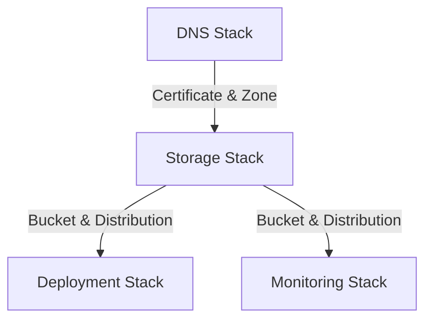

# Infrastructure Documentation

## First-Time Deployment Setup

This section guides you through setting up AWS infrastructure from scratch for a fresh clone or fork of this repository.

### Prerequisites

- AWS account with admin access
- Domain registered in Route 53 (or DNS delegated to Route 53)
- AWS CLI installed and configured (`aws configure`)
- Node.js 24.x LTS (pinned via `.nvmrc`) and Bun (pinned via `.bun-version`)
- GitHub repository with this code

### Step 1: Create GitHub OIDC Provider in AWS

> **Note:** Steps 1-3 are **manual prerequisites** that must be completed before running CDK.
> The CDK stacks do not provision these resources because:
>
> - The OIDC provider is account-wide (one per AWS account, not per project)
> - The IAM role is needed to run CDK itself (chicken-and-egg problem)
> - GitHub secrets must be configured in the repository settings
>
> Decision rationale: see `docs/architecture/adr/ADR-0008-oidc-bootstrap-manual.md`.
>
> After completing these prerequisites, CDK handles all other infrastructure (DNS, storage,
> email, monitoring). The CDK code in `lib/` is configured to only manage DNS, storage,
> email, and monitoring stacks -- it explicitly does not attempt to create the OIDC provider
> or GitHub Actions IAM role. See the [Stack Architecture section](#stack-architecture)
> below for details on what each CDK stack provisions.

Run once per AWS account to enable keyless GitHub Actions authentication:

```bash
aws iam create-open-id-connect-provider \
  --url https://token.actions.githubusercontent.com \
  --client-id-list sts.amazonaws.com \
  --thumbprint-list 6938fd4d98bab03faadb97b34396831e3780aea1
```

> **Note:** The `--thumbprint-list` parameter is required by the IAM API. Use the
> intermediate/root CA thumbprint for `token.actions.githubusercontent.com`. The value above
> is the commonly documented GitHub Actions OIDC thumbprint; update it if AWS/GitHub changes it.

### Step 2: Create IAM Role for GitHub Actions

Create a role named `prod-portfolio-deploy` with the following trust policy:

> **Placeholders to replace:**
>
> - `YOUR_ACCOUNT_ID`: Your 12-digit AWS account ID
> - `YOUR_ORG/YOUR_REPO`: Your GitHub username or organization name, followed by the repository name (e.g., `BjornMelin/bjornmelin-platform-io`)

```json
{
  "Version": "2012-10-17",
  "Statement": [{
    "Effect": "Allow",
    "Principal": {
      "Federated": "arn:aws:iam::YOUR_ACCOUNT_ID:oidc-provider/token.actions.githubusercontent.com"
    },
    "Action": "sts:AssumeRoleWithWebIdentity",
    "Condition": {
      "StringEquals": {
        "token.actions.githubusercontent.com:aud": "sts.amazonaws.com"
      },
      "StringLike": {
        "token.actions.githubusercontent.com:sub": "repo:YOUR_ORG/YOUR_REPO:*"
      }
    }
  }]
}
```

**Attach IAM policy:** Use scoped CDK/S3/CloudFront permissions (recommended for production).
For initial setup/testing only, `AdministratorAccess` may be used temporarily but should be
replaced with least-privilege permissions before production use.

<details>
<summary>Example least-privilege policy for CDK deployments</summary>

In addition to your stack-specific permissions (CloudFormation, S3, Route 53, ACM, etc.),
the GitHub Actions role must be able to validate the CDK bootstrap template version during
`cdk deploy`.

Minimum additions for **CDK v2 modern bootstrap** (default qualifier `hnb659fds`):

- Read bootstrap version: `ssm:GetParameter` on `arn:aws:ssm:REGION:ACCOUNT_ID:parameter/cdk-bootstrap/hnb659fds/version`
- Assume bootstrap roles (recommended): `sts:AssumeRole` on:
  - `cdk-hnb659fds-deploy-role-ACCOUNT_ID-REGION`
  - `cdk-hnb659fds-file-publishing-role-ACCOUNT_ID-REGION`
  - `cdk-hnb659fds-image-publishing-role-ACCOUNT_ID-REGION`
  - `cdk-hnb659fds-lookup-role-ACCOUNT_ID-REGION`

Example inline policy (replace placeholders):

```json
{
  "Version": "2012-10-17",
  "Statement": [
    {
      "Sid": "CdkBootstrapVersionRead",
      "Effect": "Allow",
      "Action": ["ssm:GetParameter", "ssm:GetParameters"],
      "Resource": "arn:aws:ssm:REGION:ACCOUNT_ID:parameter/cdk-bootstrap/hnb659fds/version"
    },
    {
      "Sid": "CdkAssumeBootstrapRoles",
      "Effect": "Allow",
      "Action": "sts:AssumeRole",
      "Resource": [
        "arn:aws:iam::ACCOUNT_ID:role/cdk-hnb659fds-deploy-role-ACCOUNT_ID-REGION",
        "arn:aws:iam::ACCOUNT_ID:role/cdk-hnb659fds-file-publishing-role-ACCOUNT_ID-REGION",
        "arn:aws:iam::ACCOUNT_ID:role/cdk-hnb659fds-image-publishing-role-ACCOUNT_ID-REGION",
        "arn:aws:iam::ACCOUNT_ID:role/cdk-hnb659fds-lookup-role-ACCOUNT_ID-REGION"
      ]
    }
  ]
}
```

#### Additional permissions for the static deploy step (S3 + CloudFront + CSP KVS)

The production workflow also runs `bun run deploy:static:prod`, which uses the AWS CLI to:

- read CloudFormation exports (`cloudformation list-exports`)
- upload the `out/` directory to S3 (`aws s3 sync ...`)
- sync the CloudFront KeyValueStore used by the CSP Function (`cloudfront-keyvaluestore list-keys/describe-key-value-store/update-keys`)
- invalidate CloudFront (`cloudfront create-invalidation`)

At minimum, ensure the role can list CloudFormation exports and has permissions for S3 sync,
CloudFront invalidation, and the CSP KeyValueStore (service prefix `cloudfront-keyvaluestore`):

```json
{
  "Version": "2012-10-17",
  "Statement": [
    {
      "Sid": "CloudFormationExportsRead",
      "Effect": "Allow",
      "Action": "cloudformation:ListExports",
      "Resource": "*"
    },
    {
      "Sid": "StaticSiteBucketList",
      "Effect": "Allow",
      "Action": "s3:ListBucket",
      "Resource": "arn:aws:s3:::YOUR_BUCKET_NAME"
    },
    {
      "Sid": "StaticSiteBucketWrite",
      "Effect": "Allow",
      "Action": [
        "s3:GetObject",
        "s3:PutObject",
        "s3:DeleteObject",
        "s3:AbortMultipartUpload",
        "s3:ListMultipartUploadParts"
      ],
      "Resource": "arn:aws:s3:::YOUR_BUCKET_NAME/*"
    },
    {
      "Sid": "CloudFrontInvalidation",
      "Effect": "Allow",
      "Action": "cloudfront:CreateInvalidation",
      "Resource": "arn:aws:cloudfront::ACCOUNT_ID:distribution/DISTRIBUTION_ID"
    },
    {
      "Sid": "CloudFrontKeyValueStoreSync",
      "Effect": "Allow",
      "Action": [
        "cloudfront-keyvaluestore:DescribeKeyValueStore",
        "cloudfront-keyvaluestore:ListKeys",
        "cloudfront-keyvaluestore:UpdateKeys"
      ],
      "Resource": "arn:aws:cloudfront::ACCOUNT_ID:key-value-store/*"
    }
  ]
}
```

The placeholders `YOUR_BUCKET_NAME` and `DISTRIBUTION_ID` can be resolved from CloudFormation exports
named `${env}-website-bucket-name` and `${env}-distribution-id` respectively (see
`scripts/deploy-static-site.mjs`).

Helper scripts (require AWS CLI auth):

- CDK bootstrap permissions: `bash scripts/ops/fix-gh-oidc-cdk-bootstrap-policy.sh --role-name
  prod-portfolio-deploy`
- Static deploy permissions (S3 + KVS + invalidation):
  `bash scripts/ops/fix-gh-oidc-static-deploy-policy.sh --role-name prod-portfolio-deploy --env prod`

See [AWS CDK bootstrapping](https://docs.aws.amazon.com/cdk/v2/guide/bootstrapping-env.html)
for background and template versioning.
</details>

### Step 3: Configure GitHub Repository

Navigate to your repository Settings → Environments → **production**.

**Environment secrets** (required):

| Secret               | Value                                                    |
| -------------------- | -------------------------------------------------------- |
| `AWS_DEPLOY_ROLE_ARN` | `arn:aws:iam::YOUR_ACCOUNT_ID:role/prod-portfolio-deploy` |
| `OPENAI_API_KEY`     | OpenAI key for auto-release (optional)                  |

**Environment variables** (required):

| Variable              | Value                                              |
| --------------------- | -------------------------------------------------- |
| `NEXT_PUBLIC_BASE_URL` | `https://your-domain.com`                         |
| `NEXT_PUBLIC_API_URL` | `https://api.your-domain.com`                     |
| `NEXT_PUBLIC_APP_URL` | `https://your-domain.com`                         |
| `CONTACT_EMAIL`       | `contact@your-domain.com` (build-time validation) |

### Step 4: Create AWS SSM Parameter for Contact Email

The contact form Lambda reads the recipient email from SSM at runtime:

```bash
aws ssm put-parameter \
  --name "/portfolio/prod/CONTACT_EMAIL" \
  --value "your-email@gmail.com" \
  --type "SecureString" \
  --region us-east-1
```

Or use the helper script: `bash scripts/ops/setup-aws-ssm.sh your-email@gmail.com`

### Step 4b: Create/Rotate Resend API Key in SSM

The contact form Lambda reads the Resend API key from SSM at runtime (default path: `/portfolio/prod/resend/api-key`).

Create a **Sending Access** key in the Resend dashboard, then store it in SSM using the helper (prompts securely):

```bash
bash scripts/ops/rotate-resend-sending-key.sh
```

> Tip: The SSM value is a JSON blob (SecureString) containing
> `{"apiKey":"re_xxx", "version":N, "rotatedAt":"..."}`. The Lambda parses this JSON and
> extracts the `apiKey` field. For backwards compatibility, plain API key strings are also
> accepted.

### Step 5: Deploy Infrastructure

```bash
cd infrastructure
bun install
bun --bun cdk deploy prod-portfolio-dns --require-approval never
bun --bun cdk deploy prod-portfolio-storage --require-approval never
bun --bun cdk deploy prod-portfolio-email --require-approval never
bun --bun cdk deploy prod-portfolio-monitoring --require-approval never
```

> **Tip:** The `--require-approval never` flag bypasses CDK's change review prompts. For
> first-time deployments, consider running `bun --bun cdk diff <stack-name>` first to review
> changes, or omit the flag to get interactive approval prompts. Keep `--require-approval
> never` primarily for automated CI/CD pipelines.
>
> **Note (CSP hashes KVS):** The Storage stack provisions the CloudFront KeyValueStore used for CSP hashes (ADR-0001).
> The KVS contents are build artifacts and are synced during the static deploy step (`bun run deploy:static:prod`).

### Step 6: Deploy Application

Push to `main` branch or run manually:

```bash
gh workflow run deploy.yml
```

---

## Stack Architecture

### Overview

The infrastructure is organized into four main stacks:

- **DNS Stack:** Manages domain and SSL certificates
- **Storage Stack:** Handles S3, CloudFront, CloudFront Functions, and the CSP hashes KeyValueStore (KVS)
- **Deployment Stack:** Manages IAM and deployment credentials
- **Monitoring Stack:** Configures CloudWatch alarms

### Resource Relationships



### Configuration Details

- **Domain:** configured in `infrastructure/lib/constants.ts` (`PROD_DOMAIN` / `DEV_DOMAIN`)
- **Environment:** Production
- **Region:** us-east-1 (primary)
- **CDK Version:** 2.99.1

### Security Measures

- SSL/TLS encryption (TLS 1.2+)
- S3 bucket public access blocked
- Strict security headers
- IAM least privilege access
- DNS validation for certificates

## Deployment Guide

### Prerequisites

- AWS CLI configured
- Node.js 24.x LTS (use `nvm use` from repo root)
- Bun (align with repository `.bun-version`)
- Domain registered in Route 53

### Configuration Parameters

```typescript
export const CONFIG = {
  prod: {
    domainName: "bjornmelin.io",
    environment: "prod",
  },
};
```

### Deployment Steps

1. Install dependencies:

   ```bash
   cd infrastructure
   bun install
   ```

2. Deploy stacks in order:

   ```bash
   # Deploy DNS stack first (wait for certificate validation)
   bun run deploy:dns

   # Deploy remaining stacks
   bun run deploy:storage
   bun run deploy:deployment
   bun run deploy:monitoring
   bun run deploy:email
   ```

### Troubleshooting Steps

1. **Certificate Issues:**

   - Verify DNS validation records
   - Check certificate region (must be us-east-1)

2. **CloudFront Issues:**

   - Verify distribution status
   - Check origin access configuration
   - Validate SSL certificate status

3. **Deployment Issues:**
   - Verify IAM permissions
   - Check GitHub Actions secrets
   - Validate S3 bucket permissions

### Rollback Procedures

```bash
# Rollback specific stack
cdk destroy prod-portfolio-[stack-name]

# Rollback all stacks
bun run destroy:all
```

## Monitoring Documentation

### Available Metrics

1. **CloudFront:**

   - 5xx Error Rate
   - Cache Hit/Miss Rate
   - Total Requests

2. **S3:**
   - 4xx Errors
   - Total Requests
   - Bucket Size

### Alarm Thresholds

- CloudFront 5xx Errors: > 5% over 2 periods
- S3 4xx Errors: > 10 errors over 2 periods

### Response Procedures

1. **High Error Rates:**

   - Check CloudWatch logs
   - Verify origin health
   - Review security configurations

2. **Performance Issues:**
   - Monitor cache hit rates
   - Check origin response times
   - Verify CloudFront settings

### Maintenance Tasks

1. **Regular:**

   - Monitor SSL certificate expiration
   - Review CloudWatch alarms
   - Check S3 lifecycle rules

2. **Monthly:**
   - Review access logs
   - Verify backup retention
   - Check cost optimization

## Tests

- Runner: Vitest (Node environment). No AWS account or credentials are required.
- Location: `infrastructure/test/*.test.ts`
- Why it’s fast:
  - Tests mock `route53.HostedZone.fromLookup` and stub `aws-cdk-lib/aws-lambda-nodejs.NodejsFunction`
    to avoid AWS lookups and esbuild bundling.

Commands

```bash
# Install deps (once)
bun --cwd infrastructure install

# Run the infra test suite
bun run --cwd infrastructure test

# With coverage (v8)
bun run --cwd infrastructure test:coverage

# Run a single test file
bun run --cwd infrastructure test -- test/storage-stack.test.ts
```

Notes

- Type-check/build excludes tests (`tsconfig.json` includes only `bin/**` and `lib/**`).
- Vitest config lives in `infrastructure/vitest.config.ts` with sensible coverage excludes.
