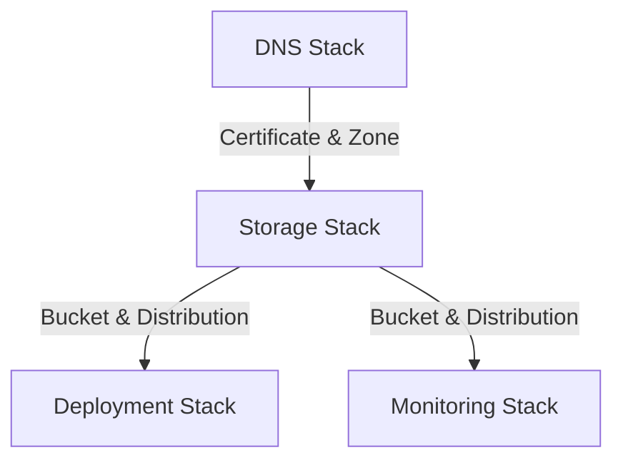

# Infrastructure Documentation

## First-Time Deployment Setup

This section guides you through setting up AWS infrastructure from scratch for a fresh clone or fork of this repository.

### Prerequisites

- AWS account with admin access
- Domain registered in Route 53 (or DNS delegated to Route 53)
- AWS CLI installed and configured (`aws configure`)
- Node.js 20+ and pnpm installed
- GitHub repository with this code

### Step 1: Create GitHub OIDC Provider in AWS

Run once per AWS account to enable keyless GitHub Actions authentication:

```bash
aws iam create-open-id-connect-provider \
  --url https://token.actions.githubusercontent.com \
  --client-id-list sts.amazonaws.com \
  --thumbprint-list 6938fd4d98bab03faadb97b34396831e3780aea1
```

### Step 2: Create IAM Role for GitHub Actions

Create a role named `prod-portfolio-deploy` with the following trust policy (replace `YOUR_ACCOUNT_ID` and `YOUR_ORG/YOUR_REPO`):

```json
{
  "Version": "2012-10-17",
  "Statement": [{
    "Effect": "Allow",
    "Principal": {
      "Federated": "arn:aws:iam::YOUR_ACCOUNT_ID:oidc-provider/token.actions.githubusercontent.com"
    },
    "Action": "sts:AssumeRoleWithWebIdentity",
    "Condition": {
      "StringEquals": {
        "token.actions.githubusercontent.com:aud": "sts.amazonaws.com"
      },
      "StringLike": {
        "token.actions.githubusercontent.com:sub": "repo:YOUR_ORG/YOUR_REPO:*"
      }
    }
  }]
}
```

Attach policy: `AdministratorAccess` (or scoped CDK/S3/CloudFront permissions for least privilege).

### Step 3: Configure GitHub Repository

Navigate to your repository Settings → Secrets and variables → Actions.

**Secrets** (required):

| Secret | Value |
|--------|-------|
| `AWS_DEPLOY_ROLE_ARN` | `arn:aws:iam::YOUR_ACCOUNT_ID:role/prod-portfolio-deploy` |
| `OPENAI_API_KEY` | OpenAI key for auto-release (optional) |

**Variables** (required):

| Variable | Value |
|----------|-------|
| `NEXT_PUBLIC_BASE_URL` | `https://your-domain.com` |
| `NEXT_PUBLIC_API_URL` | `https://api.your-domain.com` |
| `NEXT_PUBLIC_APP_URL` | `https://your-domain.com` |
| `CONTACT_EMAIL` | `contact@your-domain.com` (build-time validation) |

### Step 4: Create AWS SSM Parameter for Contact Email

The contact form Lambda reads the recipient email from SSM at runtime:

```bash
aws ssm put-parameter \
  --name "/portfolio/prod/CONTACT_EMAIL" \
  --value "your-email@gmail.com" \
  --type "SecureString" \
  --region us-east-1
```

Or use the helper script: `./scripts/ops/setup-aws-ssm.sh your-email@gmail.com`

### Step 5: Deploy Infrastructure

```bash
cd infrastructure
pnpm install
pnpm cdk deploy prod-portfolio-dns --require-approval never
pnpm cdk deploy prod-portfolio-storage --require-approval never
pnpm cdk deploy prod-portfolio-email --require-approval never
pnpm cdk deploy prod-portfolio-monitoring --require-approval never
```

### Step 6: Deploy Application

Push to `main` branch or run manually:

```bash
gh workflow run deploy.yml
```

---

## Stack Architecture

### Overview

The infrastructure is organized into four main stacks:

- **DNS Stack:** Manages domain and SSL certificates
- **Storage Stack:** Handles S3 and CloudFront configuration
- **Deployment Stack:** Manages IAM and deployment credentials
- **Monitoring Stack:** Configures CloudWatch alarms

### Resource Relationships



### Configuration Details

- **Domain:** bjornmelin.io
- **Environment:** Production
- **Region:** us-east-1 (primary)
- **CDK Version:** 2.99.1

### Security Measures

- SSL/TLS encryption (TLS 1.2+)
- S3 bucket public access blocked
- Strict security headers
- IAM least privilege access
- DNS validation for certificates

## Deployment Guide

### Prerequisites

- AWS CLI configured
- Node.js 24.x LTS (use `nvm use` from repo root)
- pnpm package manager (align with repository CI version)
- Domain registered in Route 53

### Configuration Parameters

```typescript
export const CONFIG = {
  prod: {
    domainName: "bjornmelin.io",
    environment: "prod",
  },
};
```

### Deployment Steps

1. Install dependencies:

   ```bash
   cd infrastructure
   pnpm install
   ```

2. Deploy stacks in order:

   ```bash
   # Deploy DNS stack first (wait for certificate validation)
   pnpm deploy:dns

   # Deploy remaining stacks
   pnpm deploy:storage
   pnpm deploy:deployment
   pnpm deploy:monitoring
   pnpm deploy:email
   ```

### Troubleshooting Steps

1. **Certificate Issues:**

   - Verify DNS validation records
   - Check certificate region (must be us-east-1)

2. **CloudFront Issues:**

   - Verify distribution status
   - Check origin access configuration
   - Validate SSL certificate status

3. **Deployment Issues:**
   - Verify IAM permissions
   - Check GitHub Actions secrets
   - Validate S3 bucket permissions

### Rollback Procedures

```bash
# Rollback specific stack
cdk destroy prod-portfolio-[stack-name]

# Rollback all stacks
pnpm destroy:all
```

## Monitoring Documentation

### Available Metrics

1. **CloudFront:**

   - 5xx Error Rate
   - Cache Hit/Miss Rate
   - Total Requests

2. **S3:**
   - 4xx Errors
   - Total Requests
   - Bucket Size

### Alarm Thresholds

- CloudFront 5xx Errors: > 5% over 2 periods
- S3 4xx Errors: > 10 errors over 2 periods

### Response Procedures

1. **High Error Rates:**

   - Check CloudWatch logs
   - Verify origin health
   - Review security configurations

2. **Performance Issues:**
   - Monitor cache hit rates
   - Check origin response times
   - Verify CloudFront settings

### Maintenance Tasks

1. **Regular:**

   - Monitor SSL certificate expiration
   - Review CloudWatch alarms
   - Check S3 lifecycle rules

2. **Monthly:**
   - Review access logs
   - Verify backup retention
   - Check cost optimization

## Tests

- Runner: Vitest (Node environment). No AWS account or credentials are required.
- Location: `infrastructure/test/*.test.ts`
- Why it’s fast:
  - Tests mock `route53.HostedZone.fromLookup` and stub `aws-cdk-lib/aws-lambda-nodejs.NodejsFunction`
    to avoid AWS lookups and esbuild bundling.

Commands

```bash
# Install deps (once)
pnpm -C infrastructure install

# Run the infra test suite
pnpm -C infrastructure test

# With coverage (v8)
pnpm -C infrastructure test:coverage

# Run a single test file
pnpm -C infrastructure vitest run test/storage-stack.test.ts
```

Notes

- Type-check/build excludes tests (`tsconfig.json` includes only `bin/**` and `lib/**`).
- Vitest config lives in `infrastructure/vitest.config.ts` with sensible coverage excludes.
